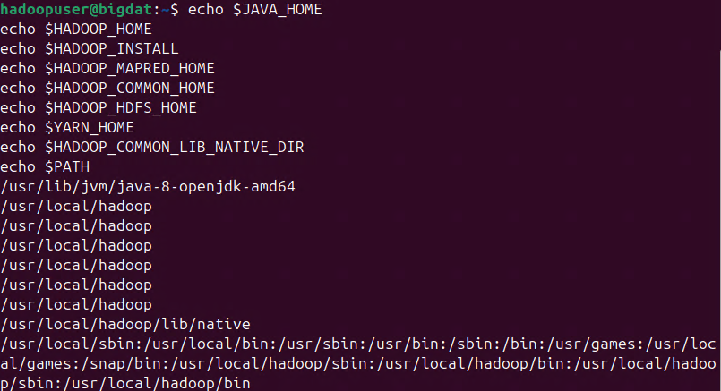
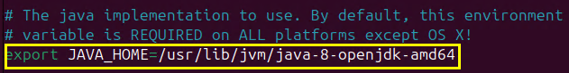
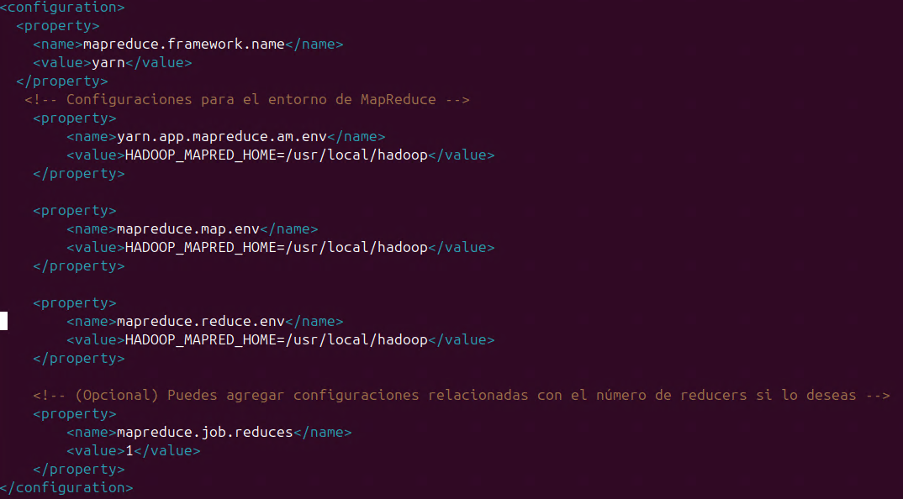
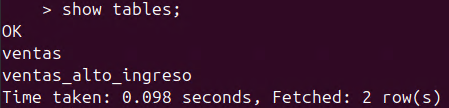

# Configuración y uso de un clúster Hadoop en un servidor local, realizando tareas de ETL y consultas con Hive

## Objetivo de la práctica:

Al finalizar la práctica, serás capaz de:
- Configurar un clúster Hadoop local con Hadoop Distributed File System (HDFS).
- Realizar una tarea de ETL con un dataset en formato CSV.
- Ejecutar consultas con Hive sobre los datos procesados.

## Duración aproximada:
- 120 minutos.

## Instrucciones 

### Tarea 1. Instalación de Hadoop (Single Node Cluster)

En esta tarea realizarás la instalación de Apache Hadoop.

**NOTA:** A lo largo de la práctica habrá imágenes para que puedas apoyarte y mejorar la experiencia de configuración.

**NOTA IMPORTANTE:** Usarás el entorno gráfico del sistema operativo UBUNTU, pero **todo lo realizarás por terminal**.

**NOTA:** Abre una **terminal** dentro del sistema de UBUNTU.

Paso 1. Inicia sesión como **root**, recuerda la contraseña es: **Pa55w.rd**

```
sudo su
```


Paso 2. Ahora crea el usuario para trabajar con **Hadoop**, copia el siguiente comando.

```
sudo adduser hadoopuser
```

Paso 3. Cuando te pida la contraseña para el usuario, copia el siguiente valor.

**NOTA:** La contraseña no será visible, ten cuidado de no escribir otro carácter.

```
ubunhadoop
```

Paso 4. Agrega el usuario **hadoopuser** al archivo de superusuarios para darle los privilegios necesarios, copia el siguiente comando.

```
sudo usermod -aG sudo hadoopuser
```

Paso 5. Escribe el siguiente comando para la **actualización** del sistema Ubuntu, como superusuario.

**NOTA:** Si te pide contraseña, escribe la que se te asignó en el curso.

```
sudo apt update
```


Paso 6. Ahora escribe el siguiente comando para la **instalación de JAVA**.

**NOTA:** El proceso puede tardar de **1 a 5 minutos**.

```
sudo apt install openjdk-8-jdk -y
```


Paso 7. **Verifica** la instalación de Java, escribe el siguiente comando:

```
java -version
```


Paso 8. Descarga la **última versión** de Hadoop desde el sitio oficial de **Apache Hadoop**, escribe/copia el siguiente comando:

```
wget https://downloads.apache.org/hadoop/common/hadoop-3.3.6/hadoop-3.3.6.tar.gz
```


**NOTA:** El proceso puede tardar un par de minutos dependiendo de tu ancho de banda de conexión a internet.

Paso 9. **Descomprime** el archivo de **Hadoop** descargado, escribe el siguiente comando:

```
tar -xzvf hadoop-3.3.6.tar.gz
```

Paso 10. Puedes escribir el comando **`ls`** en la terminal para **verificar** la descarga y descompresión de **Apache Hadoop**.


Paso 11. **Mueve** el directorio a la carpeta **/usr/local/**, escribe el siguiente comando:

```
sudo mv hadoop-3.3.6 /usr/local/hadoop
```

Paso 12. **Verifica con el siguiente comando** que la carpeta se haya movido correctamente:

```
ls /usr/local/
```


Paso 13. Ahora **otorga** permisos de acceso a **hadoopuser** para el directorio de Hadoop.

```
sudo chown -R hadoopuser:hadoopuser /usr/local/hadoop
```


Paso 14. Configura las variables de entorno para **hadoopuser**. Inicia sesión como **hadoopuser**, escribe el siguiente comando.

```
su - hadoopuser
```


Paso 15. Abre el archivo **~/.bashrc**, copia el siguiente comando:

```
nano ~/.bashrc
```

Paso 16. Ahora ve hasta la **última línea** del archivo, como lo muestra la imagen.


Paso 17. En esa última línea, añade **(copia y pega)** las siguientes líneas al final del archivo **~/.bashrc**.

```
export JAVA_HOME=/usr/lib/jvm/java-8-openjdk-amd64
export HADOOP_HOME=/usr/local/hadoop
export HADOOP_INSTALL=$HADOOP_HOME
export HADOOP_MAPRED_HOME=$HADOOP_HOME
export HADOOP_COMMON_HOME=$HADOOP_HOME
export HADOOP_HDFS_HOME=$HADOOP_HOME
export YARN_HOME=$HADOOP_HOME
export HADOOP_COMMON_LIB_NATIVE_DIR=$HADOOP_HOME/lib/native
export PATH=$PATH:$HADOOP_HOME/sbin:$HADOOP_HOME/bin
```


Paso 18. **Para guardar y cerrar** el archivo nano, escribe la siguiente combinación de teclas: 

**```CTRL + O```** **`Enter`** `Para guardar el archivo`

**```CTRL + X```** **`Enter`** `Para salir del archivo`

Paso 19. **Actualiza el sistema** con las variables de entorno configuradas, escribe el siguiente comando:

```
source ~/.bashrc
```

Paso 20. **Verifica** el guardado correcto de las variables. Escribe los siguientes comandos que imprimen cada una de las variables.

**NOTA:** Puedes escribir todos juntos o uno por uno.

```
echo $JAVA_HOME
echo $HADOOP_HOME
echo $HADOOP_INSTALL
echo $HADOOP_MAPRED_HOME
echo $HADOOP_COMMON_HOME
echo $HADOOP_HDFS_HOME
echo $YARN_HOME
echo $HADOOP_COMMON_LIB_NATIVE_DIR
echo $PATH
```



**¡TAREA FINALIZADA!**

Has completado la descarga e instalación de Apache Hadoop.

### Tarea 2. Configuración de Hadoop (Single Node Cluster)

En los siguientes pasos prepararás los archivos de Apache Hadoop adecuadamente.

Paso 1. Ahora editarás los siguientes archivos de Hadoop para su configuración. Estos archivos se encuentran en la siguiente ruta: **/usr/local/hadoop/etc/hadoop/**

**NOTA:** En el siguiente paso comenzarás la edición.

Paso 2. Edita el archivo llamado **hadoop-env.sh** y verifica que esté la variable **JAVA_HOME**.

```
nano $HADOOP_HOME/etc/hadoop/hadoop-env.sh
```

**NOTA:** Asegúrate de que esté configurada la variable **JAVA_HOME**, si no, copia y pega el siguiente comando.

```
/usr/lib/jvm/java-8-openjdk-amd64
```



**```CTRL + O```** **`Enter`** `Para guardar el archivo`

**```CTRL + X```** **`Enter`** `Para salir del archivo`

Paso 3. Edita el archivo llamado **core-site.xml** para definir el sistema de archivos y puerto de comunicación, escribe el siguiente comando:

```
nano $HADOOP_HOME/etc/hadoop/core-site.xml
```

Paso 4. Borra la sección **configuration** y pega el siguiente código en su lugar:

```
<configuration>
  <property>
    <name>fs.defaultFS</name>
    <value>hdfs://localhost:9000</value>
  </property>
</configuration>
```


**```CTRL + O```** **`Enter`** `Para guardar el archivo`

**```CTRL + X```** **`Enter`** `Para salir del archivo`

Paso 5. Ahora edita el archivo **hdfs-site.xml** para definir los directorios de almacenamiento de los datos, copia el siguiente código:

```
nano $HADOOP_HOME/etc/hadoop/hdfs-site.xml
```

Paso 6. Borra la sección **configuration** y pega el siguiente código en su lugar:

```
<configuration>
  <property>
    <name>dfs.replication</name>
    <value>1</value> <!-- Solo 1 réplica en un clúster de nodo único -->
  </property>
  <property>
    <name>dfs.namenode.name.dir</name>
    <value>file:///usr/local/hadoop/hadoopdata/hdfs/namenode</value>
  </property>
  <property>
    <name>dfs.datanode.data.dir</name>
    <value>file:///usr/local/hadoop/hadoopdata/hdfs/datanode</value>
  </property>
</configuration>
```


**```CTRL + O```** **`Enter`** `Para guardar el archivo`

**```CTRL + X```** **`Enter`** `Para salir del archivo`

Paso 7. El siguiente archivo a editar es **mapred-site.xml**, donde se definen los trabajos para MapReduce, escribe el siguiente comando:

```
nano $HADOOP_HOME/etc/hadoop/mapred-site.xml
```

Paso 8. Borra la sección **configuration** y pega el siguiente código en su lugar:

```
<configuration>
    <!-- Configuración para usar YARN como framework -->
    <property>
        <name>mapreduce.framework.name</name>
        <value>yarn</value>
    </property>

    <!-- Configuraciones para el entorno de MapReduce -->
    <property>
        <name>yarn.app.mapreduce.am.env</name>
        <value>HADOOP_MAPRED_HOME=/usr/local/hadoop</value>
    </property>
    
    <property>
        <name>mapreduce.map.env</name>
        <value>HADOOP_MAPRED_HOME=/usr/local/hadoop</value>
    </property>

    <property>
        <name>mapreduce.reduce.env</name>
        <value>HADOOP_MAPRED_HOME=/usr/local/hadoop</value>
    </property>

    <!-- (Opcional) Puedes agregar configuraciones relacionadas con el número de reducers si lo deseas -->
    <property>
        <name>mapreduce.job.reduces</name>
        <value>1</value>
    </property>
</configuration>
```



Paso 9. Adicionalmente, editarás el archivo **yarn-site.xml**, escribe el siguiente comando:

```
nano $HADOOP_HOME/etc/hadoop/yarn-site.xml
```

Paso 10. Borra la sección **configuration** y pega el siguiente código en su lugar:

```
<configuration>
  <property>
    <name>yarn.nodemanager.aux-services</name>
    <value>mapreduce_shuffle</value>
  </property>
</configuration>
```


**¡TAREA FINALIZADA!**

Has completado adecuadamente la preparación de los archivos de Apache Hadoop.

### Tarea 3. Inicialización de Apache Hadoop.

En esta tarea ejecutarás los comandos para probar el funcionamiento de Apache Hadoop.

Paso 1. Realiza la **inicialización** del sistema de archivos y arranque de Hadoop, escribe el siguiente comando:

**NOTA:** El comando formatea el NameNode de Hadoop. Si te pregunta confirmación, escribe **y**.

```
hdfs namenode -format
```


**NOTA:** El mensaje es normal, ya que indica que el NameNode ha sido apagado correctamente después de haber completado el proceso de formateo.

Paso 2. Ahora **inicia** los servicios de **Hadoop**, escribe los siguientes comandos:

```
start-dfs.sh
```

Paso 3. Si después de iniciar Hadoop te manda un mensaje parecido al de la imagen, se corregirá en los siguientes pasos.


**NOTA:** Se necesita crear la autenticación al **localhost**, ya que por ese se estará comunicando el nodo de Hadoop.

Paso 4. Copia el siguiente comando para instalar **openssh**.

```
sudo apt-get install openssh-server openssh-client
```

Paso 5. Copia el siguiente comando para crear la llave de autenticación y da **Enter** para guardar el archivo.

```
ssh-keygen -t rsa -P ""
```

Paso 6. Actualiza el archivo de autorización de llaves, copia el siguiente comando.

```
cat ~/.ssh/id_rsa.pub >> ~/.ssh/authorized_keys
```

Paso 7. Copia y pega los siguientes comandos para dar los permisos a los archivos.

```
chmod 600 ~/.ssh/authorized_keys
```
```
chmod 700 ~/.ssh
```

Paso 8. Intenta nuevamente el siguiente comando para verificar que Hadoop inicie correctamente.

```
start-dfs.sh
```

Paso 9. Si te aparece el mensaje, es que se han encendido correctamente **Apache Hadoop**.


**NOTA:** El warning que aparece puedes ignorarlo, ya que es para librerías que no usaremos.

Paso 10. Ahora inicia el servicio de **YARN**, copia y pega el siguiente comando.

```
start-yarn.sh
```

Paso 11. Si todo sale bien, verás el resultado como en la siguiente imagen.


Paso 12. Verifica que los servicios de **Hadoop** estén corriendo accediendo a las siguientes URLs **en el navegador de la máquina virtual**:

- **NameNode:** `http://localhost:9870/`


- **ResourceManager:** `http://localhost:8088/`


Paso 13. Ejecuta los siguientes comandos de prueba en HDFS. Crea un directorio en HDFS para **hadoopuser**.

```
hdfs dfs -mkdir /user/
```
```
hdfs dfs -mkdir /user/hadoopuser/
```

Paso 15. Sube un archivo de prueba a HDFS, escribe los siguientes comandos.

```
echo "Hola Hadoop" > test.txt
```
```
hdfs dfs -put test.txt /user/hadoopuser/
```

Paso 15. Verifica que el archivo se haya subido correctamente, escribe el siguiente comando.

```
hdfs dfs -ls /user/hadoopuser/
```


**¡TAREA FINALIZADA!**

Has completado la inicialización de los servicios de Apache Hadoop.

### Tarea 4. Instalación de Apache Hive

En la siguiente tarea realizarás los pasos para la instalación de Apache Hive.

**NOTA:** Recuerda que seguimos configurando con el usuario **hadoopuser**. Si te cerró la sesión, iníciala nuevamente.

Paso 1. Descarga la **última versión de Apache Hive** desde el sitio oficial, escribe el siguiente comando:

```
wget https://archive.apache.org/dist/hive/hive-3.1.3/apache-hive-3.1.3-bin.tar.gz
```


**NOTA:** Esperamos el proceso de descarga durante un par de segundos.

Paso 2. **Descomprime** el archivo de Hive descargado, escribe el siguiente comando:

```
tar -xzvf apache-hive-3.1.3-bin.tar.gz
```

Paso 3. **Mueve** el directorio a la carpeta **/usr/local/**, escribe el siguiente comando:

```
sudo mv apache-hive-3.1.3-bin /usr/local/hive
```

**NOTA:** Si te pide contraseña, escribe la que se configuró al usuario **hadoopuser**.

Paso 4. Otorga permisos de acceso a **hadoopuser** para la carpeta de **hive**.

```
sudo chown -R hadoopuser:hadoopuser /usr/local/hive
```

Paso 5. Ahora abre el archivo **.bashrc** para agregar las variables de entorno de **Hive**, copia el siguiente comando.

```
nano ~/.bashrc
```

Paso 6. Nuevamente, ve hasta el final del archivo y agrega las siguientes 4 variables de Hive, copia y pégalas.

```
export HIVE_HOME=/usr/local/hive
export PATH=$PATH:$HIVE_HOME/bin
```


**```CTRL + O```** **`Enter`** `Para guardar el archivo`

**```CTRL + X```** **`Enter`** `Para salir del archivo`

Paso 7. Recarga el archivo **.bashrc**.

```
source ~/.bashrc
```

Paso 8. Ahora descarga **Derby** para usarlo como metastore con Apache Hive, escribe el siguiente comando.

```
wget https://downloads.apache.org//db/derby/db-derby-10.14.2.0/db-derby-10.14.2.0-bin.tar.gz
```

Paso 9. **Descomprime** el archivo de Derby descargado, escribe el siguiente comando:

```
tar -xzvf db-derby-10.14.2.0-bin.tar.gz
```

Paso 10. **Mueve** el directorio a la carpeta **/usr/local/**, escribe el siguiente comando:

```
sudo mv db-derby-10.14.2.0-bin /usr/local/derby
```

Paso 11. Configura las **variables de entorno** de Hive y Derby. Abre el archivo **~/.bashrc**, escribe el siguiente comando:

```
nano ~/.bashrc
```

Paso 12. Ahora ve hasta la **última línea** del archivo, como lo muestra la imagen. Debajo de las variables anteriores, copia y pega las siguientes.

```
export DERBY_HOME=/usr/local/derby
export PATH=$PATH:$DERBY_HOME/bin
```


**```CTRL + O```** **`Enter`** `Para guardar el archivo`

**```CTRL + X```** **`Enter`** `Para salir del archivo`

Paso 13. **Actualiza** el sistema con **las variables** de entorno configuradas, escribe el siguiente comando:

```
source ~/.bashrc
```

Paso 14. Finalmente, copia la librería de **derbytools** en la carpeta de **hive**, copia el siguiente comando.

```
sudo cp /usr/local/derby/lib/derbytools.jar /usr/local/hive/lib/
```

**¡TAREA FINALIZADA!**

Has completado la instalación de Apache Hive y Derby.

### Tarea 5. Configuración de Apache Hive con Derby

Hive requiere varios archivos de configuración. Crearemos y editaremos estos archivos.

Paso 1. Crea un directorio donde Hive almacenará los datos de las tablas. Usa **sudo** si es necesario para crear el directorio:

```
sudo mkdir -p /usr/local/hive/warehouse
```
```
sudo chown hadoopuser:hadoopuser /usr/local/hive/warehouse
```

Paso 2. Crea y edita el archivo **hive-site.xml** para configurar Hive.

```
sudo nano $HIVE_HOME/conf/hive-site.xml
```

Paso 3. Dentro del archivo, agrega la siguiente configuración.

```
<configuration>
  <property>
    <name>javax.jdo.option.ConnectionURL</name>
    <value>jdbc:derby:;databaseName=/home/hadoopuser/metastore_db;create=true</value>
    <description>JDBC connect string for a JDBC metastore</description>
  </property>

  <property>
    <name>javax.jdo.option.ConnectionDriverName</name>
    <value>org.apache.derby.jdbc.EmbeddedDriver</value>
    <description>Driver class name for a JDBC metastore</description>
  </property>

  <property>
    <name>hive.metastore.warehouse.dir</name>
    <value>/usr/local/hive/warehouse</value>
    <description>Location of default database for the warehouse</description>
  </property>
</configuration>
```


**```CTRL + O```** **`Enter`** `Para guardar el archivo`

**```CTRL + X```** **`Enter`** `Para salir del archivo`

Paso 4. Crea el directorio en HDFS donde Hive almacenará los datos.

```
hdfs dfs -mkdir /user
```
```
hdfs dfs -mkdir /user/hive
```
```
hdfs dfs -mkdir /user/hive/warehouse
```
```
hdfs dfs -chmod 777 /user/hive/warehouse
```

Paso 5. Inicializa el metastore de Hive, ejecuta el siguiente comando.

```
schematool -initSchema -dbType derby 
```
```
chmod 777 metastore_db/
```

**NOTA:** Es normal que tarde un poco en iniciar, espera unos segundos.

Paso 6. Si la inicialización fue correcta, verás el siguiente resultado, como en la imagen.


Paso 7. Ahora inicializa el **metastore** de Hive, escribe el siguiente comando.

```
hive --service metastore &
```

**NOTA:** Si la terminal no responde ejecuta **Enter**.

Paso 8. Inicia el shell de Hive con el siguiente comando para verificar la configuración.

```
hive
```

**NOTA:** Pueden salirte algunos **warnings**; puedes ignorarlos por el momento.

Paso 9. Para salir de **Hive**, escribe el comando **`exit;`**.

**¡TAREA FINALIZADA!**

Has completado la configuración y preparación de Apache Hive y Derby.

### Tarea 6. ETL simple y consultas con Apache Hive

En esta tarea realizarás la carga de los datos a Apache Hadoop, después extraerás los datos desde Hive, aplicarás una transformación de datos y un conjunto de consultas, y finalmente realizarás una inserción de datos.

Paso 1. Ahora **descarga la información demostrativa** a usar, escribe el siguiente comando:

**NOTA:** El archivo es un ejemplo y está guardado en un sistema de almacenamiento de la nube de AWS.

```
wget https://s3.us-west-2.amazonaws.com/labs.netec.com/courses/BigDataSciencePro/V0.0.1/ventasejemplo.csv
```


Paso 2. Ahora sube y carga el archivo en HDFS, copia el siguiente comando.

```
hdfs dfs -put ventasejemplo.csv /user/hadoopuser/
```

Paso 3. Conéctate a **Hive** para realizar las consultas de ejemplo, escribe el siguiente comando.

```
hive
```

Paso 4. Luego, crea una tabla en Hive que coincida con la estructura del archivo CSV.

```
CREATE TABLE ventas (
    id INT,
    nombre_cliente STRING,
    producto STRING,
    cantidad INT,
    precio_unitario FLOAT,
    fecha_venta DATE
)
ROW FORMAT DELIMITED
FIELDS TERMINATED BY ','
STORED AS TEXTFILE
TBLPROPERTIES ("skip.header.line.count"="1");
```

**IMPORTANTE:** En caso de que tengas un error escribe lo siguiente: sal de hive **`exit;`** luego **`rm metastore_db -r`** siguiente **`schematool -initSchema -dbType derby `** finalmente entra a **`hive`** y prueba la consulta.


Paso 5. Carga el archivo desde el sistema de archivos de HDFS en la tabla que acabas de crear en Hive.

```
LOAD DATA INPATH '/user/hadoopuser/ventasejemplo.csv' INTO TABLE ventas;
```


Paso 6. Con los datos cargados, ahora puedes realizar las siguientes consultas.

```
SELECT * FROM ventas LIMIT 10;
```

```
SELECT COUNT(*) AS total_ventas FROM ventas;
```

```
SELECT producto, SUM(cantidad) AS total_cantidad
FROM ventas
GROUP BY producto;
```

```
SELECT producto, SUM(cantidad * precio_unitario) AS ingreso_total
FROM ventas
GROUP BY producto;
```

```
SELECT nombre_cliente, SUM(cantidad) AS total_compras
FROM ventas
GROUP BY nombre_cliente
ORDER BY total_compras DESC
LIMIT 1;
```

```
SELECT * FROM ventas
WHERE fecha_venta = '2024-01-01';
```

```
SELECT fecha_venta, SUM(cantidad) AS total_vendido, SUM(cantidad * precio_unitario) AS ingreso_total
FROM ventas
GROUP BY fecha_venta
ORDER BY fecha_venta;
```


Paso 7. Si deseas realizar **transformaciones adicionales**, por ejemplo, filtrar las ventas con ingresos superiores a un cierto monto, puedes crear una tabla.

```
CREATE TABLE ventas_alto_ingreso (
    id INT,
    nombre_cliente STRING,
    producto STRING,
    cantidad INT,
    precio_unitario FLOAT,
    fecha_venta DATE,
    valor_total FLOAT
)
STORED AS TEXTFILE;
```


Paso 8. Verifica que la tabla se haya creado correctamente, escribe el siguiente comando en Hive.

```
show tables;
```


Paso 9. Inserta datos transformados en la nueva tabla.

```
INSERT INTO TABLE ventas_alto_ingreso
SELECT 
    id,
    nombre_cliente,
    producto,
    cantidad,
    precio_unitario,
    fecha_venta,
    cantidad * precio_unitario AS valor_total
FROM 
    ventas
WHERE cantidad * precio_unitario > 500;
```


Paso 10. Para ver los datos insertados en la tabla `ventas_alto_ingreso` después de la inserción, puedes ejecutar esta consulta.

```
SELECT * FROM ventas_alto_ingreso LIMIT 10;
```


**¡TAREA FINALIZADA!**

Has completado los procesos demostrativos del uso de Apache Hadoop y Apache Hive en un entorno ETL.

**LABORATORIO FINALIZADO!**

### Resultado esperado

El resultado final esperado es visualizar las tablas creadas en Apache Hive. Teniendo esas tablas, podemos interpretar que todo lo anterior funcionó correctamente.


