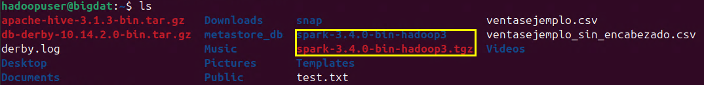
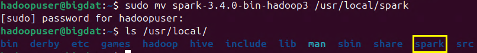
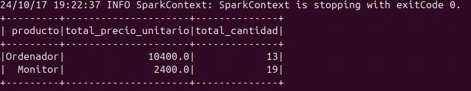
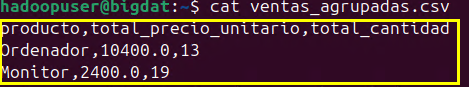
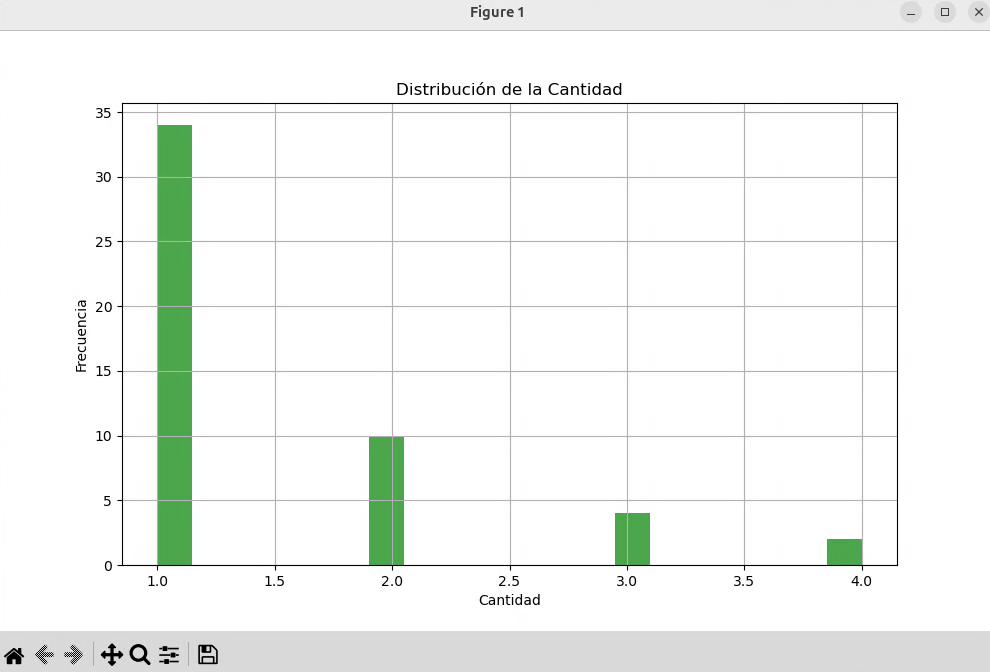

# Implementación de tareas de procesamiento y análisis de datos con PySpark, incluyendo un proyecto de Machine Learning

## Objetivo de la práctica:

Al finalizar la práctica, serás capaz de:

- Configurar el entorno PySpark.
- Ingestar y procesar datos.
- Realizar un análisis exploratorio de datos (EDA) con PySpark.
- Implementar un modelo de machine learning con PySpark MLlib.

## Duración aproximada:
- 110 minutos.

---

**[⬅️ Atrás](/Capítulo2/lab2.1.md)** | **[Lista General](README.md)** | **[Siguiente ➡️](/Capítulo4/lab4.1.md)**

---

## Instrucciones 

### Tarea 1. Instalación de PySpark

**NOTA:** A lo largo de la práctica habrá imágenes para que puedas apoyarte y mejorar la experiencia de configuración.

**NOTA IMPORTANTE:** Usarás el entorno gráfico del sistema operativo UBUNTU, pero **todo lo realizarás por terminal**.

**NOTA:** Abre una **terminal** dentro del sistema de UBUNTU.

Paso 1. Descarga Apache Spark desde el sitio oficial.

```
wget https://archive.apache.org/dist/spark/spark-3.4.0/spark-3.4.0-bin-hadoop3.tgz
```


Paso 2. Extrae la información del archivo descargado, copia el siguiente comando. Adicionalmente, verifica con el comando **`ls`**.

```
tar -xvzf spark-3.4.0-bin-hadoop3.tgz
```



Paso 3. Mueve la carpeta al directorio donde tengas permisos, en este caso la ruta **`/usr/local/`**.

```
sudo mv spark-3.4.0-bin-hadoop3 /usr/local/spark
```



Paso 4. Abre el archivo **.bashrc** del usuario **hadoopuser**.

```
nano /home/hadoopuser/.bashrc
```

Paso 5. Añade las siguientes líneas **al final** del archivo para configurar las rutas de Spark.

```
export SPARK_HOME=/usr/local/spark
export PATH=$SPARK_HOME/bin:$PATH
export PYSPARK_PYTHON=python3
```


Paso 6. **Para guardar y cerrar** el archivo en nano, escribe la siguiente combinación de teclas. 

**```CTRL + O```** **`Enter`** `Para guardar el archivo`

**```CTRL + X```** **`Enter`** `Para salir del archivo`

Paso 7. **Actualiza el sistema** con las variables de entorno configuradas, escribe el siguiente comando:

```
source /home/hadoopuser/.bashrc
```

Paso 8. Asegúrate de que el usuario **hadoopuser** tenga acceso a la instalación en **/usr/local/**, copia el siguiente comando.

```
sudo chown -R hadoopuser:hadoopuser /usr/local/spark
```

Paso 9. Verifica que Spark está instalado y configurado correctamente ejecutando **PySpark**:

```
pyspark
```

**NOTA:** Deberías ver el prompt de PySpark con información sobre la versión de Spark.


Paso 10. Prueba ejecutar el siguiente código simple en PySpark para ver si realmente está funcionando.

```
sc = spark.sparkContext
rdd = sc.parallelize([1, 2, 3, 4])
rdd.collect()
```


Paso 11. Una vez terminada la prueba, sal de Spark con el comando **`exit()`**.

**¡TAREA FINALIZADA!**

Has completado la descarga e instalación de Apache Spark con PySpark.

### Tarea 2. Ingestión y procesamiento de datos.

En esta tarea realizarás la carga y procesamiento de un conjunto de datos utilizando PySpark.

**NOTA:** Solo en caso de que se haya cerrado la sesión, inicia sesión con el usuario **hadoopuser** y contraseña **ubunhadoop**.

Paso 1. Crea una carpeta donde guardarás los scripts dentro del directorio del usuario hadoopuser, copia el siguiente comando.

```
mkdir -p /home/hadoopuser/spark_lab_3.1/scripts
```

**NOTA:** Puedes verificar con el comando **`ls`**.


Paso 2. Crea un archivo Python para la lectura de datos. Nombra este **lectura_csv.py** y guárdalo en la carpeta **spark_lab_3.1**.

```
sudo nano /home/hadoopuser/spark_lab_3.1/lectura_csv.py
```

Paso 3. Escribe el siguiente código dentro del archivo, que se encargará de cargar el archivo CSV, **puedes copiar y pegarlo para no tener errores.**

```
# Importar librerías necesarias
from pyspark.sql import SparkSession

# Crear una sesión de Spark
spark = SparkSession.builder \
    .appName("Lectura de archivo CSV") \
    .getOrCreate()

# Cargar el archivo CSV desde la URL proporcionada
df = spark.read.csv("/home/hadoopuser/ventasejemplo.csv", 
                    header=True, inferSchema=True)

# Mostrar las primeras filas del DataFrame
df.show(5)

# Detener la sesión de Spark
spark.stop()
```

**```CTRL + O```** **`Enter`** `Para guardar el archivo`

**```CTRL + X```** **`Enter`** `Para salir del archivo`


Paso 4. Ahora ejecuta el archivo que acabas de crear para verificar que se haya creado correctamente, copia el siguiente comando:

```
spark-submit /home/hadoopuser/spark_lab_3.1/lectura_csv.py
```


**NOTA:** La imagen nos indica que Spark ha cargado correctamente los datos y leído la información.

Paso 5. Crea un archivo Python para la limpieza de datos. Nombra este **limpieza_csv.py** y guárdalo en la carpeta **spark_lab_3.1**.

```
sudo nano /home/hadoopuser/spark_lab_3.1/limpieza_csv.py
```

Paso 6. Ahora copia el siguiente código en el archivo **limpieza_csv.py** que limpia los datos (eliminando duplicados y llenando valores nulos).

```
# Importar librerías necesarias
from pyspark.sql import SparkSession

# Crear una sesión de Spark
spark = SparkSession.builder \
    .appName("Limpieza de datos") \
    .getOrCreate()

# Cargar el archivo CSV desde la ruta local
df = spark.read.csv("/home/hadoopuser/ventasejemplo.csv", 
                    header=True, inferSchema=True)

# Eliminar duplicados
df_cleaned = df.dropDuplicates()

# Manejar valores nulos
df_cleaned = df_cleaned.na.fill({
    'precio_unitario': 0,
    'producto': 'Desconocido'
})

# Mostrar el DataFrame limpio
df_cleaned.show(5)

# Detener la sesión de Spark
spark.stop()
```

**```CTRL + O```** **`Enter`** `Para guardar el archivo`

**```CTRL + X```** **`Enter`** `Para salir del archivo`


Paso 7. Ahora ejecuta el archivo que acabas de crear para verificar que se haya creado correctamente, copia el siguiente comando:

```
spark-submit /home/hadoopuser/spark_lab_3.1/limpieza_csv.py
```


**NOTA:** El resultado cambio ya que hizo la limpieza en los datos.

Paso 8. Crea un archivo Python para la transformación de datos. Nombra este **transformacion_csv.py** y guárdalo en la carpeta **spark_lab_3.1**.

```
sudo nano /home/hadoopuser/spark_lab_3.1/transformacion_csv.py
```

Paso 9. Ahora copia el siguiente código en el archivo **transformacion_csv.py** que transforma los datos (seleccionando columnas, filtrando y realizando agregaciones).

```
# Importar librerías necesarias
from pyspark.sql import SparkSession

# Crear una sesión de Spark
spark = SparkSession.builder \
    .appName("Transformaciones básicas") \
    .getOrCreate()

# Cargar los datos limpios desde la ruta local
df_cleaned = spark.read.csv("/home/hadoopuser/ventasejemplo.csv", 
                            header=True, inferSchema=True).dropDuplicates().na.fill({
                                'precio_unitario': 0,
                                'producto': 'Desconocido'
                            })

# Selección de columnas importantes
df_selected = df_cleaned.select("producto", "precio_unitario", "cantidad", "fecha_venta")

# Filtrado de filas (por ejemplo, precio_unitario mayor que 100)
df_filtered = df_selected.filter(df_selected["precio_unitario"] > 100)

# Agregación por producto (suma de precio_unitario y cantidad)
df_aggregated = df_filtered.groupBy("producto") \
    .agg({"precio_unitario": "sum", "cantidad": "sum"}) \
    .withColumnRenamed("sum(precio_unitario)", "total_precio_unitario") \
    .withColumnRenamed("sum(cantidad)", "total_cantidad")

# Mostrar el resultado de la agregación
df_aggregated.show(5)

# Detener la sesión de Spark
spark.stop()
```

**```CTRL + O```** **`Enter`** `Para guardar el archivo`

**```CTRL + X```** **`Enter`** `Para salir del archivo`


Paso 10. Ahora ejecuta el archivo que acabas de crear para verificar que se haya creado correctamente, copia el siguiente comando:

```
spark-submit /home/hadoopuser/spark_lab_3.1/transformacion_csv.py
```



**NOTA:** El resultado cambió ya que hizo la transformación de los datos.

Paso 11. Crea un archivo Python para la transformación de datos. Nombra este **guardado_csv.py** y guárdalo en la carpeta **spark_lab_3.1**.

```
sudo nano /home/hadoopuser/spark_lab_3.1/guardado_csv.py
```

Paso 12. Ahora copia el siguiente código en el archivo **guardado_csv.py** que guarda el resultado final de las transformaciones en un archivo CSV.

```
# Importar librerías necesarias
from pyspark.sql import SparkSession
import shutil
import os

# Crear una sesión de Spark
spark = SparkSession.builder \
    .appName("Guardar resultados") \
    .getOrCreate()

# Cargar los datos limpios desde la ruta local
df_cleaned = spark.read.csv("/home/hadoopuser/ventasejemplo.csv", 
                            header=True, inferSchema=True).dropDuplicates().na.fill({
                                'precio_unitario': 0,
                                'producto': 'Desconocido'
                            })

# Seleccionar y filtrar los datos
df_selected = df_cleaned.select("producto", "precio_unitario", "cantidad", "fecha_venta")

# Filtrar los datos donde el precio_unitario es mayor que 100
df_filtered = df_selected.filter(df_selected["precio_unitario"] > 100)

# Agregación por producto (suma de precio_unitario y cantidad)
df_aggregated = df_filtered.groupBy("producto") \
    .agg({"precio_unitario": "sum", "cantidad": "sum"}) \
    .withColumnRenamed("sum(precio_unitario)", "total_precio_unitario") \
    .withColumnRenamed("sum(cantidad)", "total_cantidad")

# Definir la ruta de salida
output_dir = "/home/hadoopuser/ventas_agrupadas_temp"
output_file = "/home/hadoopuser/ventas_agrupadas.csv"

# Eliminar el directorio de salida si ya existe
if os.path.exists(output_dir):
    shutil.rmtree(output_dir)

# Guardar el resultado en un archivo CSV, configurando el modo de escritura como "overwrite"
df_aggregated.coalesce(1).write.mode("overwrite").csv(output_dir, header=True)

# Renombrar el archivo generado por Spark a un nombre específico
temp_file = [f for f in os.listdir(output_dir) if f.endswith(".csv")][0]
shutil.move(f"{output_dir}/{temp_file}", output_file)

# Eliminar la carpeta temporal creada por Spark
shutil.rmtree(output_dir)

# Detener la sesión de Spark
spark.stop()
```

**```CTRL + O```** **`Enter`** `Para guardar el archivo`

**```CTRL + X```** **`Enter`** `Para salir del archivo`


Paso 13. Ahora ejecuta el archivo que acabas de crear para verificar que se haya creado correctamente, copia el siguiente comando:

```
spark-submit /home/hadoopuser/spark_lab_3.1/guardado_csv.py
```


**NOTA:** El resultado muestra el directorio donde se guardó el archivo temporalmente.

Paso 14. Ahora verifica que el archivo se haya guardado, escribe el comando en la terminal **`ls`**.


Paso 15. Verifica el contenido, copia el comando siguiente.

```
cat ventas_agrupadas.csv
```

**NOTA:** El resultado muestra los datos transformados y guardados adecuadamente.



**¡TAREA FINALIZADA!**

Has completado la Ingestión y procesamiento de datos usando PySpark.

### Tarea 3. Análisis exploratorio de datos (EDA) con PySpark

En esta tarea realizarás un análisis exploratorio usando PySpark DataFrame API.

Paso 1. Primero, calculamos estadísticas descriptivas como el conteo, media, desviación estándar, valores mínimos y máximos de las columnas numéricas del DataFrame.

Paso 2. Crea el siguiente archivo llamado **`calculo_estadistico.py`** en la misma ruta que los archivos anteriores.

```
sudo nano /home/hadoopuser/spark_lab_3.1/calculo_estadistico.py
```

Paso 3. Ahora agrega el siguiente código en el archivo **calculo_estadistico.py** que realiza las estadísticas mencionadas.

```
# calculo_estadisticas.py
from pyspark.sql import SparkSession

# Crear una sesión de Spark
spark = SparkSession.builder \
    .appName("EDA - Cálculo de Estadísticas Descriptivas") \
    .getOrCreate()

# Cargar los datos limpios desde la ruta local
df_cleaned = spark.read.csv("/home/hadoopuser/ventasejemplo.csv", 
                            header=True, inferSchema=True).dropDuplicates().na.fill({
                                'precio_unitario': 0,
                                'producto': 'Desconocido'
                            })

# Cálculo de estadísticas descriptivas
df_cleaned.describe(["precio_unitario", "cantidad"]).show()

# Detener la sesión de Spark
spark.stop()
```


**```CTRL + O```** **`Enter`** `Para guardar el archivo`

**```CTRL + X```** **`Enter`** `Para salir del archivo`

Paso 4. Ahora ejecuta el archivo que acabas de crear para verificar que se haya creado correctamente, copia el siguiente comando:

```
spark-submit /home/hadoopuser/spark_lab_3.1/calculo_estadistico.py
```


Paso 5. Para crear visualizaciones de las distribuciones, necesitas convertir el DataFrame de PySpark en un DataFrame de Pandas (ya que matplotlib no puede trabajar directamente con PySpark).

Paso 6. Primero instala **Python** que aunque hemos trabajado con procesamiento no lo tenemos instalado, escribe el siguiente comando.

```
sudo apt install python3-pip -y
```
**NOTA:** Espera un momento el proceso de instalación, una vez terminado continúa al siguiente paso.

Paso 7. Ahora instala **matplotlib** ya que tampoco lo hemos usado por ende no está instalado, copia el siguiente código.

```
sudo apt install python3-matplotlib -y
```

**NOTA:** Espera un momento el proceso de instalación, una vez terminado continúa al siguiente paso.

Paso 8. Instala también **Pandas** para interactuar con los **DataFrames** del Script de Spark, copia el siguiente código.

```
sudo apt install python3-pandas -y
```

**NOTA:** Espera un momento el proceso de instalación, una vez terminado continúa al siguiente paso.

Paso 9. Crea el siguiente archivo llamado **`visualizacion.py`** en la misma ruta que los archivos anteriores.

```
sudo nano /home/hadoopuser/spark_lab_3.1/visualizacion.py
```

Paso 10. Ahora agrega el siguiente código en el archivo **visualizacion.py** que visualiza las estadísticas generadas anteriores.

```
# visualizacion.py
import matplotlib.pyplot as plt
from pyspark.sql import SparkSession

# Crear una sesión de Spark
spark = SparkSession.builder \
    .appName("EDA - Visualización de Distribuciones") \
    .getOrCreate()

# Cargar los datos limpios desde la ruta local
df_cleaned = spark.read.csv("/home/hadoopuser/ventasejemplo.csv", 
                            header=True, inferSchema=True).dropDuplicates().na.fill({
                                'precio_unitario': 0,
                                'producto': 'Desconocido'
                            })

# Convertir el DataFrame de PySpark a Pandas para visualización
df_pandas = df_cleaned.select("precio_unitario", "cantidad").toPandas()

# Crear un histograma de la columna precio_unitario
plt.figure(figsize=(10, 6))
plt.hist(df_pandas["precio_unitario"], bins=20, color='blue', alpha=0.7)
plt.title("Distribución del Precio Unitario")
plt.xlabel("Precio Unitario")
plt.ylabel("Frecuencia")
plt.grid(True)
plt.show()

# Crear un histograma de la columna cantidad
plt.figure(figsize=(10, 6))
plt.hist(df_pandas["cantidad"], bins=20, color='green', alpha=0.7)
plt.title("Distribución de la Cantidad")
plt.xlabel("Cantidad")
plt.ylabel("Frecuencia")
plt.grid(True)
plt.show()

# Detener la sesión de Spark
spark.stop()
```


**```CTRL + O```** **`Enter`** `Para guardar el archivo`

**```CTRL + X```** **`Enter`** `Para salir del archivo`

Paso 11. Ahora ejecuta el archivo que acabas de crear para verificar que se haya creado correctamente, copia el siguiente comando:

```
spark-submit /home/hadoopuser/spark_lab_3.1/visualizacion.py
```




Paso 12. El análisis de correlación permite ver la relación entre dos variables numéricas, como precio_unitario y cantidad. Usaremos la función corr() de PySpark para calcular el coeficiente de correlación de Pearson.

Paso 13. Crea el siguiente archivo llamado **`analisis.py`** en la misma ruta que los archivos anteriores.

```
sudo nano /home/hadoopuser/spark_lab_3.1/analisis.py
```

Paso 14. Ahora agrega el siguiente código en el archivo **analisis.py** que realiza la correlación entre las 2 variables.

```
# analisis.py
from pyspark.sql import SparkSession

# Crear una sesión de Spark
spark = SparkSession.builder \
    .appName("EDA - Análisis de Correlaciones") \
    .getOrCreate()

# Cargar los datos limpios desde la ruta local
df_cleaned = spark.read.csv("/home/hadoopuser/ventasejemplo.csv", 
                            header=True, inferSchema=True).dropDuplicates().na.fill({
                                'precio_unitario': 0,
                                'producto': 'Desconocido'
                            })

# Calcular la correlación entre precio_unitario y cantidad
correlacion = df_cleaned.stat.corr("precio_unitario", "cantidad")
print(f"Correlación entre Precio Unitario y Cantidad: {correlacion}")

# Detener la sesión de Spark
spark.stop()
```


**```CTRL + O```** **`Enter`** `Para guardar el archivo`

**```CTRL + X```** **`Enter`** `Para salir del archivo`

Paso 15. Ahora ejecuta el archivo que acabas de crear para verificar que se haya creado correctamente, copia el siguiente comando:

```
spark-submit /home/hadoopuser/spark_lab_3.1/analisis.py
```


**NOTA:** El resultado de la [Correlación de Pearson](https://datatab.es/tutorial/pearson-correlation) de **-0.3585** entre el Precio Unitario y la Cantidad sugiere una **correlación negativa** moderada entre las dos variables.

**Valor negativo:** Indica que, en general, a medida que el precio unitario aumenta, la cantidad tiende a disminuir, y viceversa.

**En resumen**, la correlación negativa moderada (-0.3585) indica que, en este caso, al aumentar el precio unitario, la cantidad comprada tiende a reducirse, pero no de manera drástica.

**¡TAREA FINALIZADA!**

Haz completado el análisis exploratorio usando PySpark DataFrame API.

### Tarea 4. Implementación de un modelo de machine learning con PySpark MLlib

Dentro de la tarea usaras un algoritmo de Regresión Logística para clasificación, dividiendo el conjunto de datos en entrenamiento y prueba, entrenando el modelo, y evaluando su rendimiento.

Paso 1. Vas a dividir el dataset procesado en dos subconjuntos: uno para entrenar el modelo (80%) y otro para probar su rendimiento (20%).

Paso 2. Primero crea el siguiente archivo llamado **`division_datos.py`** en la misma ruta que los archivos anteriores.

```
sudo nano /home/hadoopuser/spark_lab_3.1/division_datos.py
```

Paso 3. Ahora agrega el siguiente código en el archivo **division_datos.py** que separará la información para el entrenamiento y pruebas.

```
# division_datos.py
from pyspark.sql import SparkSession

# Crear una sesión de Spark
spark = SparkSession.builder \
    .appName("División del Dataset") \
    .getOrCreate()

# Cargar los datos procesados desde la ruta local
df_cleaned = spark.read.csv("/home/hadoopuser/ventasejemplo.csv", 
                            header=True, inferSchema=True).dropDuplicates().na.fill({
                                'precio_unitario': 0,
                                'producto': 'Desconocido'
                            })

# Seleccionar las columnas necesarias para el modelo
df_cleaned = df_cleaned.withColumnRenamed("cantidad", "label")  # Etiquetar "cantidad" como variable de salida

# Dividir los datos en conjuntos de entrenamiento (80%) y prueba (20%)
train_df, test_df = df_cleaned.randomSplit([0.8, 0.2], seed=42)

# Guardar los datasets en archivos CSV (opcional)
train_df.write.csv("/home/hadoopuser/spark_lab_3.1/mldata/train_data.csv", header=True)
test_df.write.csv("/home/hadoopuser/spark_lab_3.1/mldata/test_data.csv", header=True)

# Detener la sesión de Spark
spark.stop()
```


**```CTRL + O```** **`Enter`** `Para guardar el archivo`

**```CTRL + X```** **`Enter`** `Para salir del archivo`

Paso 4. Ahora ejecuta el archivo que acabas de crear para verificar que se haya creado correctamente, copia el siguiente comando:

```
spark-submit /home/hadoopuser/spark_lab_3.1/division_datos.py
```

**NOTA:** Los resultados se pueden mostrar en diferentes partes de los logs de la ejecución de Spark.


Paso 5. Puedes verificar que se hayan creado correctamente los archivos, copiando el siguiente comando.

```
ls /home/hadoopuser/spark_lab_3.1/mldata
```


Paso 6. Ahora entrenaras un modelo de [**Regresión Logística**](https://datascientest.com/es/que-es-la-regresion-logistica) utilizando el conjunto de datos de entrenamiento.

Paso 7. Crea el siguiente archivo llamado **`entrenamiento.py`** en la misma ruta que los archivos anteriores.

```
sudo nano /home/hadoopuser/spark_lab_3.1/entrenamiento.py
```

Paso 8. Agrega el siguiente código en el archivo **entrenamiento.py** que realizará el entrenamiento del modelo con el 80% de datos separados previamente.

```
from pyspark.sql import SparkSession
from pyspark.ml.feature import VectorAssembler
from pyspark.ml.classification import LogisticRegression

# Crear una sesión de Spark
spark = SparkSession.builder \
    .appName("Entrenamiento de Modelo de ML") \
    .getOrCreate()

# Cargar el conjunto de entrenamiento
train_df = spark.read.csv("/home/hadoopuser/spark_lab_3.1/mldata/train_data.csv", header=True, inferSchema=True)

# Asegurarse de que la columna 'label' solo tenga dos clases (0 y 1)
train_df = train_df.filter(train_df["label"].isin([0, 1]))

# Crear el vector de características
assembler = VectorAssembler(inputCols=["precio_unitario"], outputCol="features")
train_data = assembler.transform(train_df)

# Seleccionar el algoritmo de ML - Regresión Logística
lr = LogisticRegression(maxIter=10, regParam=0.3, elasticNetParam=0.8)

# Entrenar el modelo
model = lr.fit(train_data)

# Guardar el modelo entrenado
model.save("/home/hadoopuser/spark_lab_3.1/mlmodel/modelo_entrenado")

# Detener la sesión de Spark
spark.stop()
```


**```CTRL + O```** **`Enter`** `Para guardar el archivo`

**```CTRL + X```** **`Enter`** `Para salir del archivo`

Paso 9. Ahora ejecuta el archivo que acabas de crear para verificar que se haya creado correctamente, copia el siguiente comando:

```
spark-submit /home/hadoopuser/spark_lab_3.1/entrenamiento.py
```

**NOTA:** Algunos resultados estadisticos del modelo entrenado pueden aparecer en la ejecución del script de Spark.


Paso 10. Puedes verificar que se hayan creado correctamente el archivo del modelo de entrenamiento en la siguiente ruta, copia y pega en la terminal.

```
ls /home/hadoopuser/spark_lab_3.1/mlmodel
```


Paso 11. Evaluar el rendimiento del modelo utilizando la métrica [Área bajo la curva ROC](https://aprendeia.com/curvas-roc-y-area-bajo-la-curva-auc-machine-learning/). Un valor cercano a 1 indica un modelo muy preciso, mientras que un valor cercano a 0.5 indica un modelo con un rendimiento similar a una elección aleatoria.

Paso 12. Crea el siguiente archivo llamado **`evaluacion.py`** en la misma ruta que los archivos anteriores.

```
sudo nano /home/hadoopuser/spark_lab_3.1/evaluacion.py
```

Paso 13. Agrega el siguiente código en el archivo **evaluacion.py** que realizará la prueba **AUC**.

```
# evaluacion.py
from pyspark.sql import SparkSession
from pyspark.ml.evaluation import BinaryClassificationEvaluator
from pyspark.ml.feature import VectorAssembler
from pyspark.ml.classification import LogisticRegressionModel

# Crear una sesión de Spark
spark = SparkSession.builder \
    .appName("Evaluación de Modelo de ML") \
    .getOrCreate()

# Cargar el conjunto de prueba
test_df = spark.read.csv("/home/hadoopuser/spark_lab_3.1/mldata/test_data.csv", header=True, inferSchema=True)

# Asegurarse de que la columna 'label' solo tenga dos clases (0 y 1)
test_df = test_df.filter(test_df["label"].isin([0, 1]))

# Crear el vector de características
assembler = VectorAssembler(inputCols=["precio_unitario"], outputCol="features")
test_data = assembler.transform(test_df)

# Cargar el modelo entrenado
model = LogisticRegressionModel.load("/home/hadoopuser/spark_lab_3.1/mlmodel/modelo_entrenado")

# Realizar predicciones
predictions = model.transform(test_data)

# Evaluar el rendimiento del modelo usando el evaluador de clasificación binaria
evaluator = BinaryClassificationEvaluator(rawPredictionCol="rawPrediction", labelCol="label", metricName="areaUnderROC")
roc_auc = evaluator.evaluate(predictions)

print(f"Área bajo la curva ROC: {roc_auc}")

# Detener la sesión de Spark
spark.stop()
```


**```CTRL + O```** **`Enter`** `Para guardar el archivo`

**```CTRL + X```** **`Enter`** `Para salir del archivo`

Paso 14. Ahora ejecuta el archivo que acabas de crear para verificar que se haya creado correctamente, copia el siguiente comando:

```
spark-submit /home/hadoopuser/spark_lab_3.1/evaluacion.py
```


**NOTA:** Ese resultado que el modelo para los datos demostrativos tiene una precisión excelente.

**¡TAREA FINALIZADA!**

Haz completado el entrenamiento de un modelo con el algoritmo de Regresión Logística para clasificación.

**LABORATORIO FINALIZADO!**

### Resultado esperado

El resultado final esperado es la ejecución de todos los scripts de Spark correctamente y tener el resultado del modelo de entrenamiento como lo muestra la imagen.


---

**[⬅️ Atrás](/Capítulo2/lab2.1.md)** | **[Lista General](README.md)** | **[Siguiente ➡️](/Capítulo4/lab4.1.md)**

---