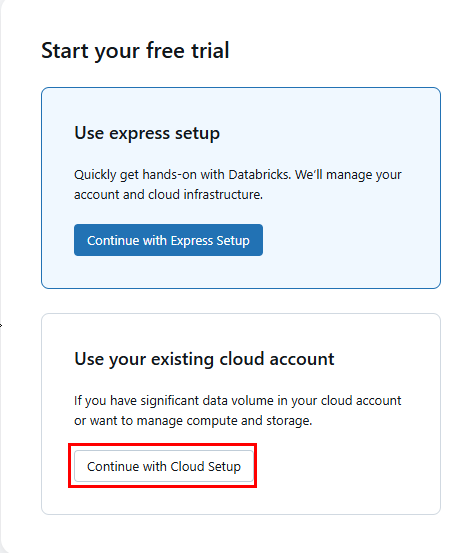
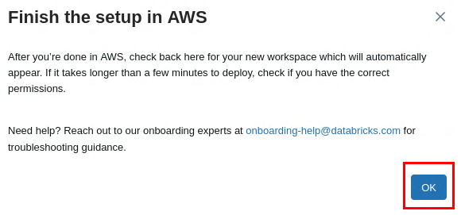
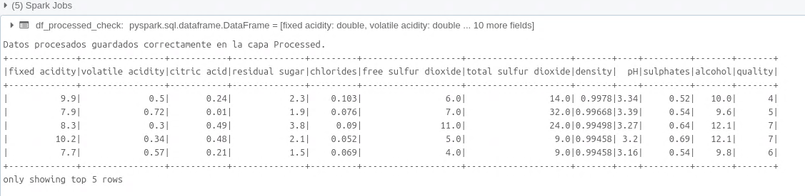

# Práctica 3. Creación y gestión de un Data Lake en Databricks, incluyendo la ingestión y procesamiento de datos en diferentes capas.

## Objetivo de la práctica:

Al finalizar la práctica, serás capaz de:

- Configurar un entorno Databricks para crear y gestionar un Data Lake.
- Ingerir y procesar datos a través de las capas Raw, Processed y Gold.
- Optimizar los datos para un análisis eficiente.

## Duración aproximada:
- 90 minutos.

---

**[⬅️ Atrás](/Capítulo3/lab3.1.md)** | **[Lista General](/README.md)** | **[Siguiente ➡️](/Capítulo5/lab5.1.md)**

---

## Instrucciones 

### Tarea 1. Configuración del entorno Databricks

En esta tarea te registrarás para acceder a tu cuenta en Databricks. Se usará el periodo gratuito de la cuenta para completar tu laboratorio.

**NOTA:** A lo largo de la práctica habrá imágenes para que puedas apoyarte y mejorar la experiencia de configuración.

Paso 1. Abrir el navegador **Firefox** dentro del ambiente de trabajo. Puedes buscarlo en la barra de herramientas lateral (si aparece) o puedes optar por el buscador del sistema.

Paso 2. Una vez abierto, copiar la URL de Databricks para crear la cuenta --> [Databricks Free Trial](https://www.databricks.com/try/databricks-free#account) y pégala en el navegador de **Firefox**.

Paso 3. Dar clic en el botón **Start your free trial**.



Paso 4. Crear una cuenta proporcionando los detalles solicitados en el formulario (correo electrónico, nombre, etc.).


Paso 5. Dar clic en el botón **Get Started**.

Paso 6. Una vez llenados los datos, en la siguiente imagen seleccionar el logo de **AWS** y dar clic en **Get Started**.


**NOTA:** Esta cuenta te dará acceso 14 días a Databricks con 400 USD de crédito para probar la infraestructura.

Paso 7. Ya creada la cuenta, el siguiente paso es autenticarte. Copiar la URL --> [Databricks Sign in](https://accounts.cloud.databricks.com/login?tuuid=98a9b760-3b26-4df5-9041-98030f2c09e1) y pegarla dentro de la máquina virtual de trabajo.

Paso 8. Colocar el correo con el cual te registraste, e iniciar sesión.


Paso 9. En la siguiente ventana te pedirá enlazar la cuenta de **Databricks** con la cuenta de **AWS**.

| Propiedad | Valor | Descripción |
|-----------| ----- | -----------  |
| Workspace name | databricks-lab4.1-workspace-xxxx | Sustituir las letras **x** por las letras iniciales de tu nombre. |
| AWS Region | Oregon (us-west-2) | Región a usar para la nube de AWS. |

Paso 10. Dar clic en el botón **Start Quickstart**.


Paso 11. En la siguiente ventana aparecerá la página de AWS para el inicio de sesión. Colocar los datos asignados dentro del curso.

| Propiedad | Valor | Descripción |
|-----------| ----- | -----------  |
| Account ID (12 digits) or account alias | Asignado en el curso | Número de cuenta de AWS. | 
| IAM user name | Asignado en el curso | Nombre del usuario de la cuenta de AWS. |
| Password | Asignado en el curso | Contraseña del usuario. |


**NOTA:** La imagen es demostrativa **no** copies esos valores.

Paso 12. Dar clic en el botón **Sign in**.

Paso 13. En la sección **Quick create stack**, dejar todos los valores por defecto e ir hasta el final de la pantalla.

Paso 14. Marcar la casilla que comienza con **I acknowledge that AWS...**.


Paso 15. Dar clic en el botón **Create Stack** en la parte inferior derecha.

**NOTA:** Comenzará el proceso de creación de la infraestructura de Databricks en AWS, esto puede tardar de **2 a 4 minutos**. Esperar el despliegue de la infraestructura.

Paso 16. Verificar que todo haya salido correcto y que el stack diga **CREATE_COMPLETE**.


Paso 17. Muy bien! Ahora **regresar** a la pestaña de **Databricks** en el mismo navegador. Dar clic en **OK** en la ventana emergente.



Paso 18. Actualizar la página de **Databricks** si es necesario para ver los cambios.


Paso 19. Recorrer toda la página, a la derecha de la sección **Workspaces** y dar clic en la palabra como hipervínculo **Open**.


Paso 20. Dar clic en la propiedad **Compute** del menú lateral izquierdo.


Paso 21. Ahora, en el centro de la página, dar clic en el botón **Create compute** para crear un clúster de Databricks.


Paso 22. Configurar las siguientes propiedades para la creación del cluster. El cluster se creara hasta el paso **# 24**.

**NOTA:** El resto de las configuraciones no mencionadas en la tabla se quedan por defecto. En el siguiente paso hay más parámetros a configurar.

| Propiedad | Valor | Descripción |
|-----------| ----- | -----------  |
| Policy | Unrestricted | No se aplican restricciones específicas al clúster. |
| Policy | Single node | Para ambientes de desarrollo o pruebas. |
| Access mode | Single user | Para ambientes de desarrollo o pruebas. |
| Databricks runtime version | Runtime: 15.4 LTS (Scala 2.12, Spark 3.5.0) | La versión que es estable y recomendada. |
| Use Photon Acceleration | Desmarcar la casilla | Es un acelerador para cargas de trabajo pesadas, no se usa en esta práctica. |
| Node type | r5.large | Tipo de servidor con recursos para desarrollo. |
| Enable autoscaling local storage | Desmarcar la casilla | Para el ambiente no requerimos almacenamiento elástico. |

**NOTA IMPORTANTE:** Aún no dar clic para crear el clúster, falta definir el disco duro que necesitará el servidor. Avanzar al siguiente paso.


Paso 23. En la siguiente sección de **Advanced Options**, configurar lo siguiente.

| Propiedad | Valor | Descripción |
|-----------| ----- | -----------  |
| EBS volume type | General purpose SSD | Tipo de disco a usar en el clúster de Databricks. |
| # Volumes | 1 | Cantidad de discos a usar. |
| Size in GB | 50 | Tamaño del disco en GB. |


Paso 24. Teniendo toda la configuración, ahora sí dar clic en el botón **Create compute**.

**NOTA:** El clúster puede tardar unos **10 minutos** aproximadamente. Esperar para continuar con la siguiente tarea.


**¡TAREA FINALIZADA!**

Haz completado la configuración del clúster de Databricks.

### Tarea 2. Creación de un Data Lake

En esta tarea crearás la estructura básica de un Data Lake utilizando Databricks y Amazon S3, organizando las diferentes capas (Raw, Processed, Gold).

Paso 1. Recolectar el nombre del bucket creado por el workspace, dar clic en el nombre del workspace.

**NOTA:** Se encuentra en la página anterior.


Paso 2. Copiar el nombre de la propiedad **Bucket name** de la sección **Storage**. Guárdalo en un bloc de notas temporalmente en la máquina virtual.


Paso 3. Ahora dar clic en el hipervínculo de la sección **URL**.


Paso 4. Dar clic en la sección **workspace** del menú lateral izquierdo, y luego hacer clic en **Create** ---> **Notebook**.


Paso 5. En la parte superior dar clic en el nombre aleatorio y renómbralo **`DataLakeNotebook`** elegir **Python** como lenguaje, dar **Enter** o clic en otra parte de la pantalla para guardarlo.


Paso 6. Copiar el siguiente código en la celda del notebook que montará el bucket de S3 en Databricks.

```
# Definir las credenciales y el bucket.
ACCESS_KEY = "tu-access-key-id"
SECRET_KEY = "tu-secret-access-key"
BUCKET_NAME = "tu-nombre-del-bucket"
MOUNT_NAME = "/mnt/datalake"

# Convertir las credenciales en formato URL.
encoded_secret_key = SECRET_KEY.replace("/", "%2F")

# URL para montar S3.
aws_s3_url = f"s3a://{ACCESS_KEY}:{encoded_secret_key}@{BUCKET_NAME}"

# Desmontar el bucket si ya está montado.
try:
    dbutils.fs.unmount(MOUNT_NAME)
except:
    pass

# Montar el bucket en Databricks.
dbutils.fs.mount(
    source=aws_s3_url,
    mount_point=MOUNT_NAME
)
```


Paso 7. Modificar la variable **ACCESS_KEY**, **SECRET_KEY** que te otorgaron al inicio del laboratorio y **bucket_name** con el nombre del bucket que guardaste en el bloc de notas.

**NOTA:** No copies los valores de la imagen.


Paso 8. Ejecutar la celda, dar clic en el botón de la esquina.


Paso 9. En la parte inferior de la celda verás que se ejecutó correctamente.


Paso 10. Agregar otra celda, pasa el puntero en el área resaltada con el marco rojo para ver la opción **Code** y dar clic.


Paso 11. En la celda de abajo, copiar el siguiente código para crear la estructura básica de un Data Lake y ejecutar la celda.

```
# Crear la estructura de carpetas.
dbutils.fs.mkdirs("/mnt/datalake/raw")
dbutils.fs.mkdirs("/mnt/datalake/processed")
dbutils.fs.mkdirs("/mnt/datalake/gold")
```


Paso 12. Agregar una celda más y copiar este código para verificar que las carpetas hayan sido creadas exitosamente.

```
# Listar los directorios creados en el Data Lake.
dbutils.fs.ls("/mnt/datalake/")
```


**¡TAREA FINALIZADA!**

Haz completado la creación de la estructura básica de un Data Lake utilizando Databricks y Amazon S3, organizando las diferentes capas (Raw, Processed, Gold).

### Tarea 3. Ingestión de datos

En esta tarea vas a cargar datos en la capa Raw del Data Lake.

Paso 1. Vamos a simular el proceso de la capa **Raw**. Copiar el siguiente enlace para descargar el archivo de datos crudos, usar el ejemplo de datos **Wine Quality**.

```
https://demoappj864.s3.amazonaws.com/winequality-red.csv
```

Paso 2. Abrir una pestaña de tu navegador en la máquina virtual, copiar y pegar la URL de la página de ---> [AWS](https://us-east-2.signin.aws.amazon.com/oauth?client_id=arn%3Aaws%3Asignin%3A%3A%3Aconsole%2Fcanvas&code_challenge=gfh1_SQ5n7dnq6ETh0C-PoCw4VuI-HLYRfC06evdqHw&code_challenge_method=SHA-256&response_type=code&redirect_uri=https%3A%2F%2Fconsole.aws.amazon.com%2Fconsole%2Fhome%3FhashArgs%3D%2523%26isauthcode%3Dtrue%26state%3DhashArgsFromTB_us-east-2_10ffbbe8d449d843).

Paso 3. Usar los datos que te asignaron al inicio del laboratorio para iniciar sesión en la consola de AWS.


Paso 4. Una vez autenticado, dar clic en el buscador de la parte superior y escribir **S3**, dar clic en el servicio.


Paso 5. Dentro de la lista de los buckets creados por el clúster, dar clic en el que lleve el nombre **bucket** al final.


Paso 6. Dentro del bucket (Data Lake), dar clic en la carpeta llamada **raw**.

Paso 7. Dentro de la carpeta **raw**, dar clic en el botón **Upload** color naranja.

Paso 8. Dar clic en la opción **Add files**, buscar el dataset descargado y cárgalo al bucket.


Paso 9. Al final de la página, dar clic en el botón **Upload**.

Paso 10. Finalmente, dar clic en el botón **Close** de la esquina superior derecha.

Paso 11. **Regresar** a la pestaña donde está el notebook de Databricks y agregar otra celda, copiar y pegar el siguiente código para leer los datos de la capa **Raw**.

```
# Ruta del archivo en S3.
file_path = "/mnt/datalake/raw/winequality-red.csv"

# Leer el archivo CSV en un DataFrame, especificando el delimitador como ';'
df = spark.read.csv(file_path, header=True, inferSchema=True, sep=';')

# Mostrar las primeras 10 filas del DataFrame.
df.show(10)
```


Paso 12. Ejecutar la celda para ver el resultado, dar clic en el botón de play.


**¡TAREA FINALIZADA!**

Haz completado la carga de datos a la capa Raw y la lectura.

### Tarea 4. Procesamiento de datos en la capa Raw

En esta tarea, limpiarás y transformarás los datos del archivo winequality-red.csv que has cargado previamente en la capa Raw del Data Lake y luego guardarás los datos procesados en la capa Processed.

Paso 1. Agregar otra celda debajo de la última para utilizar el método **dropDuplicates()** y eliminar filas duplicadas del DataFrame.

Paso 2. Copiar y pegar el siguiente código en la celda. Ejecutar la celda.

```
# Eliminar duplicados.
df_cleaned = df.dropDuplicates()

# Validación: Comprobar el número de filas antes y después de eliminar duplicados.
original_count = df.count()
cleaned_count = df_cleaned.count()

print(f"Número original de filas: {original_count}, Número de filas después de eliminar duplicados: {cleaned_count}")
```


Paso 3. El resultado es como el de la imagen.


Paso 4. Verificar si hay valores nulos en el DataFrame, agregar otra celda, copiar y pegar el siguiente código.

```
from pyspark.sql import functions as F
from pyspark.sql.functions import count, when, col  # Agregar 'col' aquí

# Mostrar el conteo de valores nulos en cada columna.
null_counts = df_cleaned.select([count(when(col(c).isNull(), c)).alias(c) for c in df_cleaned.columns]).first().asDict()

print("Conteo de valores nulos por columna:")
for column, count in null_counts.items():
    print(f"{column}: {count}")

# Por ejemplo, eliminar filas con valores nulos.
df_cleaned = df_cleaned.na.drop()

# Validación: Comprobar cuántas filas se eliminaron debido a valores nulos.
print(f"Número de filas después de eliminar valores nulos: {df_cleaned.count()}")
```


Paso 5. El resultado es como el de la imagen.


Paso 6. Agregar los resultados para calcular la cantidad promedio de alcohol basada en la calidad del vino, agregar otra celda.

Paso 7. Pegar el siguiente código en la celda y ejecutar.

```
# Ejemplo: calcular el promedio de 'alcohol' agrupado por 'quality'.
df_aggregated = df_cleaned.groupBy("quality").agg(F.avg("alcohol").alias("avg_alcohol"))

# Validación: Comprobar si la agregación devuelve resultados.
if df_aggregated.count() > 0:
    print("Agregación realizada con éxito.")
    df_aggregated.show()
else:
    print("Error: La agregación no devolvió resultados.")
```


Paso 8. El resultado es como el de la imagen.


Paso 9. Finalmente, una vez que los datos han sido limpiados y transformados, guárdalos en la capa Processed. Agregar otra celda.

Paso 10. Copiar y pegar el siguiente código en la celda. Ejecutar la celda.

```
# Ruta para guardar los datos procesados en la capa Processed.
file_path_processed = "/mnt/datalake/processed/winequality-processed.csv"

# Guardar el DataFrame como CSV en la capa Processed.
df_cleaned.write.csv(file_path_processed, header=True, mode='overwrite')

# Validación: Verificar si el archivo fue guardado correctamente.
try:
    df_processed_check = spark.read.csv(file_path_processed, header=True, inferSchema=True)
    print("Datos procesados guardados correctamente en la capa Processed.")
    df_processed_check.show(5)  # Mostrar las primeras 5 filas del archivo guardado
except Exception as e:
    print(f"Error al cargar los datos procesados: {e}")
```


Paso 11. El resultado se mostrará como la imagen.



**¡TAREA FINALIZADA!**

Haz completado un flujo de trabajo que te permitió procesar los datos desde la capa Raw.

### Tarea 5. Consulta de datos en la capa Processed

En esta tarea, realizarás consultas sobre los datos procesados almacenados en la capa Processed del Data Lake utilizando SQL en Databricks.

**NOTA:** Asegúrate de que los datos procesados estén guardados en la capa Processed del Data Lake. Para ello, verificar que has completado la tarea anterior donde los datos se transformaron y se guardaron correctamente.

Paso 1. Crear una tabla temporal para facilitar las consultas SQL. Esto permite consultar los datos directamente sin tener que escribir código PySpark cada vez.

Paso 2. Agregar una celda más, copiar y pegar el siguiente código en la celda.

```
# Crear una tabla temporal para los datos procesados.
df_aggregated.createOrReplaceTempView("wine_quality_processed")

# Comprobar que el DataFrame se creó correctamente.
if df_aggregated is not None:
    print("El DataFrame procesado está listo para la consulta.")
else:
    print("Error: El DataFrame procesado no está definido.")
```


Paso 3. Realizar una consulta para obtener las primeras 10 filas del DataFrame. Copiar y pegar la siguiente consulta en una celda nueva.

```
SELECT * FROM wine_quality_processed LIMIT 10;
```


Paso 4. El resultado muestra una tabla con la información de los datos procesados.


Paso 5. En este siguiente ejemplo, contarás la cantidad de registros por calidad de los datos procesados. Agregar una nueva celda y copiar el código siguiente.

```
SELECT quality, COUNT(*) as count
FROM wine_quality_processed
GROUP BY quality
ORDER BY quality;
```


Paso 6. El resultado será la siguiente tabla.


Paso 7. Ahora obtén estadísticas descriptivas de las columnas numéricas. Agregar una celda nueva, copiar y pegar el siguiente código.

```
%sql
SELECT 
    quality,
    COUNT(*) AS count,
    AVG(avg_alcohol) AS avg_avg_alcohol,
    MIN(avg_alcohol) AS min_avg_alcohol,
    MAX(avg_alcohol) AS max_avg_alcohol
FROM wine_quality_processed
GROUP BY quality
ORDER BY quality;
```


Paso 8. El resultado será la siguiente tabla.


- **quality:** Agrupa los resultados por la calidad del vino.
- **COUNT(*) AS count:** Cuenta el número de registros para cada calidad.
- **AVG(avg_alcohol) AS avg_avg_alcohol:** Calcula el promedio del contenido de alcohol para cada grupo de calidad.
- **MIN(avg_alcohol) AS min_avg_alcohol:** Encuentra el valor mínimo de alcohol promedio para cada grupo de calidad.
- **MAX(avg_alcohol) AS max_avg_alcohol:** Encuentra el valor máximo de alcohol promedio para cada grupo de calidad.
- **ORDER BY quality:** Ordena los resultados por la calidad del vino.

**¡TAREA FINALIZADA!**

Haz completado las consultas sobre los datos procesados almacenados en la capa Processed del Data Lake utilizando SQL en Databricks.

### Tarea 6. Optimización y preparación para análisis.

En esta tarea se aplicará particionamiento y compresión, y se guardarán los datos en la capa Gold del Data Lake.

Paso 1. El **Particionamiento** mejora la eficiencia de las consultas. La **Compresión** reduce el tamaño del archivo para un almacenamiento más eficiente. 

Paso 2. Agregar una celda más, copiar y pegar el siguiente código en la celda. Importar las librerías e inicializar la Sesión de Spark.

```
# Importar las bibliotecas necesarias.
from pyspark.sql import SparkSession

# Inicializar una sesión de Spark.
spark = SparkSession.builder \
    .appName("Optimización y Preparación para Análisis") \
    .getOrCreate()
```


**NOTA:** La carga de librerías no genera un resultado.

Paso 3. Agregar otra celda y pegar el siguiente código que lee el archivo CSV.

```
# Leer el archivo CSV.
try:
    df = spark.read.csv("/mnt/datalake/raw/winequality-red.csv", header=True, inferSchema=True, sep=';')
    print("Archivo CSV cargado correctamente.")
except Exception as e:
    print(f"Error al cargar el archivo CSV: {e}")
    spark.stop()  # Detener la sesión si ocurre un error

# Mostrar el esquema y algunas filas del DataFrame.
print("Esquema del DataFrame original:")
df.printSchema()
print("Primeras 5 filas del DataFrame:")
df.show(5)
```


Paso 4. El resultado será la lectura correcta y el top 5 de los registros de la información.


Paso 5. Guardar el DataFrame en formato Parquet. Copiar y pegar el siguiente código.

```
# Guardar el DataFrame en formato Parquet.
try:
    df.write.mode("overwrite").parquet("mnt/datalake/intermediate/wine_temporal.parquet")
    print("Datos guardados en formato Parquet en la capa intermedia.")
except Exception as e:
    print(f"Error al guardar el DataFrame en Parquet: {e}")
    spark.stop()  # Detener la sesión si ocurre un error
```


Paso 6. El resultado será haber creado exitosamente el formato Parquet.


Paso 7. Leer el archivo Parquet y realizar el particionamiento de los datos. Agregar este código en una celda nueva.

```
# Leer el archivo Parquet optimizado.
try:
    df_optimized = spark.read.parquet("/mnt/datalake/intermediate/wine_temporal.parquet")
    print("Archivo Parquet cargado correctamente.")
except Exception as e:
    print(f"Error al cargar el archivo Parquet: {e}")
    spark.stop()  # Detener la sesión si ocurre un error

# Mostrar el esquema y algunas filas del DataFrame optimizado.
print("Esquema del DataFrame optimizado:")
df_optimized.printSchema()
print("Primeras 5 filas del DataFrame optimizado:")
df_optimized.show(5)

# Particionar y comprimir los datos por la columna 'quality'.
try:
    df_optimized.write.partitionBy("quality").mode("overwrite") \
        .parquet("/mnt/datalake/gold/wine_optimizado", compression="snappy")
    print("Datos particionados y comprimidos en la capa Gold.")
except Exception as e:
    print(f"Error al guardar el DataFrame particionado y comprimido: {e}")
    spark.stop()  # Detener la sesión si ocurre un error
```


Paso 8. El resultado serán los datos particionados y comprimidos para la capa Gold.


Paso 9. Verificar la estructura final del Data Lake. Agregar el siguiente código a una celda nueva.

```
# Verificar la estructura final del Data Lake.
try:
    df_gold = spark.read.parquet("/mnt/datalake/gold/wine_optimizado")
    print("Archivo Parquet de la capa Gold cargado correctamente.")
except Exception as e:
    print(f"Error al cargar el archivo Parquet de la capa Gold: {e}")
    spark.stop()  # Detener la sesión si ocurre un error

# Mostrar el esquema y algunas filas del DataFrame de la capa Gold.
print("Esquema del DataFrame de la capa Gold:")
df_gold.printSchema()
print("Primeras 5 filas del DataFrame de la capa Gold:")
df_gold.show(5)
df_gold = df_gold.repartition(1)

# Comprobar el número de particiones.
num_partitions = df_gold.rdd.getNumPartitions()
print(f"Número de particiones en la capa Gold: {num_partitions}")

df_gold.cache()
# Detener la sesión de Spark.
spark.stop()
```


Paso 10. El resultado mostrará la tabla del DataFrame y la cantidad de particiones. La cantidad de particiones está configurada a 1, pero son más; dado que tenemos recursos limitados, puede que no se muestre adecuadamente el resultado.


Paso 11. Realizar una comprobación de tiempo de la lectura del archivo antes de la optimización. Agregar una nueva celda.

```
import time  # Para medir el tiempo de ejecución.

# Medir el tiempo de lectura del archivo CSV.
start_time_csv = time.time()

# Leer el archivo CSV.
df_csv = spark.read.csv("/mnt/datalake/raw/winequality-red.csv", header=True, inferSchema=True)

# Calcular el tiempo tomado para leer el archivo CSV.
end_time_csv = time.time()
csv_read_time = end_time_csv - start_time_csv

# Mostrar el tiempo de lectura.
print(f"Tiempo de lectura del archivo CSV: {csv_read_time:.2f} segundos")
```


**NOTA:** Si al ejecutar la celda de este paso se marca un error, es causa de la celda anterior, intenta ejecutar la celda de este paso o actualizar la página de la libreta.

Paso 12. El resultado será **8.17 segundos** aproximadamente, el resultado puede variar.


Paso 13. Medir el tiempo de la lectura del archivo después de la optimización. Agregar una nueva celda.

```
# Medir el tiempo de lectura del archivo Parquet.
start_time_parquet = time.time()

# Leer el archivo Parquet.
df_parquet = spark.read.parquet("/mnt/datalake/gold/wine_optimizado")

# Calcular el tiempo tomado para leer el archivo Parquet.
end_time_parquet = time.time()
parquet_read_time = end_time_parquet - start_time_parquet

# Mostrar el tiempo de lectura.
print(f"Tiempo de lectura del archivo Parquet: {parquet_read_time:.2f} segundos")

# Comparar los tiempos de lectura.
print(f"Tiempo de lectura del archivo CSV: {csv_read_time:.2f} segundos")
print(f"Tiempo de lectura del archivo Parquet: {parquet_read_time:.2f} segundos")

# Calcular la mejora en el tiempo de lectura.
improvement = (csv_read_time - parquet_read_time) / csv_read_time * 100
print(f"Mejora en el tiempo de lectura: {improvement:.2f}%")
```


Paso 14. El resultado será **2.36 segundos** aproximadamente, el resultado puede variar.


**¡TAREA FINALIZADA!**

Haz completado el particionamiento y compresión de los datos en la capa Gold del Data Lake.

**LABORATORIO FINALIZADO!**

### Resultado esperado

El resultado final esperado es la ejecución de todas las celdas de la práctica y la comparación de los tiempos de lectura antes y después de la optimización de los datos.


---

**[⬅️ Atrás](/Capítulo3/lab3.1.md)** | **[Lista General](/README.md)** | **[Siguiente ➡️](/Capítulo5/lab5.1.md)**

---
