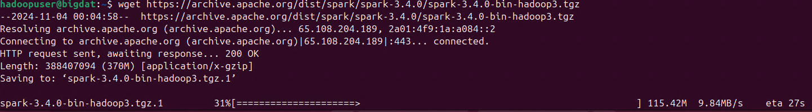

## Demostración de Apache Giraph e implementación de grafos con Apache Spark GraphX

### Objetivo de la práctica:

Al finalizar la práctica, serás capaz de:

- Configurar Apache Giraph en un ambiente de desarrollo en Ubuntu.
- Aprender a configurar Apache Spark en un entorno local en Ubuntu.
- Implementar un análisis simple de grafos utilizando GraphX.
- Visualizar los resultados de los análisis de grafos de manera efectiva.

### Duración aproximada:
- 50 minutos.

---

**[⬅️ Atrás](/Capítulo4/lab4.1.md)** | **[Lista General](/README.md)** | **[Siguiente ➡️](/Capítulo6/lab6.1.md)**

---

### Instrucciones 

#### Tarea 1. Preparación del ambiente para Apache Giraph.

En esta tarea configurarás el entorno **demostrativo** necesario para ejecutar Apache Giraph en Ubuntu .

**NOTA:** A lo largo de la práctica habrá imágenes para que puedas apoyarte y mejorar la experiencia de configuración.

**NOTA IMPORTANTE:** Usarás el entorno gráfico del sistema operativo Ubuntu, pero **todo lo realizarás por terminal**.

**NOTA:** Recuerda que seguimos usando el usuario **hadoopuser** y la contraseña **ubunhadoop**.

**IMPORTANTE:** Es necesario que tengas instalado y ejecutando exitosamente Apache Hadoop para interactuar con Apache Giraph. Puedes verificar los servicios con el comando **`jps`**.

**ALTAMENTE IMPORTANTE:** Esta tarea 1 solo son pasos demostrativos, al final de la tarea saldra un **Error** debido a algunas clases de Java y compatibilidad con el ambiente, cuando termines avanza a la tarea 2 con Spark y GraphX.

Paso 1. Si no tienes abierta una terminal de comandos en Ubuntu, abre una.

Paso 2. Es necesario tener **Java** instalado para ejecutar Giraph. Para verificarlo, ejecuta el siguiente comando en la terminal.

```
java -version
```


**NOTA:** La versión que muestra la imagen está bien para trabajar con Giraph.

Paso 3. Ahora crearás una carpeta para guardar los datos temporales de Hadoop con la interacción de Apache Giraph, copia los siguientes comandos.

```
sudo mkdir -p /app/hadoop/tmp
```
```
sudo chown hadoopuser:hadoopuser /app/hadoop/tmp
```
```
sudo chmod 750 /app/hadoop/tmp
```

Paso 4. Primero apaga los servicios de Hadoop para aplicar los cambios de las siguientes tareas, copia los siguientes comandos.

```
stop-dfs.sh
```
```
stop-yarn.sh
```


Paso 5. Ahora edita el archivo **core-site.xml** de Hadoop para ajustar el archivo temporal creado, copia el siguiente comando.

```
nano $HADOOP_HOME/etc/hadoop/core-site.xml
```

Paso 6. Agrega el siguiente código dentro del archivo, no te preocupes si no queda indentado.

```
<property>
   <name>hadoop.tmp.dir</name>
   <value>/app/hadoop/tmp</value>
</property>
```

**```CTRL + O```** **`Enter`** `Para guardar el archivo`

**```CTRL + X```** **`Enter`** `Para salir del archivo`


Paso 7. Ahora edita el archivo **mapred-site.xml** de Hadoop para ajustar el archivo temporal creado, copia el siguiente comando.

```
nano $HADOOP_HOME/etc/hadoop/mapred-site.xml
```

Paso 8. Agrega el siguiente código dentro del archivo, no te preocupes si no queda indentado.

```
<property>
   <name>mapred.tasktracker.map.tasks.maximum</name>
   <value>4</value>
</property>

<property>
   <name>mapred.map.tasks</name>
   <value>4</value>
</property>
```

**```CTRL + O```** **`Enter`** `Para guardar el archivo`

**```CTRL + X```** **`Enter`** `Para salir del archivo`


Paso 9. Enciende los procesos de Hadoop y YARN, copia los siguientes comandos.

```
start-dfs.sh
```
```
start-yarn.sh
```


Paso 10. Giraph necesita **Apache Maven** para gestionar las dependencias y construir el proyecto. Instálalo con el siguiente comando.

```
sudo apt-get install maven -y
```

**NOTA:** Espera la instalación antes de continuar con el siguiente paso.

Paso 11. Descarga **Giraph** desde el repositorio oficial de **GitHub** y compílalo con Maven. Ejecuta los siguientes comandos uno por uno.

```
cd /usr/local/
```
```
sudo git clone https://github.com/apache/giraph.git
```

- **git clone:** Clona el repositorio oficial de Giraph.


```
sudo chown -R hadoopuser:hadoopuser giraph
```

Paso 12. Es importante configurar las rutas correctas para que el sistema sepa dónde están **Giraph** y **Java**. Abre el archivo **`.bashrc`**.

```
nano /home/hadoopuser/.bashrc
```

Paso 13. Agrega las siguientes líneas al final del archivo, debajo de todas las demás variables.

```
export GIRAPH_HOME=/usr/local/giraph
export PATH=$PATH:$GIRAPH_HOME/bin
```

**```CTRL + O```** **`Enter`** `Para guardar el archivo`

**```CTRL + X```** **`Enter`** `Para salir del archivo`


Paso 14. Actualiza el archivo de variables de entorno, copia el siguiente comando.

```
source $HOME/.bashrc
```

Paso 15. Entra al directorio de Apache Giraph.

```
cd $GIRAPH_HOME
```

Paso 16. Dentro del directorio de Apache Giraph, ejecuta el comando de compilación para generar los archivos necesarios **Jar**.

```
mvn package -DskipTests
```


**NOTA:** El proceso de compilación puede tardar varios minutos.


Paso 17. Ahora crea el archivo de datos llamado **tiny_graph.txt** para realizar una prueba y que todo funcione correctamente.

```
nano /app/hadoop/tmp/tiny_graph.txt
```

Paso 18. Agrega los siguientes datos al archivo que está abierto y guárdalo.

```
[0,0,[[1,1],[3,3]]]
[1,0,[[0,1],[2,2],[3,1]]]
[2,0,[[1,2],[4,4]]]
[3,0,[[0,3],[1,1],[4,4]]]
[4,0,[[3,4],[2,4]]]
```

**```CTRL + O```** **`Enter`** `Para guardar el archivo`

**```CTRL + X```** **`Enter`** `Para salir del archivo`


Paso 19. Crea un directorio dentro del sistema de Hadoop para guardar el archivo de datos, copia el siguiente comando.

```
hdfs dfs -mkdir /user/giraph/
```

Paso 20. Ahora sube el archivo de datos al directorio de Hadoop creado previamente, copia y pega el siguiente comando.

```
hdfs dfs -put /app/hadoop/tmp/tiny_graph.txt /user/giraph/
```

Paso 21. Finalmente verifica que se haya cargado correctamente, copia y pega el siguiente comando.

```
hdfs dfs -ls /user/giraph/
```


Paso 22. Ahora ejecuta el siguiente comando en la terminal.

**NOTA:** Recuerda que en esta tarea son pasos demostrativos, una vez ejecutado el comando el resultado será un **Error** debido a algunas clases de Java y compatibilidad con el ambiente.

```
$HADOOP_HOME/bin/hadoop jar giraph-examples/target/giraph-examples-1.4.0-SNAPSHOT-for-hadoop-1.2.1-jar-with-dependencies.jar org.apache.giraph.GiraphRunner org.apache.giraph.examples.SimpleShortestPathsComputation -vif org.apache.giraph.io.formats.JsonLongDoubleFloatDoubleVertexInputFormat -vip /user/giraph/tiny_graph.txt -vof org.apache.giraph.io.formats.IdWithValueTextOutputFormat -op /user/giraph/output/shortestpaths -w 1
```

**NOTA:** El error en la imagen es normal para este laboratorio es una tarea **demostrativa**, avanza a las siguientes tareas.


**¡TAREA FINALIZADA!**

Has completado la preparación del ambiente para Apache Giraph.

### Tarea 2. Instalación de Apache Spark.

En esta tarea, descargarás e instalarás Apache Spark y sus dependencias.

Paso 1. Escribe el siguiente comando que cambiará de ruta, al home del usuario **hadoopuser**.

```
cd ~
```

Paso 2. Apache Spark requiere Java, necesitas instalar las dependencias.

**NOTA:** Si ya las instalaste en prácticas previas, puedes avanzar al paso 3 para verificar que esté instalado.

```
sudo apt update
```

```
sudo apt install openjdk-8-jdk
```


Paso 3. Verifica la instalación de Java 8.

```
java -version
```


Paso 4. Para este ejemplo usarás la versión 3.4.0 de Apache Spark. Copia y pega el siguiente comando en la terminal.

**NOTA:** Puede que ya tengas descargado el software de Apache, verifica con el comando **`ls`**.

```
wget https://archive.apache.org/dist/spark/spark-3.4.0/spark-3.4.0-bin-hadoop3.tgz
```



Paso 5. Una vez descargado, descomprime el archivo utilizando el siguiente comando.

```
tar -xvzf spark-3.4.0-bin-hadoop3.tgz
```

Paso 6. Es una buena práctica mover los archivos de instalación al directorio **/usr/local/**.

**IMPORTANTE:** Antes de moverlo, **verifica** que ya lo tengas con el siguiente comando: **`ls /usr/local/`**, recuerda que si realizaste correctamente la práctica anterior de Spark ya deberías tener la carpeta ahí.

```
sudo mv spark-3.4.0-bin-hadoop3 /usr/local/spark
```

Paso 7. Verifica con el siguiente comando que se haya movido correctamente la carpeta.

```
ls /usr/local/
```


Paso 8. Para facilitar el uso de Spark, necesitas configurar las variables de entorno. Abre tu archivo de configuración de bash.

**NOTA:** Recuerda que estas variables posiblemente ya las tengas, solo verifica que existan. **Si no** existen, configúralas en el paso 9.

```
nano ~/.bashrc
```


Paso 9. **SOLO SI NO** tienes las variables, agrégalas al final del archivo.

**NOTA:** Si ya las tienes, avanza al paso 10.

```
export SPARK_HOME=/usr/local/spark
export PATH=$SPARK_HOME/bin:$PATH
```

**```CTRL + O```** **`Enter`** `Para guardar el archivo`

**```CTRL + X```** **`Enter`** `Para salir del archivo`

Paso 10. Ejecuta el siguiente comando para aplicar los cambios sin reiniciar.

```
source ~/.bashrc
```

**¡TAREA FINALIZADA!**

Has completado la configuración de Apache Spark.

### Tarea 3. Configuración de un proyecto de grafos en Spark con Java.

En esta tarea crearás un proyecto de Maven en Java para usar GraphX en Spark.

Paso 1. Crea y navega a un nuevo directorio para tu proyecto Spark.

```
mkdir SparkGraphXExample
```
```
cd SparkGraphXExample
```


Paso 2. Crea un proyecto de Maven con una estructura fundamental en Java.

```
mvn archetype:generate -DgroupId=com.example -DartifactId=SparkGraphXExample -DarchetypeArtifactId=maven-archetype-quickstart -DinteractiveMode=false
```


Paso 3. Muy bien, ahora entra al directorio del proyecto creado.

```
cd SparkGraphXExample
```

Paso 4. Edita el archivo **pom.xml** para agregar las dependencias de Spark. Abre el archivo con el siguiente comando.

```
nano pom.xml
```

Paso 5. Busca la sección **`<dependencies>`** y añade las siguientes dependencias para Spark y GraphX.

```
<dependency>
    <groupId>org.apache.spark</groupId>
    <artifactId>spark-core_2.12</artifactId>
    <version>3.4.0</version>
</dependency>
<dependency>
    <groupId>org.apache.spark</groupId>
    <artifactId>spark-sql_2.12</artifactId>
    <version>3.4.0</version>
</dependency>
<dependency>
    <groupId>org.apache.spark</groupId>
    <artifactId>spark-graphx_2.12</artifactId>
    <version>3.4.0</version>
</dependency>
```

**```CTRL + O```** **`Enter`** `Para guardar el archivo`

**```CTRL + X```** **`Enter`** `Para salir del archivo`


Paso 6. Ahora agrega la sección de **`<build>`** dentro del archivo pom. Esta sección va dentro del proyecto y antes de que inicien las dependencias. Puedes apoyarte de la imagen.

**NOTA:** Repite el paso 4 para abrir el archivo pom.xml.

```
<build>
    <plugins>
        <plugin>
            <groupId>org.apache.maven.plugins</groupId>
            <artifactId>maven-compiler-plugin</artifactId>
            <version>3.8.1</version>
            <configuration>
                <source>1.8</source>
                <target>1.8</target>
            </configuration>
        </plugin>
    </plugins>
</build>
```

**```CTRL + O```** **`Enter`** `Para guardar el archivo`

**```CTRL + X```** **`Enter`** `Para salir del archivo`


**¡TAREA FINALIZADA!**

Has completado la preparación del proyecto para la elaboración de los grafos con Spark GraphX.

### Tarea 4. Implementación del análisis de grafos con Spark GraphX.

En esta tarea crearás un programa que utilice GraphX para un análisis de grafo simple en Java.

Paso 1. Primero debes navegar al directorio de código fuente del proyecto.

```
cd src/main/java/com/example
```


Paso 2. Dentro de esa ruta crea un archivo llamado **GraphXExample.java**.

```
nano GraphXExample.java
```

Paso 3. Reemplaza el contenido de **GraphXExample.java** con el siguiente código.

```
package com.example;

import org.apache.spark.SparkConf;
import org.apache.spark.api.java.JavaSparkContext;
import org.apache.spark.graphx.Edge;
import org.apache.spark.graphx.Graph;
import org.apache.spark.graphx.VertexRDD;
import org.apache.spark.rdd.RDD;
import org.apache.spark.storage.StorageLevel;
import scala.Tuple2;
import scala.reflect.ClassTag;
import scala.reflect.ClassTag$;

import java.util.ArrayList;
import java.util.List;

public class GraphXExample {
    public static void main(String[] args) {
        // Configuración de Spark
        SparkConf conf = new SparkConf().setAppName("GraphXExample").setMaster("local");
        JavaSparkContext sc = new JavaSparkContext(conf);

        // Creación de los vértices
        List<Tuple2<Object, String>> vertices = new ArrayList<>();
        vertices.add(new Tuple2<>(1L, "Alice"));
        vertices.add(new Tuple2<>(2L, "Bob"));
        vertices.add(new Tuple2<>(3L, "Charlie"));
        vertices.add(new Tuple2<>(4L, "David"));
        vertices.add(new Tuple2<>(5L, "Ed"));

        RDD<Tuple2<Object, String>> vertexRDD = sc.parallelize(vertices).rdd();

        // Creación de las aristas
        List<Edge<String>> edges = new ArrayList<>();
        edges.add(new Edge<>(1L, 2L, "amigos"));
        edges.add(new Edge<>(2L, 3L, "amigos"));
        edges.add(new Edge<>(3L, 4L, "amigos"));
        edges.add(new Edge<>(4L, 5L, "amigos"));

        RDD<Edge<String>> edgeRDD = sc.parallelize(edges).rdd();

        // ClassTags para los tipos de datos
        ClassTag<String> stringTag = ClassTag$.MODULE$.apply(String.class);
        ClassTag<Object> objectTag = ClassTag$.MODULE$.apply(Object.class);

        // Creación del grafo
        Graph<String, String> graph = Graph.apply(vertexRDD, edgeRDD, "default", StorageLevel.MEMORY_ONLY(), StorageLevel.MEMORY_ONLY(), stringTag, stringTag);

        // Operaciones sobre el grafo
        VertexRDD<String> verticesRDD = graph.vertices();
        System.out.println("Número de vértices: " + verticesRDD.count());
        System.out.println("Número de aristas: " + graph.edges().count());

        // Cierre del contexto de Spark
        sc.close();
    }
}
```

**```CTRL + O```** **`Enter`** `Para guardar el archivo`

**```CTRL + X```** **`Enter`** `Para salir del archivo`


**¡TAREA FINALIZADA!**

Has completado la configuración del script para la ejecución del grafo.

### Tarea 5. Ejecución y visualización de resultados

En esta última tarea, probarás el script y verás los resultados sobre la ejecución del grafo.

Paso 1. Asegúrate de estar dentro del directorio del proyecto, escribe el siguiente comando.

```
cd ~/SparkGraphXExample/SparkGraphXExample
```


Paso 2. Compila el proyecto ejecutando el siguiente comando.

```
mvn clean package
```


Paso 3. Si la compilación es exitosa, ejecuta el siguiente comando.

```
/usr/local/spark/bin/spark-submit --class com.example.GraphXExample --master local target/SparkGraphXExample-1.0-SNAPSHOT.jar
```


**Explicación**

- **Número de vértices:** Se definieron cinco vértices **(Alice, Bob, Charlie, David, Ed)**, por lo que el conteo de vértices debería ser 5.

- **Número de aristas:** Se definieron cuatro conexiones o aristas entre estos vértices:

  - Alice -> Bob
  - Bob -> Charlie
  - Charlie -> David
  - David -> Ed

Esto da como resultado un conteo de aristas igual a 4.

**¡TAREA FINALIZADA!**

**LABORATORIO FINALIZADO!**

### Resultado esperado

El resultado esperado es la ejecución correcta de todas las tareas y la verificación de la relación entre los nodos.


---

**[⬅️ Atrás](/Capítulo4/lab4.1.md)** | **[Lista General](/README.md)** | **[Siguiente ➡️](/Capítulo6/lab6.1.md)**

---