# Práctica 5. Configuración y uso de Kafka y Flink para el procesamiento de datos en tiempo real 

## Objetivo de la práctica:

Al finalizar la práctica, serás capaz de:

- Configurar y conectar Apache Kafka y Apache Flink
- Procesar datos en tiempo real

## Duración aproximada:
- 90 minutos.

---

**[⬅️ Atrás](/Capítulo5/lab5.1.md)** | **[Lista General](/README.md)** | **[Siguiente ➡️](/Capítulo7/lab7.1.md)**

---

## Instrucciones 

### Tarea 1. Instalación de Apache Kafka

Apache Kafka es una plataforma distribuida de transmisión de datos que permite la publicación y suscripción de mensajes de manera eficiente. En este paso, descargaremos, instalaremos y configuraremos Apache Kafka en Ubuntu.

**NOTA:** A lo largo de la práctica habrá imágenes para que puedas apoyarte y mejorar la experiencia de configuración.

**NOTA IMPORTANTE:** Usarás el entorno grafico de el sistema operativo UBUNTU, pero **todo lo realizaras por la terminal**.

**NOTA:** Abrir una **terminal** dentro del sistema de UBUNTU

Paso 1. Asegúrate de tener Java 8 instalado. Si ya lo tienes instalado, puedes avanzar al siguiente paso.

```
sudo apt update
```
```
sudo apt install openjdk-8-jdk
```

Paso 2. Kafka depende de Zookeeper para la coordinación de los brokers, incluso si se está utilizando un solo servidor, instalar la dependencia.

```
sudo apt install zookeeperd -y
```

Paso 3. Descargar y descomprimir Kafka.

```
wget https://archive.apache.org/dist/kafka/2.7.0/kafka_2.13-2.7.0.tgz
```
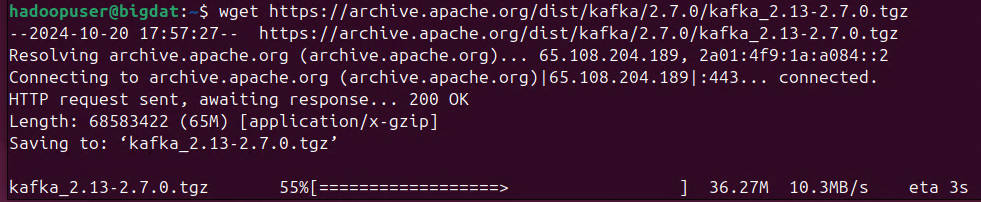
```
tar -xzf kafka_2.13-2.7.0.tgz
```

Paso 4. Verificar que se haya descomprimido correctamente, puedes escribir el comando **`ls`**.

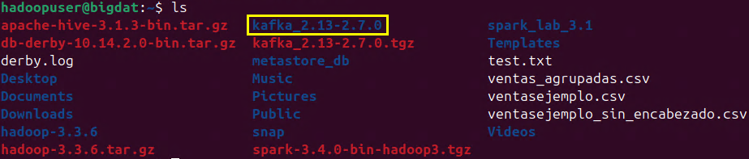

Paso 5. Ingresar a la carpeta de Kafka.

```
cd kafka_2.13-2.7.0
```

Paso 6. Dar los permisos de escritura a zookeeper.

```
sudo chmod -R 777 /tmp/zookeeper
```

Paso 7. Iniciar Zookeeper como proceso en segundo plano.

```
bin/zookeeper-server-start.sh config/zookeeper.properties &
```

**NOTA:** Apareceran un conjunto de logs, ejecutar **Enter** para continar con la terminal

Paso 8. En caso de que los logs te indiquen que el puerto este ocupado, puedes realizar el siguiente troubleshooting.

**NOTA:** **Solo** realizar estos pasos si el puerto esta ocupado por otro proceso. Sino avanza al paso 9.

```
sudo lsof -i :<PORT>
```
```
sudo kill <PID>
```
```
bin/kafka-server-start.sh config/server.properties &
```

Paso 9. Iniciar el broker de Kafka.

```
bin/kafka-server-start.sh config/server.properties &
```

**NOTA:** No habra alguna salida especifica, ejecutar **Enter** para continuar con la terminal.

**¡TAREA FINALIZADA!**

Kafka y Zookeeper estarán en ejecución en el servidor de desarrollo, listos para recibir y transmitir datos.

### Tarea 2. Creación de un topic en Kafka.

En esta tarea crearas un topic en Kafka para almacenar los mensajes que serán procesados. Un topic es un canal donde se publican los mensajes y los consumidores los leen.

Paso 1. Crear un topic llamado **"test-topic"**, escribir el siguiente comando.

```
bin/kafka-topics.sh --create --topic test-topic --bootstrap-server localhost:9092 --partitions 1 --replication-factor 1
```

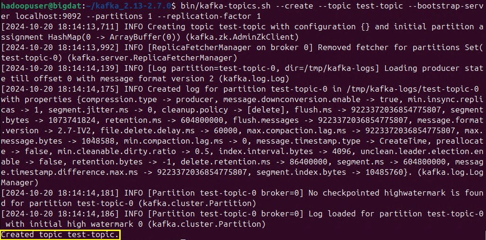

Paso 2. Verificar la creación del topic, con el siguiente comando.

```
bin/kafka-topics.sh --describe --topic test-topic --bootstrap-server localhost:9092
```

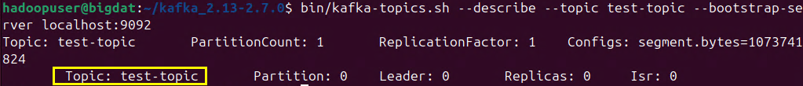

**¡TAREA FINALIZADA!**

Un topic llamado **test-topic** estará listo para enviar y recibir mensajes.

### Tarea 3. Instalación de Apache Flink en el servidor de desarrollo

Apache Flink es un motor de procesamiento de datos en tiempo real. En esta tarea, descargaremos e instalaremos Flink en el servidor.

Paso 1. Salir de la carpeta de Kafka para regresar al directorio **Home**, escribir el siguiente comando.

```
cd ..
```

Paso 2. Primero descarga Apache Flink.

```
wget https://archive.apache.org/dist/flink/flink-1.13.2/flink-1.13.2-bin-scala_2.11.tgz
```

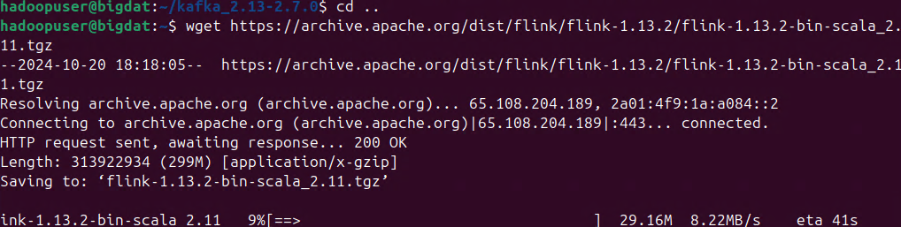

Paso 3. Ahora descomprimir Flink.

```
tar -xzf flink-1.13.2-bin-scala_2.11.tgz
```

Paso 4. Puedes verificar el directorio escribiendo **`ls`**.

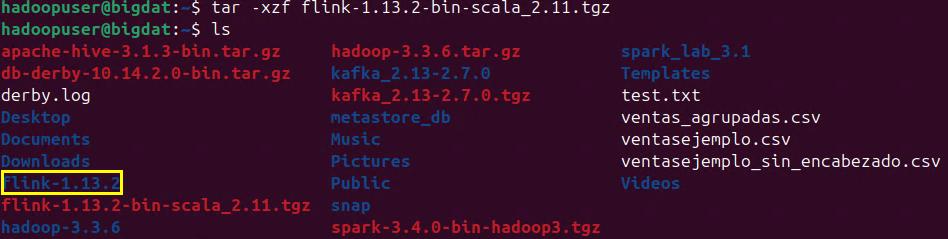

Paso 5. Entrar al directorio de Apache Flink.

```
cd flink-1.13.2
```

Paso 6. Iniciar el servicio de Apache Flink.

```
./bin/start-cluster.sh
```

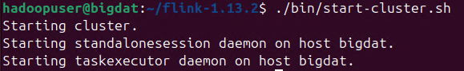

**¡TAREA FINALIZADA!**

Haz completado la instalación de Flink que esta listo para integrarse con Kafka.

### Tarea 4. Creación de un productor y consumidor en Kafka usando Java

En esta tarea vas a escribir código en Java para crear un productor que envíe mensajes a Kafka y un consumidor que lea esos mensajes en tiempo real.

Paso 1. Salir de la carpeta de Flink para regresar al directorio **Home**, escribir el siguiente comando.

```
cd ..
```

Paso 2. Escribir el siguiente comando para inicar un proyecto en **Maven**.

```
mvn archetype:generate -DgroupId=com.example.kafka -DartifactId=kafka-example -DarchetypeArtifactId=maven-archetype-quickstart -DinteractiveMode=false
```
**NOTA:** Esperar el proceso de la inicializacion de proyecto.

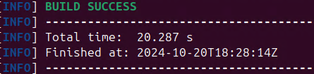

Paso 3. Entrar a la carpeta **kafka-example**.

```
cd kafka-example
```

Paso 4. Abrir el archivo **pom.xml**.

```
nano pom.xml
```

Paso 5. Agregar las dependencias de Kafka y la version de java. Copiar y pegar el codigo. Tambien puedes apoyarte de la imagen.

```
<dependency>
    <groupId>org.apache.kafka</groupId>
    <artifactId>kafka-clients</artifactId>
    <version>2.7.0</version>
</dependency>
```
```
<properties>
        <maven.compiler.source>1.8</maven.compiler.source>
        <maven.compiler.target>1.8</maven.compiler.target>
</properties>
```

**```CTRL + O```** **`Enter`** `Para guardar el archivo`

**```CTRL + X```** **`Enter`** `Para salir del archivo`

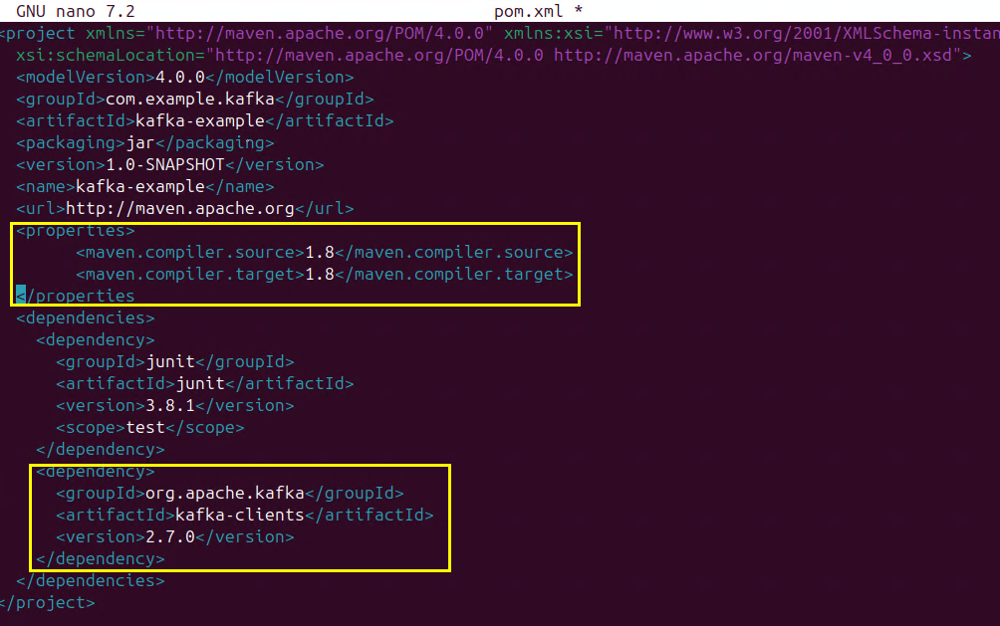

Paso 6. En el directorio `src/main/java/com/example/kafka`, crear un archivo llamado **SimpleProducer.java**

```
rm src/test/java/com/example/kafka/AppTest.java
```
```
nano src/main/java/com/example/kafka/SimpleProducer.java
```

Paso 7. Copiar y pegar el siguiente codigo dentro del archivo recien creado.

```
package com.example.kafka;

import org.apache.kafka.clients.producer.KafkaProducer;
import org.apache.kafka.clients.producer.ProducerRecord;

import java.util.Properties;

public class SimpleProducer {
    public static void main(String[] args) {
        Properties props = new Properties();
        props.put("bootstrap.servers", "localhost:9092");
        props.put("key.serializer", "org.apache.kafka.common.serialization.StringSerializer");
        props.put("value.serializer", "org.apache.kafka.common.serialization.StringSerializer");

        KafkaProducer<String, String> producer = new KafkaProducer<>(props);
        for (int i = 0; i < 10; i++) {
            producer.send(new ProducerRecord<>("test-topic", "key-" + i, "value-" + i));
        }
        producer.close();
    }
}
```

**```CTRL + O```** **`Enter`** `Para guardar el archivo`

**```CTRL + X```** **`Enter`** `Para salir del archivo`

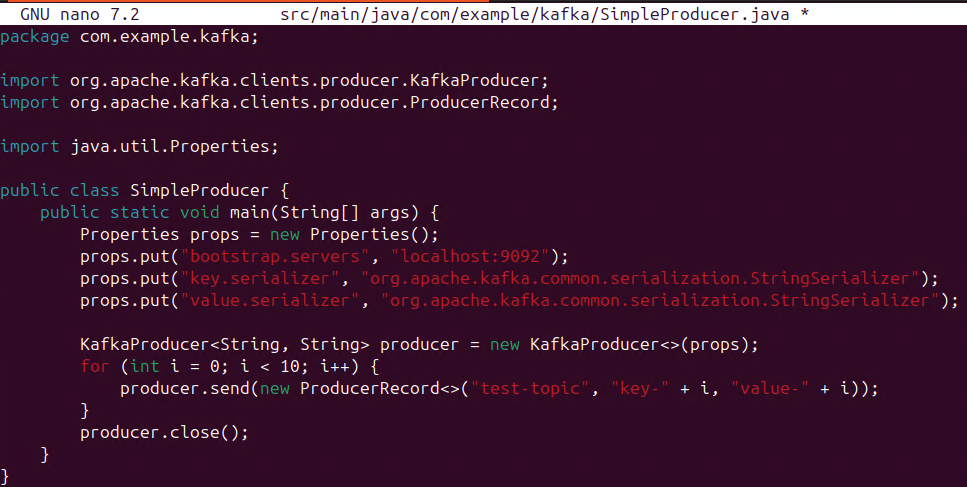

Paso 8. En el mismo directorio `src/main/java/com/example/kafka`, crear otro archivo llamado **SimpleConsumer.java**

```
nano src/main/java/com/example/kafka/SimpleConsumer.java
```

Paso 9. Copiar y pegar el siguiente codigo dentro del archivo recien creado.

```
package com.example.kafka;

import org.apache.kafka.clients.consumer.ConsumerRecord;
import org.apache.kafka.clients.consumer.KafkaConsumer;

import java.util.Collections;
import java.util.Properties;

public class SimpleConsumer {
    public static void main(String[] args) {
        Properties props = new Properties();
        props.put("bootstrap.servers", "localhost:9092");
        props.put("group.id", "test-group");
        props.put("key.deserializer", "org.apache.kafka.common.serialization.StringDeserializer");
        props.put("value.deserializer", "org.apache.kafka.common.serialization.StringDeserializer");

        KafkaConsumer<String, String> consumer = new KafkaConsumer<>(props);
        consumer.subscribe(Collections.singletonList("test-topic"));

        while (true) {
            for (ConsumerRecord<String, String> record : consumer.poll(100)) {
                System.out.printf("key=%s, value=%s%n", record.key(), record.value());
            }
        }
    }
}
```

**```CTRL + O```** **`Enter`** `Para guardar el archivo`

**```CTRL + X```** **`Enter`** `Para salir del archivo`

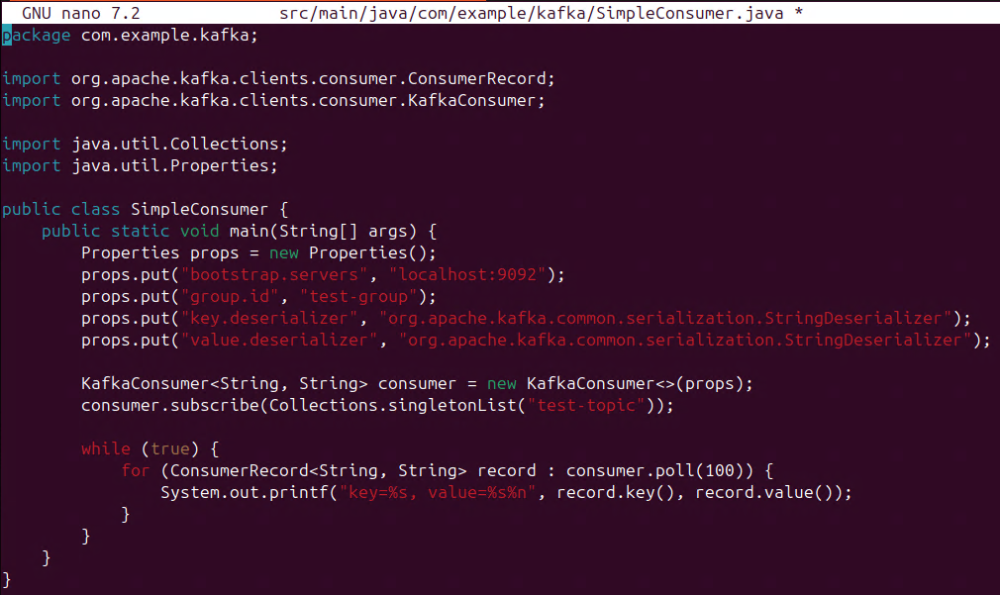

Paso 10. Para compilar el proyecto, ejecutar el siguiente comando.

```
mvn clean install
```

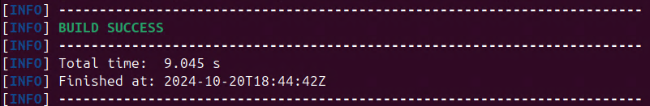

Paso 11. Ejecutar el servicio productor.

```
java -cp target/kafka-example-1.0-SNAPSHOT.jar com.example.kafka.SimpleProducer
```

Paso 12. Si te sale el siguiente mensaje es porque requiere una actualización en el archivo **pom.xml** abrir el archivo.

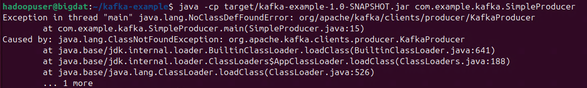

```
nano pom.xml
```

Paso 13. Borrar todas las lineas del archivo existente y pegar el siguiente codigo.

```
<project xmlns="http://maven.apache.org/POM/4.0.0"
         xmlns:xsi="http://www.w3.org/2001/XMLSchema-instance"
         xsi:schemaLocation="http://maven.apache.org/POM/4.0.0 http://maven.apache.org/xsd/maven-4.0.0.xsd">
    <modelVersion>4.0.0</modelVersion>

    <groupId>com.example.kafka</groupId>
    <artifactId>kafka-example</artifactId>
    <version>1.0-SNAPSHOT</version>

    <properties>
        <maven.compiler.source>1.8</maven.compiler.source>
        <maven.compiler.target>1.8</maven.compiler.target>
    </properties>

    <dependencies>
        <!-- Dependencia de Kafka -->
        <dependency>
            <groupId>org.apache.kafka</groupId>
            <artifactId>kafka-clients</artifactId>
            <version>2.7.0</version>
        </dependency>

        <!-- Dependencias de Flink -->
        <dependency>
            <groupId>org.apache.flink</groupId>
            <artifactId>flink-clients_2.12</artifactId>
            <version>1.14.4</version>
        </dependency>
        <dependency>
            <groupId>org.apache.flink</groupId>
            <artifactId>flink-streaming-java_2.12</artifactId>
            <version>1.14.4</version>
        </dependency>
        <dependency>
            <groupId>org.apache.flink</groupId>
            <artifactId>flink-connector-kafka_2.12</artifactId>
            <version>1.14.4</version>
        </dependency>
        
        <!-- Akka dependencies -->
        <dependency>
            <groupId>com.typesafe.akka</groupId>
            <artifactId>akka-actor_2.12</artifactId>
            <version>2.5.32</version>
        </dependency>
        <dependency>
            <groupId>com.typesafe.akka</groupId>
            <artifactId>akka-stream_2.12</artifactId>
            <version>2.5.32</version>
        </dependency>
        
        <!-- SLF4J para logging -->
        <dependency>
            <groupId>org.slf4j</groupId>
            <artifactId>slf4j-simple</artifactId>
            <version>1.7.32</version>
        </dependency>
        
        <!-- Typesafe Config para manejar configuraciones de Akka -->
        <dependency>
            <groupId>com.typesafe</groupId>
            <artifactId>config</artifactId>
            <version>1.4.1</version>
        </dependency>

        <!-- JUnit para pruebas -->
        <dependency>
            <groupId>junit</groupId>
            <artifactId>junit</artifactId>
            <version>4.13.1</version>
            <scope>test</scope>
        </dependency>
    </dependencies>

    <build>
        <plugins>
            <!-- Plugin para crear un JAR ejecutable con dependencias -->
            <plugin>
                <groupId>org.apache.maven.plugins</groupId>
                <artifactId>maven-assembly-plugin</artifactId>
                <version>3.3.0</version>
                <configuration>
                    <archive>
                        <manifest>
                            <mainClass>com.example.kafka.FlinkKafkaJob</mainClass>
                        </manifest>
                    </archive>
                    <descriptorRefs>
                        <descriptorRef>jar-with-dependencies</descriptorRef>
                    </descriptorRefs>
                </configuration>
                <executions>
                    <execution>
                        <id>make-assembly</id>
                        <phase>package</phase>
                        <goals>
                            <goal>single</goal>
                        </goals>
                    </execution>
                </executions>
            </plugin>
        </plugins>
    </build>
</project>
```

**```CTRL + O```** **`Enter`** `Para guardar el archivo`

**```CTRL + X```** **`Enter`** `Para salir del archivo`

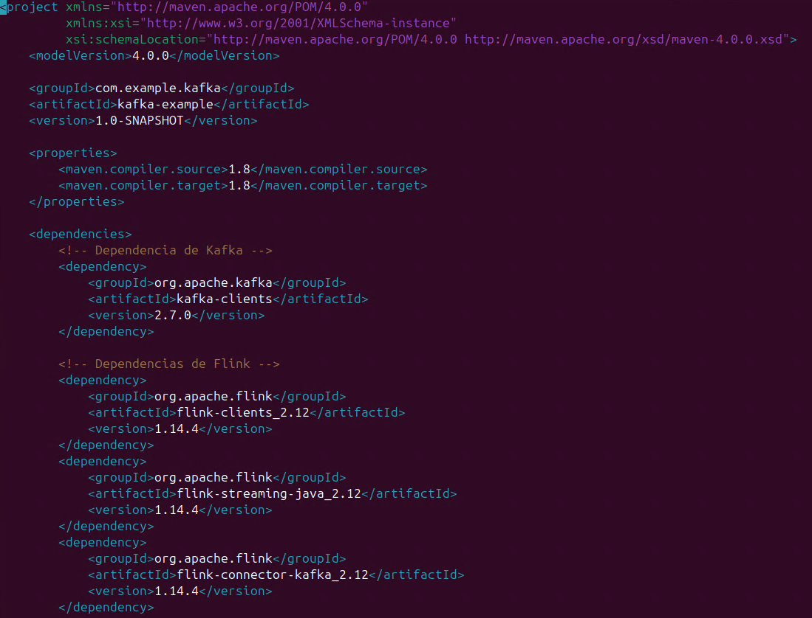
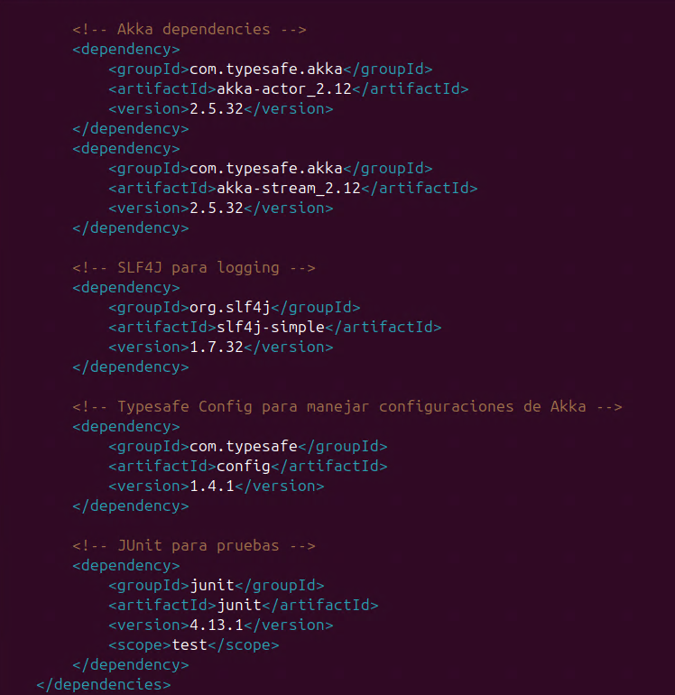
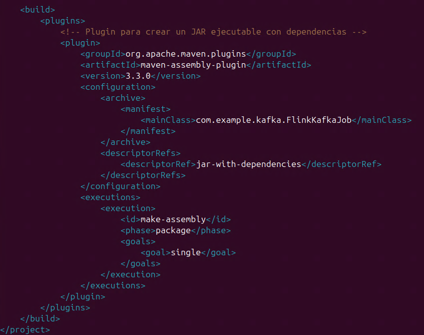

Paso 14. Compilar nuevamente el proyecto, ejecutar el siguiente comando.

```
mvn clean install
```
```
mvn package
```

Paso 15. Ejecutar el productor.

```
java -cp target/kafka-example-1.0-SNAPSHOT-jar-with-dependencies.jar com.example.kafka.SimpleProducer
```
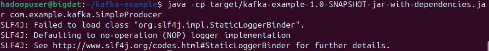

**NOTA:** Si te aparecen los mensajes como la imagen quiere decir que el producto se ha activado correctamente. Aunque existan algunas clases no encontradas, es normal para el ejemplo.

Paso 15. Ahora el consumidor, **Abrir otra pestaña de la terminal para ejecutar el consumidor**.

```
cd kafka-example/
```
```
java -cp target/kafka-example-1.0-SNAPSHOT-jar-with-dependencies.jar com.example.kafka.SimpleConsumer
```

**NOTA:** Los mensajes que ves son normales y simplemente informan sobre la gestión de los consumidores y offsets.

**¡TAREA FINALIZADA!**

Has completado la configuracion del productor de mensajes y consumidor para Apache Kafka.   

### Tarea 5. Configuración de Apache Flink para consumir mensajes de Kafka

En esta tarea configuraras Apache Flink para que consuma mensajes desde un topic de Kafka y los procese en tiempo real.

Paso 1. Abrir **otra terminal** dando clic en la esquina superior izquierda de la terminal e ingresar a **kafka-example**

```
cd kafka-example/
```

Paso 2. Crear el archivo llamado FlinkKafkaJob.java que realizara la prueba de los mensajes.

```
nano src/main/java/com/example/kafka/FlinkKafkaJob.java
```

Paso 3. Pegar el siguiente código dentro del archivo.

```
package com.example.kafka;

import org.apache.flink.api.common.serialization.SimpleStringSchema;
import org.apache.flink.streaming.api.environment.StreamExecutionEnvironment;
import org.apache.flink.streaming.connectors.kafka.FlinkKafkaConsumer;

import java.util.Properties;

public class FlinkKafkaJob {
    public static void main(String[] args) throws Exception {
        // Crear el entorno de ejecución de Flink
        final StreamExecutionEnvironment env = StreamExecutionEnvironment.getExecutionEnvironment();
        
        // Configurar el paralelismo en 1 para simplificar el entorno de prueba
        env.setParallelism(1);

        // Configurar las propiedades para conectarás a Kafka
        Properties properties = new Properties();
        properties.setProperty("bootstrap.servers", "localhost:9092");  // Servidor Kafka
        properties.setProperty("group.id", "flink-test-group");         // Grupo de consumidores

        // Crear un consumidor de Kafka para el topic "test-topic"
        FlinkKafkaConsumer<String> kafkaConsumer = new FlinkKafkaConsumer<>(
            "test-topic",                                    // Nombre del topic
            new SimpleStringSchema(),                        // Esquema de los datos (cadena de texto)
            properties                                       // Propiedades de Kafka
        );

        // Añadir la fuente de datos Kafka a Flink y procesar los mensajes
        env.addSource(kafkaConsumer)
           .print();   // Procesar mensajes imprimiéndolos en la consola

        // Ejecutar el job de Flink
        env.execute("Flink Kafka Job");
    }
}
```

**```CTRL + O```** **`Enter`** `Para guardar el archivo`

**```CTRL + X```** **`Enter`** `Para salir del archivo`

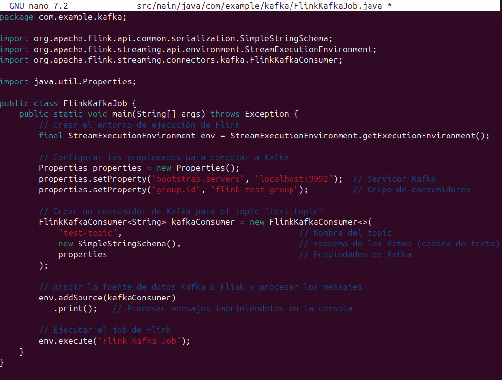

Paso 4. Dentro de la ruta **`src/main/`** crear el siguiente directorio llamado **resources**.

```
mkdir src/main/resources/
```

Paso 5. Crea el archivo llamado **reference.conf** dentro de ese directorio.

```
nano src/main/resources/reference.conf
```

Paso 6. Dentro del archivo, pegar el siguiente bloque de código para la configuración de AKKA que necesitara Flink para el procesamiento en tiempo real.

```
akka {
  stream {
    materializer {
      # Resolución de ${akka.stream.materializer}
      output-burst-limit = 1024
      initial-input-buffer-size = 4
      max-input-buffer-size = 16
    }
  }
}
```

**```CTRL + O```** **`Enter`** `Para guardar el archivo`

**```CTRL + X```** **`Enter`** `Para salir del archivo`

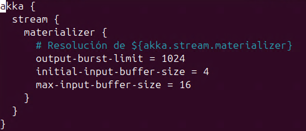

Paso 7. Compilar el proyecto con el nuevo código.

```
mvn clean install
```

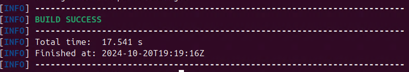

Paso 8. Ejecutar el job con el archivo jar compilado para conectarse a Kafka y procesar los mensajes.

```
java -cp target/kafka-example-1.0-SNAPSHOT-jar-with-dependencies.jar com.example.kafka.FlinkKafkaJob
```

**NOTA:** En caso de que marque algun error puedes probar los siguientes puntos.

- `sudo update-alternatives --config java` Verificar que este Java8
- Repite la tarea que recompila el proyecto de JAVA. Paso 7
- Repite el Paso 8.
- Ejecuta flink localmente `~/flink-1.13.2/./bin/start-cluster.sh`
- Repite el paso 8

Paso 9. Ya que inicializo el Job, probar el consumo de mensajes. Puedes comparar la inicialización con la siguiente imagen.

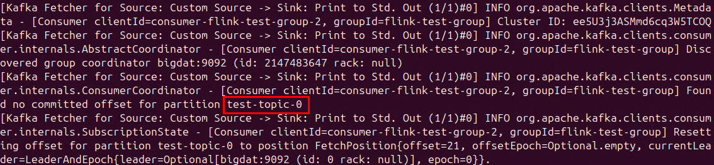

**NOTA:** Son algunos de los logs del sistema de Kafka que ya recolecto Flink.

Paso 10. Entra al directorio de Kafka **`kafka_2.13-2.7.0`**, escribir el siguiente comando **(Abre otra terminal)**.

**NOTA:** Recuerda, si necesitas salirte de un directorio escribe **cd ..**

```
cd ~/kafka_2.13-2.7.0
```

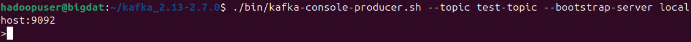

Paso 11. Dentro de la carpeta escribe el siguiente comando.

```
./bin/kafka-console-producer.sh --topic test-topic --bootstrap-server localhost:9092
```

**NOTA:** En el prompt escribe un mensaje corto como **Hola Mundo**.

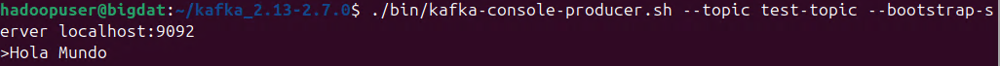

Paso 12. Regresar a la primera terminal que dejaste abierta **(Apache Flink)** para poder ver el consumo de los mensajes de flink. Como lo muestra la siguiente imagen.

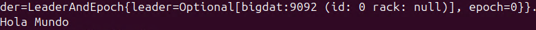
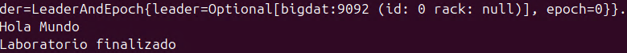

Paso 13. Realizar un ejemplo más, primero debes estar dentro de la carpeta **kafka-example**.

- `CTRL + C`
- `cd ~/kafka-example/`

Paso 13. Copiar y pegar el siguiente comando que creara un archivo llamado **WordCountKafkaJob**.

```
nano src/main/java/com/example/kafka/WordCountKafkaJob.java
```

Paso 14. Dentro del archivo agregar este código para realizar el conteo de palabras.

```
package com.example.kafka;

import org.apache.flink.api.common.functions.FlatMapFunction;
import org.apache.flink.api.common.state.ValueState;
import org.apache.flink.api.common.state.ValueStateDescriptor;
import org.apache.flink.api.common.typeinfo.Types;
import org.apache.flink.api.common.serialization.SimpleStringSchema;
import org.apache.flink.streaming.api.datastream.DataStream;
import org.apache.flink.streaming.api.environment.StreamExecutionEnvironment;
import org.apache.flink.streaming.connectors.kafka.FlinkKafkaConsumer;
import org.apache.flink.streaming.api.functions.KeyedProcessFunction;
import org.apache.flink.configuration.Configuration;
import org.apache.flink.util.Collector;

import java.util.Properties;

public class WordCountKafkaJob {
    public static void main(String[] args) throws Exception {
        // Crear el entorno de ejecución de Flink
        final StreamExecutionEnvironment env = StreamExecutionEnvironment.getExecutionEnvironment();

        // Configurar las propiedades para conectarás a Kafka
        Properties properties = new Properties();
        properties.setProperty("bootstrap.servers", "localhost:9092");  // Servidor Kafka
        properties.setProperty("group.id", "flink-wordcount-group");    // Grupo de consumidores

        // Crear un consumidor de Kafka para el topic "test-topic"
        FlinkKafkaConsumer<String> kafkaConsumer = new FlinkKafkaConsumer<>(
                "test-topic",                                    // Nombre del topic
                new SimpleStringSchema(),                        // Esquema de los datos (cadena de texto)
                properties                                       // Propiedades de Kafka
        );

        // Añadir la fuente de datos Kafka a Flink
        DataStream<String> stream = env.addSource(kafkaConsumer);

        // Contar palabras
        stream.flatMap(new Tokenizer())
              .keyBy(word -> word)   // Agrupar por palabra
              .process(new CountWords()) // Usar un proceso para contar las palabras
              .print();                // Imprimir el resultado en la consola

        // Ejecutar el job de Flink
        env.execute("Word Count from Kafka");
    }

    // Clase interna para dividir líneas en palabras
    public static final class Tokenizer implements FlatMapFunction<String, String> {
        @Override
        public void flatMap(String value, Collector<String> out) {
            // Dividir la línea en palabras y emitir cada palabra
            for (String word : value.split(" ")) {
                out.collect(word);
            }
        }
    }

    // Clase para contar las palabras
    public static final class CountWords extends KeyedProcessFunction<String, String, String> {
        private transient ValueState<Integer> count;

        @Override
        public void open(Configuration parameters) {
            ValueStateDescriptor<Integer> descriptor = new ValueStateDescriptor<>(
                    "wordCount", // el nombre del estado
                    Types.INT);  // valor por defecto es 0
            count = getRuntimeContext().getState(descriptor);
        }

        @Override
        public void processElement(String value, Context ctx, Collector<String> out) throws Exception {
            // Incrementar el conteo de la palabra
            Integer currentCount = count.value() == null ? 0 : count.value();
            currentCount += 1;
            count.update(currentCount);
            out.collect(value + " : " + currentCount);
        }
    }
}
```

**```CTRL + O```** **`Enter`** `Para guardar el archivo`

**```CTRL + X```** **`Enter`** `Para salir del archivo`

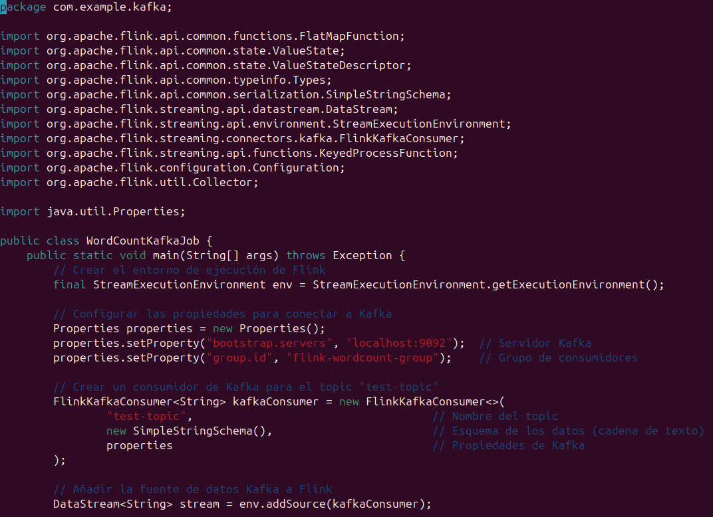
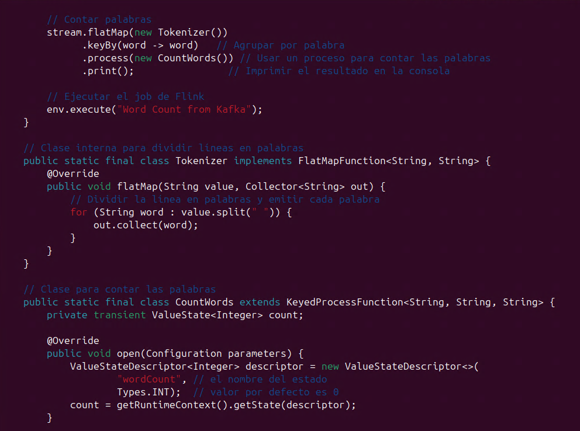
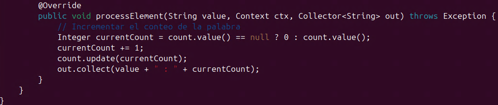

Paso 15. Compilar job con mvn y ejecutar el job de conteo de palabras, copiar y pegar los siguientes comandos.

```
mvn clean install
```
```
java -cp target/kafka-example-1.0-SNAPSHOT-jar-with-dependencies.jar com.example.kafka.WordCountKafkaJob
```

**NOTA:** Nuevamente veras logs de conexion al tópico de Kafka si todo sale bien.

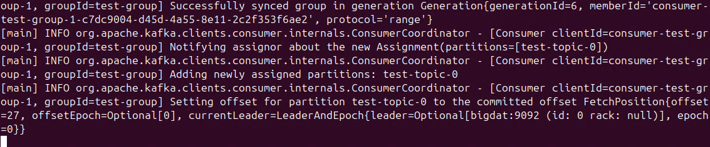

Paso 16. Ahora, ir a la ventana de la terminal que tiene el **producer** de **Kafka**. Escribir el siguiente texto.

**NOTA:** Si lo cerraste, puedes volverlo a activar.

```
Nunca te olvides de sonreír, porque el día que no sonrías, será un día perdido (Chaplin, 1992)
```
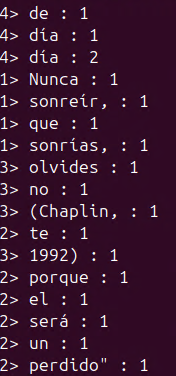
```
Aprende como si fueras a vivir toda la vida, y vive como si fueras a morir mañana (Chaplin, 1992)
```


**NOTA:** Intentar agregar mas frases.

**NOTA:** Para salir puedes usar **`CTRL + C`** en cada una de las ventanas.

**¡TAREA FINALIZADA!**

Haz completado la tarea donde Flink consumio los mensajes desde Kafka y los imprimio en la consola en tiempo real.

**LABORATORIO FINALIZADO!**

### Resultado esperado

El resultado final de la práctica es la ejecución completa de todos los pasos en la tarea y como comprobación la siguiente imagen.


---

**[⬅️ Atrás](/Capítulo5/lab5.1.md)** | **[Lista General](/README.md)** | **[Siguiente ➡️](/Capítulo7/lab7.1.md)**

---
