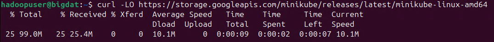

# Implementación de un ambiente de Big Data utilizando Docker y Kubernetes

## Objetivo de la práctica:

Al finalizar la práctica, serás capaz de:

- Configurar Docker y Kubernetes en un entorno de desarrollo.
- Implementar un contenedor de Hadoop dentro de un clúster de Kubernetes.

## Duración aproximada:
- 50 minutos.

## Instrucciones 

### Tarea 1. Instalación de Docker y Kubernetes.

En esta tarea, instalarás Docker y Kubernetes en el sistema Ubuntu. Docker se encargará de los contenedores y Kubernetes permitirá la orquestación de estos para crear un clúster de Big Data.

**NOTA:** A lo largo de la práctica habrá imágenes para que puedas apoyarte y mejorar la experiencia de configuración.

**NOTA IMPORTANTE:** Usarás el entorno gráfico del sistema operativo Ubuntu, pero **todo lo realizarás por terminal**.

**NOTA:** Abre una **terminal** dentro del sistema de Ubuntu.

Paso 1. Abre una terminal en el sistema operativo Ubuntu con el usuario **hadoopuser**. Recuerda que la contraseña es **ubunhadoop**.

Paso 2. Una vez abierta, escribe el siguiente comando que actualizará el sistema.

```
sudo apt update && sudo apt upgrade -y
```


**NOTA:** Espera, la actualización puede tardar unos minutos.

Paso 3. Ahora copia el siguiente comando que instalará el software de **Docker**.

```
sudo apt install docker.io -y
```

Paso 4. Verifica que se haya instalado correctamente con el siguiente comando.

```
docker --version
```


Paso 5. Agrega al usuario **hadoopuser** a la lista de los usuarios para manejar **Docker**. Escribe el siguiente comando.

```
sudo usermod -aG docker hadoopuser
```

**NOTA:** Después de esto, si es necesario, reinicia la sesión para aplicar los cambios.

Paso 6. Ahora instalarás **Kubernetes** mediante los siguientes comandos.

```
sudo snap install kubectl --classic
```


Paso 7. Además, instalarás **Minikube** para el ambiente de desarrollo de **Kubernetes**.

```
curl -LO https://storage.googleapis.com/minikube/releases/latest/minikube-linux-amd64
```

```
sudo install minikube-linux-amd64 /usr/local/bin/minikube
```

Paso 8. Verifica las instalaciones con los siguientes comandos.

```
kubectl version --client
```

```
minikube version
```


**¡TAREA FINALIZADA!**

Has completado la descarga e instalación de Docker y Kubernetes. 

### Tarea 2. Configuración del clúster de Kubernetes.

En esta tarea, configurarás un clúster de Kubernetes con Minikube para gestionar contenedores de aplicaciones de Big Data.

Paso 1. Dentro de la terminal, ahora inicia el servicio de **Minikube**. Escribe el siguiente comando:

**NOTA:** `newgrp` reinicia la sesión del usuario para que pueda iniciar correctamente **Minikube**.

```
newgrp docker
```
```
minikube start
```


**NOTA:** La inicialización puede tardar unos minutos.

Paso 2. Verifica el estado del clúster. Copia el siguiente comando.

```
kubectl get nodes
```


Paso 3. Ahora configura un **namespace** personalizado para el ejemplo de contenedor de Big Data.

```
kubectl create namespace bigdata-env
```


Paso 4. Verifica la creación del **namespace**, escribe el siguiente comando.

```
kubectl get namespaces
```


**¡TAREA FINALIZADA!**

Has completado la configuración y activación del clúster de Kubernetes.

### Tarea 3. Creación de un contenedor para procesamiento de datos (Hadoop).

En esta tarea, desplegarás un contenedor de Hadoop dentro de Kubernetes para simular un ambiente de procesamiento de datos.

Paso 1. En el directorio **home** del usuario **hadoopuser**, crea un archivo llamado **`hadoop-deployment.yaml`**. Copia y pega el siguiente comando.

```
nano hadoop-deployment.yaml
```

Paso 2. Ahora copia el siguiente código dentro del archivo creado previamente.

```
apiVersion: apps/v1
kind: Deployment
metadata:
  name: hadoop-deployment
  namespace: bigdata-env
spec:
  replicas: 1
  selector:
    matchLabels:
      app: hadoop
  template:
    metadata:
      labels:
        app: hadoop
    spec:
      containers:
      - name: hadoop-container
        image: jpas01/bdschadoop:bdschadoop
        ports:
        - containerPort: 8088
```

**```CTRL + O```** **`Enter`** `Para guardar el archivo`

**```CTRL + X```** **`Enter`** `Para salir del archivo`


Paso 3. Realiza el despliegue del contenedor, copia el siguiente comando en la terminal.

```
kubectl apply -f hadoop-deployment.yaml
```


**TROUBLESHOOTING:** Solo en caso de ser necesario puedes usar el siguiente comando para eliminar el deployment.

```
kubectl get deployments --namespace=bigdata-env
```
```
kubectl delete deployment hadoop-deployment --namespace=bigdata-env
```

Paso 4. Verifica que los **pods** se hayan creado correctamente, con el siguiente comando.

```
kubectl get pods -n bigdata-env
```


**TROUBLESHOOTING:** Solo en caso de ser necesario, puedes usar el siguiente comando para ver detalles o eliminar los pods.

```
kubectl describe pod <id-pod> -n bigdata-env
```
```
kubectl delete pod <id-pod> -n bigdat-env
```

Paso 5. Ahora debes exponer el servicio del contenedor de Hadoop implementado, con el siguiente comando.

```
kubectl expose deployment hadoop-deployment --type=NodePort --port=8088 --namespace=bigdata-env
```


**TROUBLESHOOTING:** Solo en caso de ser necesario, puedes usar el siguiente comando para eliminar el servicio que expone Kubernetes.

```
kubectl delete service hadoop-deployment --namespace=bigdata-env
```

Paso 6. Si todo salió bien, puedes obtener la URL para acceder a Hadoop, copia el siguiente comando.

```
minikube service hadoop-deployment -n bigdata-env
```


**¡TAREA FINALIZADA!**

Has completado el despliegue del contenedor de Hadoop mediante las configuraciones de Kubernetes y Docker.

### Tarea 4. Escalabilidad en el clúster de Big Data con Kubernetes

En esta última tarea, escalarás el número de réplicas del contenedor de Hadoop para manejar más carga de trabajo en el entorno de Big Data.

Paso 1. Realiza la escalabilidad del ambiente desplegado con el siguiente comando.

```
kubectl scale deployment hadoop-deployment --replicas=3 -n bigdata-env
```


Paso 2. Verifica que los pods adicionales se hayan creado correctamente.

```
kubectl get pods -n bigdata-env
```


**¡TAREA FINALIZADA!**

HAs completado la escalabilidad del cluster de Kubernetes

**LABORATORIO FINALIZADO!**

### Resultado esperado

El resultado final del laboratorio debe de ser el cluster de kubernetes y el contenedor de Hadoop desplegado correctamente.


