### Creación de un Proyecto de Natural Language Processing (NLP)

### Objetivo de la práctica:

Al finalizar la práctica, serás capaz de:

- Configurar un entorno de desarrollo para procesamiento de lenguaje natural en Python.
- Realizar la limpieza y tokenización de un conjunto de datos de texto.
- Analizar la frecuencia de palabras y guardar los resultados en un archivo CSV.

### Duración aproximada:
- 50 minutos.

---

**[⬅️ Atrás](/Capítulo7/lab7.1.md)** | **[Lista General](/README.md)** | **[Siguiente ➡️](/Capítulo9/lab9.1.md)**

---

### Instrucciones 

### Tarea 1. Configuración del ambiente para NLP.

En esta tarea se instalarán y configurarán las librerías necesarias para trabajar con NLP en Python. También se instalará un entorno virtual para aislar las dependencias del proyecto.

**NOTA:** A lo largo de la práctica habrá imágenes para que puedas apoyarte y mejorar la experiencia de configuración.

**NOTA IMPORTANTE:** Usarás el entorno gráfico del sistema operativo Ubuntu, pero **todo lo realizarás por terminal**.

**NOTA:** Abre una **terminal** dentro del sistema de Ubuntu. Recuerda el usuario **hadoopuser** y la contraseña **ubunhadoop**.

Paso 1. Abre una terminal dentro del sistema operativo de Ubuntu.

Paso 2. Ahora instala las siguientes dependencias con el siguiente código, cópialo y pégalo en la terminal.

**NOTA:** Si ya las tienes instaladas, avanza a la siguiente tarea.

```
if ! command -v python3 &> /dev/null
then
    sudo apt update
    sudo apt install python3 python3-pip
else
    echo "Python3 ya está instalado."
fi
```

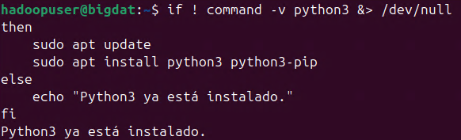

Paso 3. En la misma ruta de tu directorio, verifica si ya está instalado el ambiente virtual de Python; si no, instálalo. Copia el siguiente código en la terminal.

```
if ! pip3 show virtualenv &> /dev/null
then
    pip3 install virtualenv
else
    echo "Virtualenv ya está instalado."
fi
```

**IMPORTANTE:** Solo en caso de que te aparezca este mensaje al validar el estado del ambiente virtual de Python, ejecuta el siguiente comando.

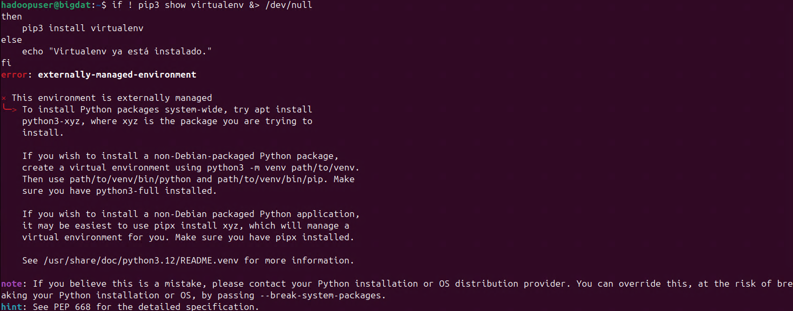

```
pip3 install virtualenv --break-system-packages
```
```
sudo apt install python3-venv -y
```

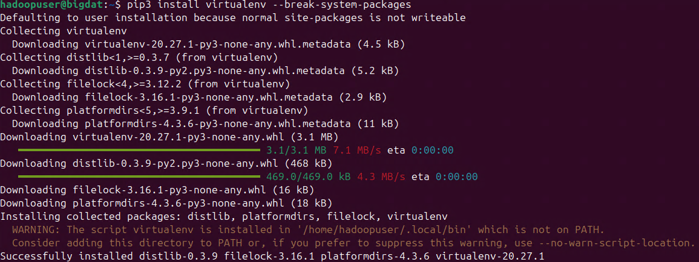


Paso 4. Ahora crea un entorno virtual de python, el siguiente codigo bash verificara si ya lo tienes existente y sino lo creara, copialo y pegalo en la terminal.

```
if [ ! -d "nlp-project" ]; then
    mkdir nlp-project
fi
cd nlp-project

if [ ! -d "venv" ]; then
    python3 -m venv venv
    echo "Entorno virtual creado."
else
    echo "El entorno virtual ya existe."
fi
```

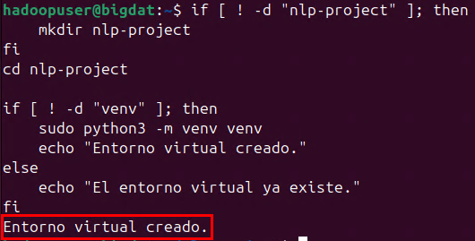

Paso 5. Realiza la activación del entorno virtual. El comando simple es **`source venv/bin/activate`**, pero usa este método más elegante para activarlo.

```
source venv/bin/activate
if [[ "$VIRTUAL_ENV" != "" ]]; then
    echo "Entorno virtual activado correctamente."
else
    echo "Error al activar el entorno virtual."
fi
```

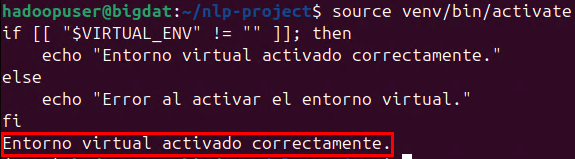

Paso 6. Finalmente, dentro del ambiente virtual, instala las librerías necesarias para trabajar con NLP. Copia y pega el siguiente código bash.

**NOTA:** Para el ejemplo, usarás las librerías **nltk** y **pandas**.

```
if ! pip show nltk pandas &> /dev/null
then
    pip install nltk pandas
else
    echo "Las bibliotecas nltk y pandas ya están instaladas."
fi
```

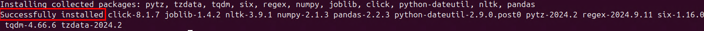

**¡TAREA FINALIZADA!**

Has completado la descarga e instalación de las librerías para el ejemplo de NLP.

### Tarea 2. Preparación de Datos.

En esta tarea, descargarás un dataset de ejemplo, lo cargarás con pandas y limpiarás los datos de texto.

Paso 1. Ahora, en la terminal, descarga el conjunto de datos; si no existe el archivo, se descargará.

**NOTA:** El conjunto de datos es sobre reseñas de películas. 

```
if [ ! -d "movie_reviews" ]; then
    wget https://raw.githubusercontent.com/nltk/nltk_data/gh-pages/packages/corpora/movie_reviews.zip
    unzip movie_reviews.zip -d movie_reviews
else
    echo "El conjunto de datos ya está descargado."
fi
```

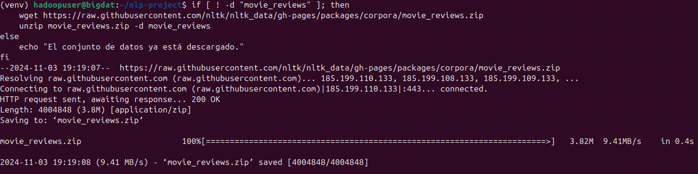


Paso 2. Crea un archivo llamado **`carga.py`**, escribe el siguiente comando en la terminal.

```
nano carga.py
```

Paso 3. Ahora copia el siguiente código en el archivo **carga.py**. El script visualiza el dataset y valida que el archivo se cargue correctamente en un DataFrame de pandas.

```
# carga.py

import pandas as pd
import os

def load_reviews():
    # Listar archivos
    reviews_dir = 'movie_reviews/movie_reviews/pos'
    reviews = []

    for filename in os.listdir(reviews_dir):
        with open(os.path.join(reviews_dir, filename), 'r') as file:
            reviews.append(file.read())

    df = pd.DataFrame(reviews, columns=['review'])
    return df

if __name__ == "__main__":
    df = load_reviews()
    print(df.head())
```

**```CTRL + O```** **`Enter`** `Para guardar el archivo`

**```CTRL + X```** **`Enter`** `Para salir del archivo`

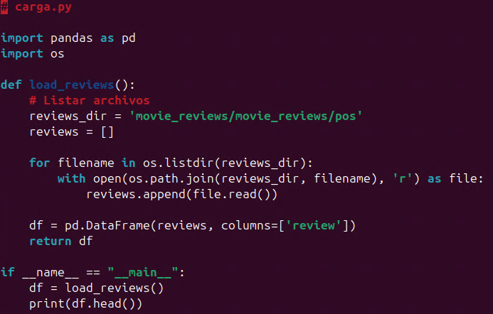

Paso 4. Ejecuta el archivo Python con el siguiente comando en la terminal.

```
python carga.py
```

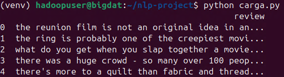

Paso 5. Crea un archivo llamado **`limpieza.py`**, escribe el siguiente comando en la terminal.

```
nano limpieza.py
```

Paso 6. Ahora copia el siguiente código en el archivo **limpieza.py**. El script verifica si la limpieza de texto (eliminación y estandarización de datos) se ha realizado adecuadamente.

```
# limpieza.py

import re
from carga import load_reviews

# Cargar el DataFrame
df = load_reviews()

# Función de limpieza
def clean_text(text):
    text = re.sub(r'[^\w\s]', '', text)  # Eliminar caracteres especiales
    text = text.lower()  # Convertir a minúsculas
    return text

df['clean_review'] = df['review'].apply(clean_text)
print("Reviews limpiados:")
print(df['clean_review'].head())
```

**```CTRL + O```** **`Enter`** `Para guardar el archivo`

**```CTRL + X```** **`Enter`** `Para salir del archivo`

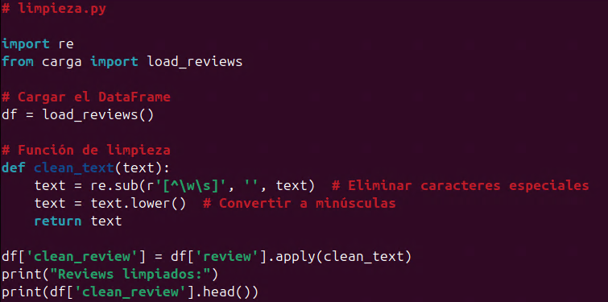

Paso 7. Ejecuta el archivo Python con el siguiente comando en la terminal.

```
python limpieza.py
```

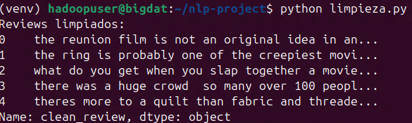

**¡TAREA FINALIZADA!**

Has completado la preparación de datos en el ambiente virtual de Python para el ejemplo de NLP.

### Tarea 3. Tokenización y Análisis de Frecuencia.

En esta tarea, realizarás el proceso de tokenizar las reseñas de texto y llevarás a cabo un análisis de frecuencia de palabras.

Paso 1. Primero, crea el archivo llamado **analisis_frecuencia.py**. Copia el siguiente comando.

```
nano analisis_frecuencia.py
```

Paso 2. Ahora copia y pega el siguiente código para realizar la tokenización y el análisis de frecuencia.

```
# analisis_frecuencia.py
import pandas as pd
import re
from nltk.tokenize import word_tokenize
from collections import Counter
import os
import nltk

# Asegúrate de que NLTK tenga los recursos necesarios
nltk.download('punkt')

# Función para limpiar el texto
def clean_text(text):
    text = re.sub(r'[^\w\s]', '', text)  # Eliminar caracteres especiales
    text = text.lower()  # Convertir a minúsculas
    return text

# Cargar las reseñas
reviews_dir = 'movie_reviews/movie_reviews/pos'  # Ruta corregida
print("Buscando reseñas en el directorio:", reviews_dir)
reviews = []

if os.path.exists(reviews_dir):
    for filename in os.listdir(reviews_dir):
        with open(os.path.join(reviews_dir, filename), 'r') as file:
            reviews.append(file.read())

# Verifica que las reseñas se hayan cargado
if not reviews:
    print("No se encontraron reseñas en el directorio especificado.")
else:
    df = pd.DataFrame(reviews, columns=['review'])

    # Limpiar y tokenizar las reseñas
    df['clean_review'] = df['review'].apply(clean_text)
    df['tokens'] = df['clean_review'].apply(word_tokenize)

    # Análisis de frecuencia de palabras
    all_words = [word for tokens in df['tokens'] for word in tokens]
    word_freq = Counter(all_words)

    # Mostrar las 10 palabras más comunes
    if word_freq:
        print("Las 10 palabras más comunes son:", word_freq.most_common(10))
    else:
        print("No se encontraron palabras para analizar.")
```

**```CTRL + O```** **`Enter`** `Para guardar el archivo`

**```CTRL + X```** **`Enter`** `Para salir del archivo`

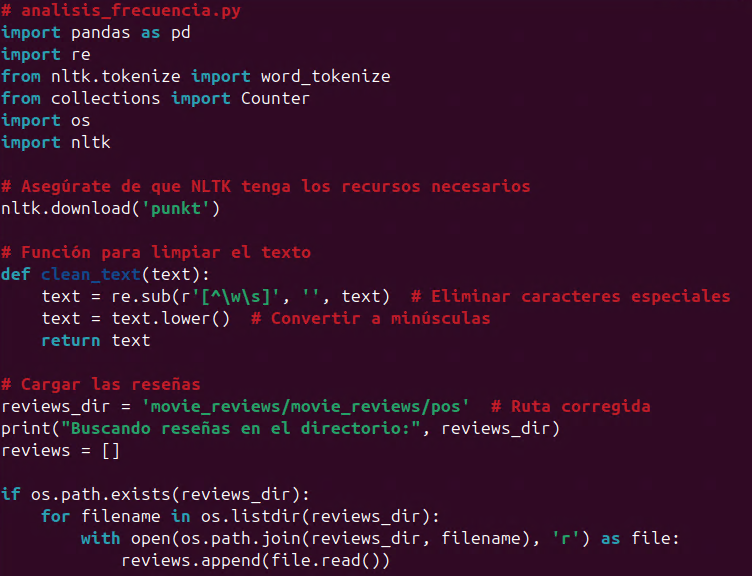
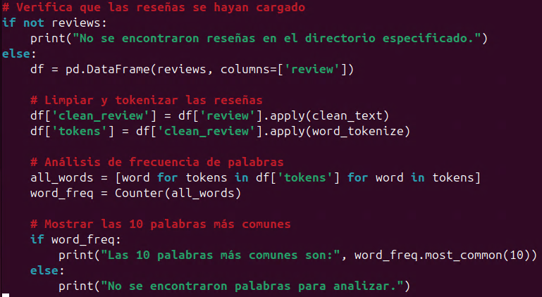

Paso 3. Antes de ejecutar el archivo, instala las siguientes dependencias de **NLTK-PUNKT_TAB**.

```
python
```
```
import nltk
```
```
nltk.download('punkt')
```
```
nltk.download('punkt_tab')
```

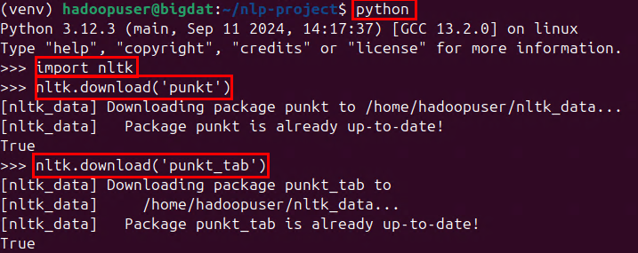

**NOTA:** Para salir del modo interactivo de Python, ejecuta **`exit()`** o **`CTRL + d`**.

Paso 4. Desde la terminal, navega a la carpeta del proyecto y asegúrate de que el entorno virtual esté activado. Luego, ejecuta el archivo con el siguiente comando.

```
python analisis_frecuencia.py
```

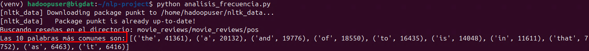

**¡TAREA FINALIZADA!**

Has completado el proceso de tokenización de palabras para el ejemplo de NLP.

### Tarea 4. Guardar Resultados.

En esta tarea, guardarás los resultados del análisis de frecuencia en un archivo CSV.

Paso 1. Primero, crea el archivo llamado **guardar_resultados.py**. Copia el siguiente comando.

```
nano guardar_resultados.py
```

Paso 2. Ahora copia y pega el siguiente contenido que guardará los resultados del análisis de frecuencia en un archivo CSV.

```
import pandas as pd
import os
from collections import Counter
import re

# Función para limpiar el texto
def clean_text(text):
    text = re.sub(r'[^\w\s]', '', text)  # Eliminar caracteres especiales
    text = text.lower()  # Convertir a minúsculas
    return text

# Cargar las reseñas
reviews_dir = 'movie_reviews/movie_reviews/pos'
reviews = []
if os.path.exists(reviews_dir):
    for filename in os.listdir(reviews_dir):
        with open(os.path.join(reviews_dir, filename), 'r') as file:
            reviews.append(file.read())

# Crear DataFrame
df = pd.DataFrame(reviews, columns=['review'])

# Limpiar las reseñas
df['clean_review'] = df['review'].apply(clean_text)

# Contar la frecuencia de palabras
word_freq = Counter()
for review in df['clean_review']:
    for word in review.split():
        word_freq[word] += 1

# Guardar los resultados en un archivo CSV
freq_df = pd.DataFrame(word_freq.most_common(), columns=['word', 'frequency'])
freq_df.to_csv('pal_frequentes.csv', index=False)

# Verificar si el archivo se guardó correctamente
if os.path.exists('pal_frequentes.csv'):
    print("Resultados guardados correctamente en pal_frequentes.csv.")
else:
    print("Error al guardar el archivo CSV.")
```

**```CTRL + O```** **`Enter`** `Para guardar el archivo`

**```CTRL + X```** **`Enter`** `Para salir del archivo`

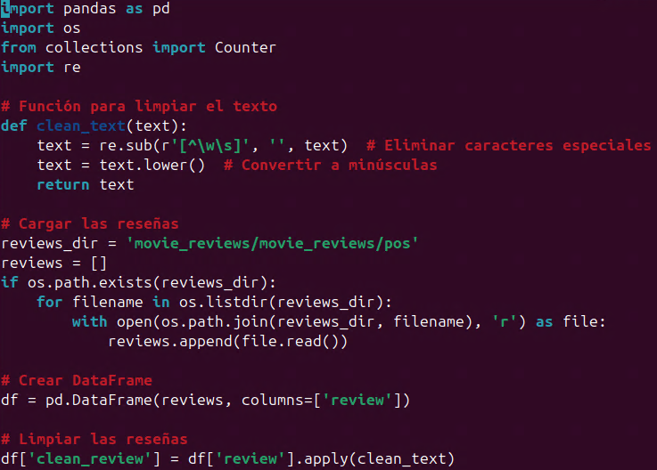
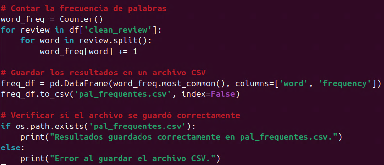

Paso 3. Desde la terminal, navega a la carpeta del proyecto y asegúrate de que el entorno virtual esté activado. Luego, ejecuta el archivo con el siguiente comando.

```
python guardar_resultados.py
```

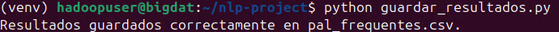

Paso 4. Comprueba si el archivo `pal_frequentes.csv` se ha creado correctamente en el directorio del proyecto.

```
cat pal_frequentes.csv
```

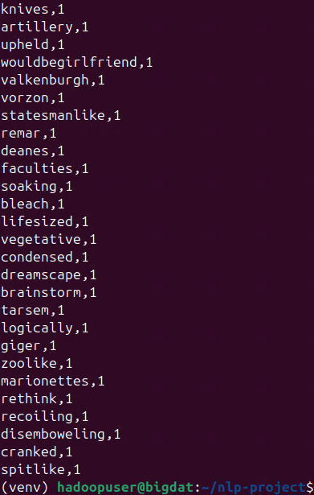

**NOTA:** Es una lista bastante larga.

**NOTA:** Esto debería mostrar el contenido del archivo CSV en la terminal, con las palabras y su frecuencia.

Paso 5. Una vez terminado, sal del ambiente virtual de Python, escribe el siguiente comando.

```
deactivate
```

Paso 6. Si necesitas volver a activarlo, escribe el siguiente comando.

```
source venv/bin/activate
```

**¡TAREA FINALIZADA!**

Has completado el guardado de la tokenización de palabras.

**LABORATORIO FINALIZADO!**

### Resultado esperado

El resultado final es poder realizar las tareas exitosamente sin errores y ver el archivo CSV generado.


---

**[⬅️ Atrás](/Capítulo7/lab7.1.md)** | **[Lista General](/README.md)** | **[Siguiente ➡️](/Capítulo9/lab9.1.md)**

---