# Práctica 8. Configuración y despliegue de un proyecto de Big Data utilizando Amazon EMR

## Objetivo de la práctica:

Al finalizar la práctica, serás capaz de:

- Configurar un clúster de Amazon EMR para el procesamiento de Big Data.
- Ejecutar un análisis utilizando Hive en un clúster EMR.

## Duración aproximada:
- 40 minutos.

---

**[⬅️ Atrás](/Capítulo8/lab8.1.md)** | **[Lista General](/README.md)** | **[Siguiente ➡️](/Capítulo9/lab9.2.md)**

---

### Instrucciones 

### Tarea 1. Crear un clúster EMR básico

En esta tarea, se desplegará un clúster de Amazon EMR utilizando la consola de AWS, configurado para ejecutar análisis de Big Data.

Paso 1. Dar clic [Aquí AWS](https://us-east-2.signin.aws.amazon.com/oauth?client_id=arn%3Aaws%3Asignin%3A%3A%3Aconsole%2Fcanvas&code_challenge=gfh1_SQ5n7dnq6ETh0C-PoCw4VuI-HLYRfC06evdqHw&code_challenge_method=SHA-256&response_type=code&redirect_uri=https%3A%2F%2Fconsole.aws.amazon.com%2Fconsole%2Fhome%3FhashArgs%3D%2523%26isauthcode%3Dtrue%26state%3DhashArgsFromTB_us-east-2_10ffbbe8d449d843) para ingresar a la cuenta de AWS. Los datos que ingresaras se te asignaron al comienzo de esta laboratorio.

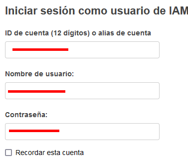

Paso 2. Colocar los datos de autenticación y dar clic en el botón **Iniciar sesión**.

**NOTA IMPORTANTE:** Después de iniciar sesión, verificar que estés en la región de **Oregon** en la esquina superior derecha.

Paso 3. Una vez iniciada la sesión, ir al buscador de AWS y escribir el nombre del servicio **`EMR`**. Luego, dar clic en el nombre.

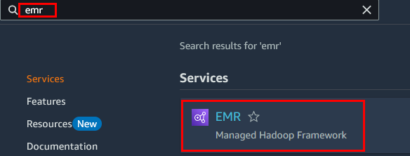

Paso 4. Dentro de la consola de EMR, dar clic en el botón **Create cluster**.

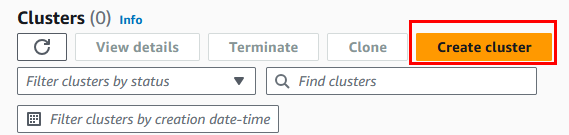

Paso 5. Dentro de la sección **Create cluster**, configurar solo los parámetros definidos en la siguiente tabla. También puedes apoyarte en la imagen que está más abajo.

| Parametro | Valor |
| --------- | ----- |
| Cluster Name | `emr-lab-cluster` |
| Amazon EMR release | emr-6.15.0 |
| Application bundle | Hadoop y Hive |

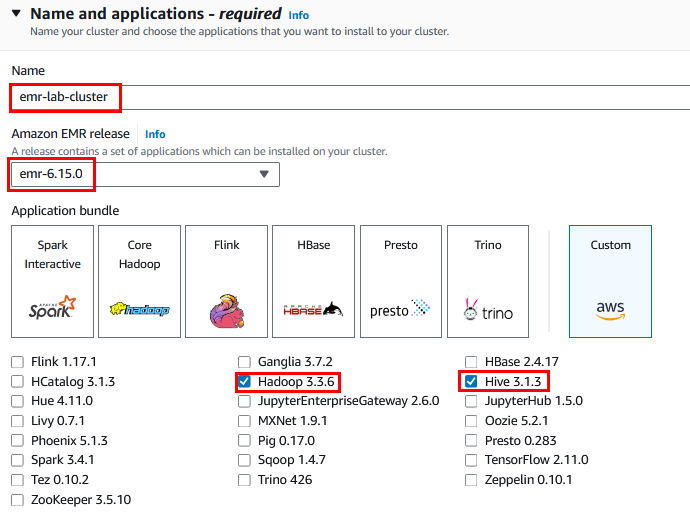

**NOTA:** Continuar con la configuración en el siguiente paso.

Paso 6. Ahora, en la sección **Cluster configuration**, definir los siguientes valores de la tabla.

| Parametro | Valor |
| --------- | ----- |
| Uniform instance groups | **Seleccionado** |
| Primary | m5.xlarge |
| Core | m5.xlarge |
| Task 1 of 1 | Clic en **Remove instance group** |

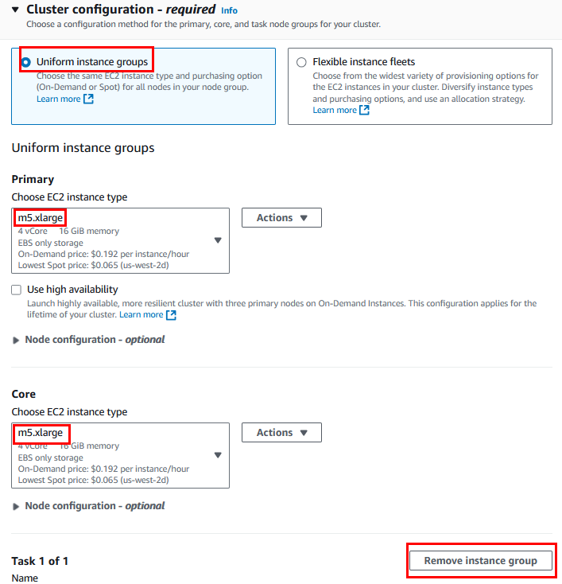

**NOTA:** Continuar con la configuración en el siguiente paso.

Paso 7. En la sección **Cluster scaling and provisioning - required**, configurar lo siguiente.

| Parametro | Valor |
| --------- | ----- |
| Set cluster size manually | **Seleccionado** |
| Instance(s) size | **2** |

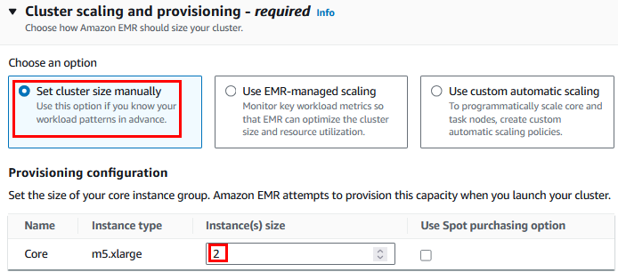

**NOTA:** Continuar con la configuración en el siguiente paso.

Paso 8. En la sección **Networking - required**, configurar lo siguiente.

| Parametro | Valor |
| --------- | ----- |
| Virtual private cloud (VPC) | Clic en **Browse** y selecciona **LabVPC** |
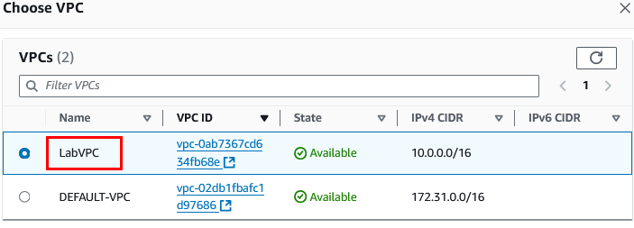
| Subnet | Clic en **Browse** y selecciona **Public Subnet** |
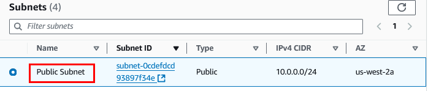
| Primary node - EMR-managed security group | EMRPrimarySG |
| Core and task nodes - EMR-managed security group | EMRCoreSG |

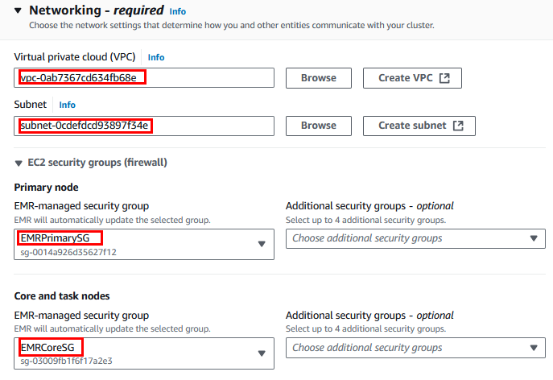

Paso 9. En la sección **Security configuration and EC2 key pair** configurar la siguiente propiedad.

| Parametro | Valor |
| --------- | ----- |
| Amazon EC2 key pair for SSH to the cluster | Clic en **Browse** y selecciona **EMRKeyPair** |

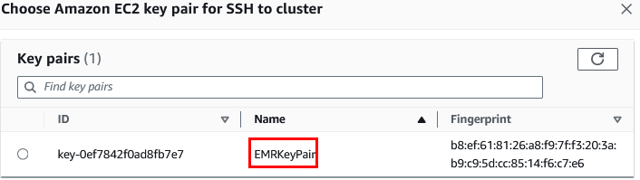
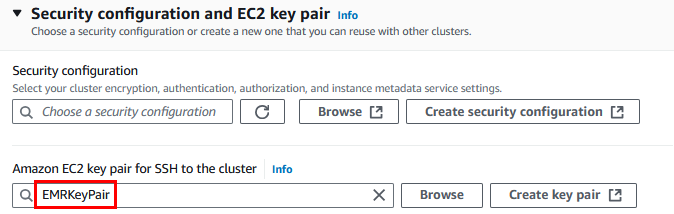

Paso 10. Para la sección **Identity and Access Management (IAM) roles - required** configurar lo siguiente de la tabla.

| Parametro | Valor |
| --------- | ----- |
| Choose an existing service role | **Seleccionado** |
| Service role | **EMR-Role** |
| Choose an existing instance profile | **Seleccionado** |
| Service role | **EMR-InstRole** |

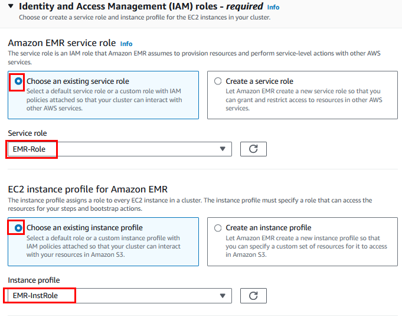

Paso 11. Finalmente, dar clic en el botón del lado derecho **Create cluster**.


**NOTA:** Dejar el clúster creando y avanzar a la siguiente tarea; en promedio tarda de **2 a 4 minutos**.

**¡TAREA FINALIZADA!**

Haz completado la creación del cluster de Amazon EMR con Apache Hadoop y Apache Hive instalados.

### Tarea 2. Subir datos a S3

En esta tarea, se usará un archivo CSV con datos de ventas guardado en un bucket de S3 para que el clúster EMR pueda acceder a él y procesarlo.

Paso 1. El archivo llamado **ventasejemplo.csv** ya está guardado en un bucket de S3 externo. Copiar y pegar la URL en tu navegador para descargar el archivo en el equipo.

```
https://s3.us-west-2.amazonaws.com/labs.netec.com/courses/BigDataSciencePro/V0.0.1/ventasejemplo.csv
```

Paso 2. Ir al buscador de AWS, escribir el nombre del servicio **`S3`** y dar clic en el nombre.

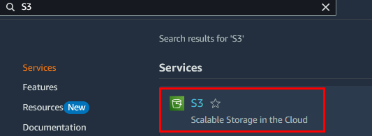

Paso 3. Dentro de la página de Amazon S3, dar clic en el botón **Create bucket** de color naranja.

Paso 4. En la sección **General configuration**, configurar lo siguiente que se muestra en la tabla:

| Parametro | Valor |
| --------- | ----- |
| General purpose | **Seleccionado** |
| Bucket name | emrdatabucket-**XXXX** Sustituye las **X** por 4 letras minusculas/numeros aleatorios |

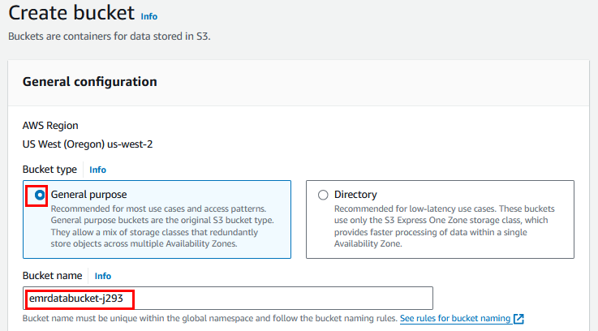

Paso 5. Al final de la página, dar clic en el botón **Create bucket**.

Paso 6. Seleccionar el bucket creado dando clic en el nombre del bucket.


Paso 7. Dentro del bucket, dar clic en el botón **Upload** en el lateral derecho para cargar el archivo CSV.

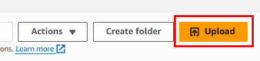

Paso 8. Dar clic en el botón **Add files** de la sección **Files and folders**.

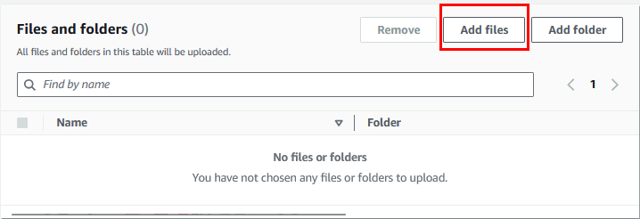

Paso 9. Buscar el archivo CSV y cárgalo.

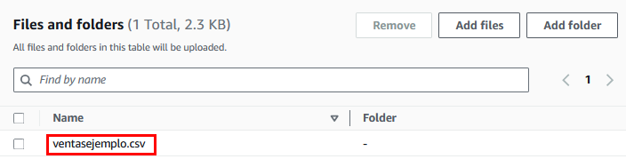

Paso 10. Finalmente, al final de la página, dar clic en el botón **Upload**.

Paso 11. Dar clic en el botón **Close** que se encuentra en la esquina superior derecha.

Paso 12. Verificar que se haya cargado correctamente y se muestre en la ventana principal de los objetos.

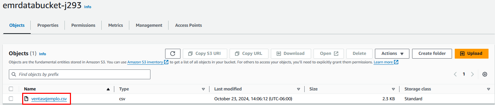

Paso 13. Dar clic en el nombre del archivo cargado llamado **ventasejemplo.csv**.

Paso 14. Copiar el parámetro que dice **S3 URI** y pegarlo en un **bloc de notas** temporalmente; lo usarás en la siguiente tarea.

**¡TAREA FINALIZADA!**

Haz completado la carga de los datos al bucket de S3.

### Tarea 3. Ejecutar un trabajo simple de análisis de datos con Hive

En esta tarea, se utilizará Hive en el clúster EMR para procesar y analizar los datos cargados en S3.

Paso 1. Ir a la consola del servicio de Amazon EMR. En el buscador de AWS, escribir el nombre del servicio **`EMR`** y dar clic en el nombre.


Paso 2. En la sección de **Clusters** deberás ver el clúster creado y con el estatus **Waiting**.

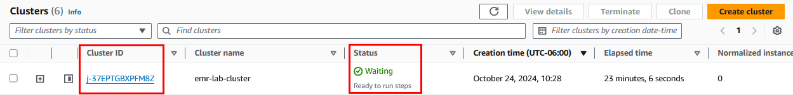

Paso 3. Dar clic en el nombre del **Cluster ID** para entrar a los detalles.

Paso 4. Dentro de los detalles del clúster, identificar la propiedad llamada **Connect to the Primary node using SSM** y dar clic.

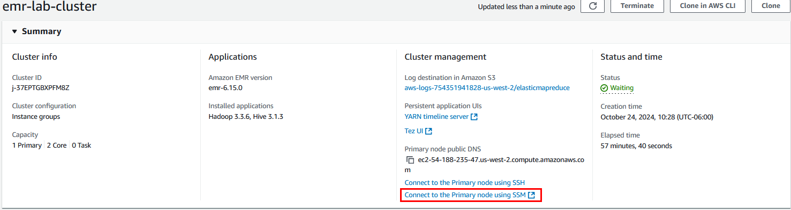

**NOTA:** Se abrirá otra pestaña en el navegador.

Paso 5. En la nueva pestaña, dar clic en el botón **Connect** para acceder remotamente al nodo de Hadoop.

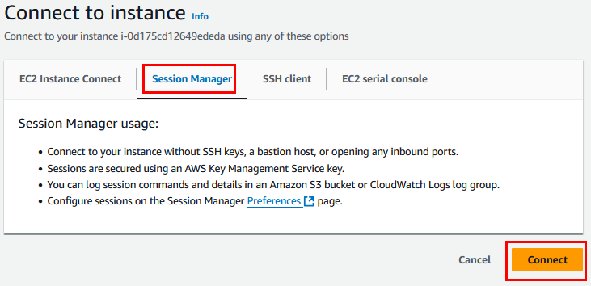

**NOTA:** Se volverá a abrir otra pestaña en el navegador.

Paso 6. Ahora ya estás en la sesión remota del servidor de Hadoop, **escribir o copiar el siguiente comando** para inicializar la sesión con Apache Hadoop.

```
sudo su - hadoop
```

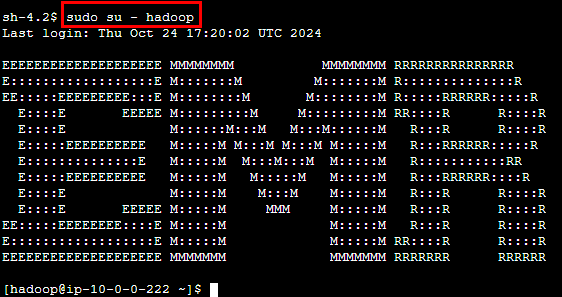

Paso 7. Ahora, dentro de la sesión, escribir o copiar el siguiente comando para activar Apache Hive.

```
hive
```

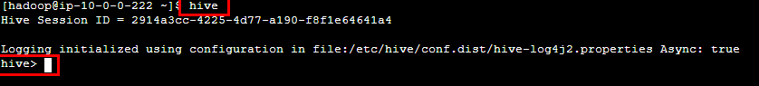

Paso 8. Dentro de la terminal de **Apache Hive**, crear una tabla externa para los datos que cargaste en S3.

Paso 9. Copiar la consulta en un bloc de notas; ahí modificar la propiedad llamada **LOCATION** con la **URI** del S3 que guardaste en la tarea anterior.

**NOTA:** No modifiques ningún otro parámetro.

```
CREATE EXTERNAL TABLE ventas (
  id INT,
  nombre_cliente STRING,
  producto STRING,
  cantidad INT,
  precio_unitario FLOAT,
  fecha_venta STRING
)
ROW FORMAT DELIMITED
FIELDS TERMINATED BY ','
ESCAPED BY '"'
STORED AS TEXTFILE
LOCATION 's3://emrdatabucket-XXXX/'
TBLPROPERTIES ("skip.header.line.count"="1");
```

Paso 10. Una vez editado en el bloc de notas, copiar y pegar en la terminal de Apache Hive del servicio de Amazon EMR.

Paso 11. Si todo salió bien, deberás ver el mensaje en la terminal.

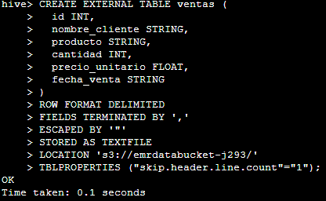

Paso 12. Ahora realizar la consulta para validar que los datos hayan sido cargados correctamente a la tabla de Hive.

```
SELECT producto, 
       SUM(cantidad) AS total_vendido, 
       SUM(cantidad * precio_unitario) AS ingreso_total
FROM ventas
WHERE producto IS NOT NULL AND producto != ''
GROUP BY producto;
```

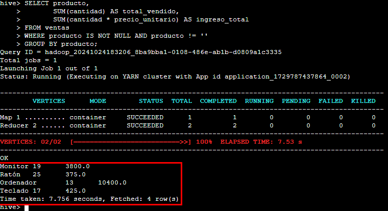

**¡TAREA FINALIZADA!**

Haz completado la interacción del clúster Amazon EMR realizando la creación de la tabla externa y cargando los datos desde el servicio de Amazon S3.

**LABORATORIO FINALIZADO!**

### Resultado esperado.

El resultado esperado es que se hayan creado correctamente todas las tareas y la consulta final como se muestra en la imagen.


---

**[⬅️ Atrás](/Capítulo8/lab8.1.md)** | **[Lista General](/README.md)** | **[Siguiente ➡️](/Capítulo9/lab9.2.md)**

---
