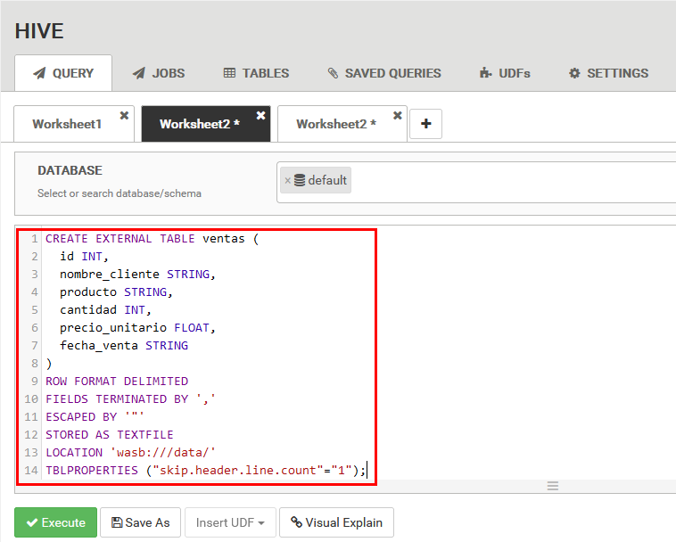

# Práctica 9. Configuración y despliegue de un proyecto de Big Data utilizando Azure HDInsight

## Objetivo de la práctica:

Al finalizar la práctica, serás capaz de:

- Configurar un clúster de Hadoop en Azure HDInsight.
- Ejecutar una consulta en Hive utilizando el clúster HDInsight.
- Realizar un análisis sobre datos almacenados en Hadoop.

## Duración aproximada:
- 40 minutos.

---

**[⬅️ Atrás](/Capítulo9/lab9.1.md)** | **[Lista General](/README.md)** | **[Siguiente ➡️](/Capítulo9/lab9.3.md)**

---

### Instrucciones 

### Tarea 1. Creación del clúster de HDInsight en Azure.

En esta tarea, crearemos un clúster de Hadoop en HDInsight utilizando el portal de Azure, detallando cada paso para su configuración básica.

Paso 1. Primero acceder a la cuenta de Azure.

Paso 2. Acceder al portal de Azure [**AQUÍ**](https://portal.azure.com/)

Paso 3. Iniciar sesión con el **usuario y contraseña** otorgados al inicio de este laboratorio.

Paso 4. En la barra de búsqueda, escribir **HDInsight** y seleccionar **HDInsight Clusters**.


Paso 5. Haz clic en **Create** para iniciar la configuración de un nuevo clúster.


Paso 6. En la sección **Basics** de **Create HDInsight cluster**, configurar las siguientes propiedades como se muestra en la tabla de abajo.

| Parametro | Valor |
| --------- | ----- |
| Subscription | Seleccionar la suscripción mencionada al inicio del curso |
| Resource group | Clic en **Create new** escribir el nombre **hadoop-rg-`XXXX`** sustituir las **X** por las letras iniciales de tu nombre, Clic en **OK**. |
| Cluster name | hadoop-**`XXXX`**-**`YYY`** - Cambiar las **X** por las iniciales de tu nombre y las **Y** por 3 numeros **aleatorios**   |
| Cluster type | Clic en **Cluster type** Seleccionar **Hadoop** de la lista lateral derecha.|
| Cluster login username | hadoopuser |
| Cluster login password | Pa55w.rd7482 |
| Confirm cluster login password | Pa55w.rd7482 |

**NOTA:** Para esta sección, el resto de los valores se quedarán por defecto. Continuar con el siguiente paso.


Paso 7. En la parte inferior de la configuración, dar clic en el botón **Review + create**.

Paso 8. Verificar que la **Validación** haya pasado correctamente y dar clic en el botón **Create**.


Paso 9. Esperar a que termine el proceso de creación del clúster. 


**NOTA:** El proceso puede tardar **20 minutos** aproximadamente.

**NOTA:** Mientras esperas la creación del clúster, puedes revisar la documentación del servicio [¿Qué es Azure HDInsight?](https://learn.microsoft.com/es-es/azure/hdinsight/hdinsight-overview)

**¡TAREA FINALIZADA!**

Haz completado la creación del clúster de Azure HDInsight con Apache Hadoop y Apache Hive instalados.

### Tarea 2. Carga de datos en el almacenamiento de Hadoop

En esta tarea, subirás un conjunto de datos de ejemplo al almacenamiento predeterminado asociado con el clúster Hadoop en HDInsight.

Paso 1. El archivo llamado **ventasejemplo.csv** ya está guardado en un bucket de S3 externo. Copiar y pegar la URL en el navegador para descargar el archivo en el equipo.

```
https://s3.us-west-2.amazonaws.com/labs.netec.com/courses/BigDataSciencePro/V0.0.1/ventasejemplo.csv
```

Paso 2. Cuando ya haya terminado de crearse el clúster, dar clic en el botón **Go to resource**.


Paso 3. Dentro de la interfaz del clúster creado, dar clic en la opción **Settings** y luego seleccionar **Storage accounts**.


Paso 4. Seleccionar el contenedor de almacenamiento creado para el clúster.


Paso 5. Dar clic en el botón **Upload**.


Paso 6. **Buscar y cargar** el archivo **ventasejemplo.csv** que descargaste en el primer paso de esta tarea.

Paso 7. Seleccionar el **contenedor existente** y dar clic en la opción **Advanced**.

Paso 8. En la opción **Upload to folder** escribir **`data`**.

Paso 9. Dar clic en el botón **Upload**.


**¡TAREA FINALIZADA!**

Haz completado la carga de datos al clúster de Azure HDInsight.

### Tarea 3. Creación de una tabla Hive y consultas.

En esta tarea, crearás una tabla en Hive utilizando el dataset cargado y ejecutarás una consulta simple para verificar los datos.

Paso 1. Regresar a la página inicial del clúster de Hadoop y dar clic en el nombre del clúster **en la esquina superior izquierda**.


Paso 2. Dar clic en la opción de **Overview**.


Paso 3. Dar clic en la opción **Ambari home** para conectarte al clúster.


Paso 4. En la nueva pestaña del navegador que se abrió, colocar las credenciales del clúster **hadoopuser** y **Pa55w.rd7482** y dar clic en **Iniciar sesión**.


Paso 5. En el menú lateral izquierdo, dar clic en la opción **Hive**.


Paso 6. Verificar que los servicios de **Hive** estén todos activos.


Paso 7. Dar clic en las vistas y seleccionar la vista de **Hive View 2.0**.


Paso 8. Espera a que carguen los procesos.

Paso 9. En la sección de **QUERY** copiar y pegar la consulta para crear la tabla externa en Hive.

```
CREATE EXTERNAL TABLE ventas (
  id INT,
  nombre_cliente STRING,
  producto STRING,
  cantidad INT,
  precio_unitario FLOAT,
  fecha_venta STRING
)
ROW FORMAT DELIMITED
FIELDS TERMINATED BY ','
ESCAPED BY '"'
STORED AS TEXTFILE
LOCATION 'wasb:///data/'
TBLPROPERTIES ("skip.header.line.count"="1");
```



Paso 10. Dar clic en el botón **Execute**.

Paso 11. Verificar que la tabla se haya creado exitosamente en el panel lateral derecho.


Paso 12. Verificar que puedas obtener los datos de la tabla creada, escribiendo la consulta.

**NOTA:** Puedes borrar el contenido de la primera consulta.

```
SELECT * FROM ventas LIMIT 10;
```


Paso 13. Realizar una prueba más para interactuar con la información, copiando y pegando la siguiente consulta.

```
SELECT producto, SUM(cantidad * precio_unitario) AS total_ventas
FROM ventas
GROUP BY producto;
```


Paso 14. Esta prueba es un poco más avanzada, **¿Puedes deducir el resultado antes de ejecutarla?**.

```
SELECT 
    producto,
    COUNT(*) AS total_transacciones,
    SUM(cantidad) AS total_cantidad,
    ROUND(SUM(cantidad * precio_unitario), 2) AS total_ventas,
    ROUND(AVG(cantidad * precio_unitario), 2) AS venta_promedio,
    MAX(cantidad * precio_unitario) AS venta_maxima,
    MIN(cantidad * precio_unitario) AS venta_minima
FROM 
    ventas
WHERE 
    fecha_venta BETWEEN '2024-01-01' AND '2024-12-31'
GROUP BY 
    producto
HAVING 
    ROUND(SUM(cantidad * precio_unitario), 2) > 1000
ORDER BY 
    total_ventas DESC
LIMIT 10;
```


Paso 15 (Opcional). Si deseas guardar el resultado, puedes ejecutar una consulta adicional.

```
INSERT OVERWRITE DIRECTORY 'wasbs:///data/analisis_ventas'
ROW FORMAT DELIMITED
FIELDS TERMINATED BY ','
SELECT 
    producto,
    COUNT(*) AS total_transacciones,
    SUM(cantidad) AS total_cantidad,
    ROUND(SUM(cantidad * precio_unitario), 2) AS total_ventas,
    ROUND(AVG(cantidad * precio_unitario), 2) AS venta_promedio,
    MAX(cantidad * precio_unitario) AS venta_maxima,
    MIN(cantidad * precio_unitario) AS venta_minima
FROM 
    ventas
WHERE 
    fecha_venta BETWEEN '2024-01-01' AND '2024-12-31'
GROUP BY 
    producto
HAVING 
    ROUND(SUM(cantidad * precio_unitario), 2) > 1000
ORDER BY 
    total_ventas DESC
LIMIT 10;
```

**¡TAREA FINALIZADA!**

Haz completado la creación de la tabla en Apache Hive y un conjunto de consultas para la interacción de los datos.

**LABORATORIO FINALIZADO!**

### Resultado esperado

El resultado final esperado es la ejecución correcta de todos los pasos en las tareas y la imagen final como comprobación.


---

**[⬅️ Atrás](/Capítulo9/lab9.1.md)** | **[Lista General](/README.md)** | **[Siguiente ➡️](/Capítulo9/lab9.3.md)**

---
