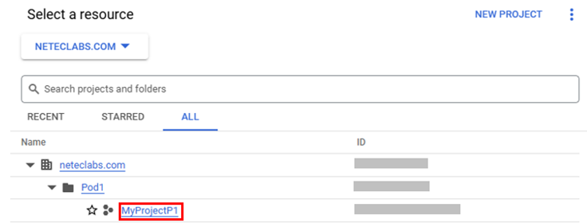
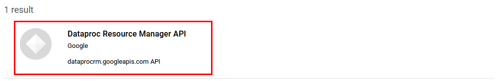
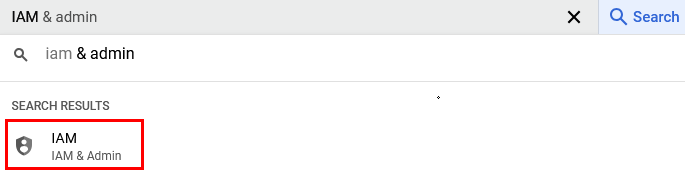
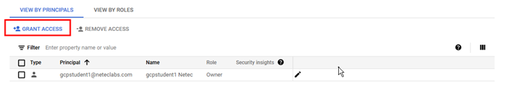
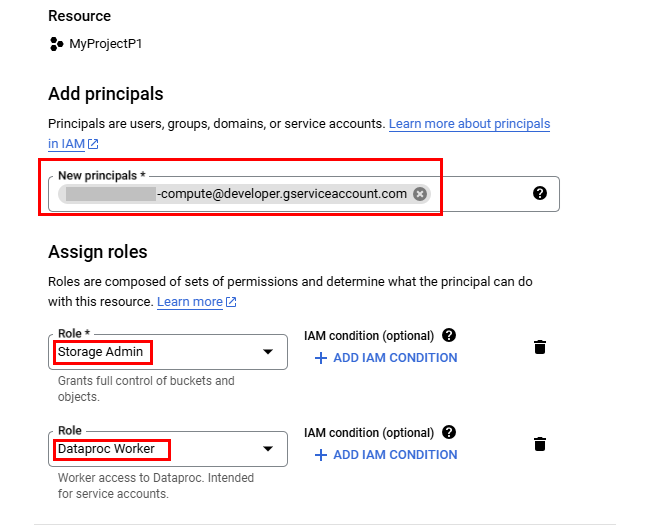
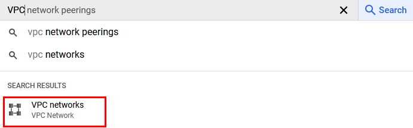

### Configuración y despliegue de un proyecto de Big Data en Google Cloud Dataproc

### Objetivo de la práctica:

Al finalizar la práctica, serás capaz de:

- Configurar un clúster de procesamiento de datos con Google Cloud Dataproc.
- Ejecutar tareas de análisis de datos utilizando Hadoop y Hive en el clúster.

### Duración aproximada:
- 40 minutos.

---

**[⬅️ Atrás](/Capítulo9/lab9.2.md)** | **[Lista General](/README.md)** | **[Siguiente ➡️](/Capítulo2/lab2.1.md)**

---

### Instrucciones 

### Tarea 1. Crear un proyecto en Google Cloud Platform.

En esta tarea, configurarás un proyecto en **Google Cloud** para gestionar recursos y permisos necesarios para **Dataproc**.

Paso 1. Si no tienes una cuenta de **Google Cloud Platform**, regístrate [**AQUÍ**](https://cloud.google.com/free/). El proceso incluye una prueba gratuita con crédito inicial, ideal para esta práctica.

Paso 2. Una vez que inicies sesión, entrarás a la consola principal de Google Cloud.


Paso 3. Ahora, en la barra de herramientas superior, haz clic en el menú desplegable **Select a project**.


Paso 4. En la ventana emergente, da clic en la opción de **NEW PROJECT**.


Paso 5. Escribe el siguiente nombre del proyecto **`dataprocessing-project`**, y haz clic en el botón **CREATE**.



Paso 6. Vuelve a dar clic en la opción **Select a project**.


Paso 7. Da clic en el nombre de tu proyecto.


**NOTA:** En el menú de la izquierda, selecciona **Facturación**. Si es la primera vez que usas Google Cloud, sigue las instrucciones para activar la facturación en el proyecto. Esto permite el acceso a servicios como **Dataproc**, aunque podrás usar el crédito gratuito para esta práctica.

**NOTA:** Si ya tienes configurada tu facturación, avanza a la siguiente tarea.

**¡TAREA FINALIZADA!**

Has completado la creación o inicio de sesión de tu cuenta de GCP y la creación de tu proyecto.

### Tarea 2. Habilitar las APIs necesarias.

En esta tarea, activarás las APIs de GCP que Dataproc y otros servicios necesitan para funcionar.

**NOTA:** Si es la primera vez que tienes una cuenta de GCP, deberás activar todas las APIs. Si ya tienes una cuenta, solo verifica que no falte alguna por activar.

Paso 1. En el buscador de Google Cloud Platform, escribe **`API & Services`** y da clic.


Paso 2. Ahora, en el menú lateral izquierdo, da clic en **Library**.


Paso 3. En la caja de búsqueda central, escribe **Dataproc**.

Paso 4. Selecciona **Dataproc Resource Manager API**.


Paso 5. Ahora da clic en la opción de **Dataproc**.



Paso 6. Finalmente, da clic en la opción **Enable** para activar el servicio.


Paso 7. Una vez habilitado, verás la siguiente interfaz.


Paso 8. Ahora repite desde el paso 3, pero con la API **Compute Engine API**.


Paso 9. Nuevamente, pero ahora con la API **Dataproc Metastore API**.


Paso 10. Siguiente, la API de **Cloud Dataproc API**.


Paso 11. Siguiente, la API de **Cloud Resource Manager API**.


**NOTA:** Espera a que se activen las API.

**¡TAREA FINALIZADA!**

Has completado la activación del servicio de GCP Dataproc y Compute Engine.

### Tarea 3. Configuraciones previas al clúster.

En esta tarea, configurarás los permisos necesarios y redes para la creación del clúster de Dataproc.

Paso 1. En el buscador de GCP, escribe **IAM** y da clic en la opción **IAM**.



Paso 2. En la lista de los usuarios, deberás tener un service principal, con el ícono de una llave; da clic en el **lápiz** a la derecha para editar los permisos.

**NOTA:** Si no te aparece el usuario service principal, puedes avanzar al paso 5 de esta tarea.


Paso 3. En la ventana lateral derecha, selecciona de la lista **Role** y cambia a **Owner**.



Paso 4. Ahora da clic en la opción **ADD ANOTHER ROLE**.

Paso 5. De la lista selecciona **Storage Admin**.



Paso 6. Da clic en el botón **Save**.

Paso 7. En el buscador de GCP, escribe **VPC** y da clic en la opción **VPC networks**.



Paso 8. Da clic en la opción **SUBNETS IN CURRENT PROJECT**.


Paso 9. Ahora filtra por la **Region: us-central1** y da clic en el nombre de la subred filtrada llamada **default**.


Paso 10. En los detalles de la subred, da clic en el botón **EDIT**.


Paso 11. Cambia la propiedad **Private Google Access** a **On** y da clic en el botón **Save**.


Paso 12. Ahora regresa a la lista de tus VPCs y haz clic en el menú lateral izquierdo **VPC networks**.

Paso 13. Selecciona la única VPC que se muestra en la lista y da clic en el nombre.

Paso 14. Dentro de los detalles de la VPC, da clic en la opción **DNS CONFIGURATION**.

Paso 15. Da clic en el botón **ENABLE API**.


**¡TAREA FINALIZADA!**

Has completado las preconfiguraciones necesarias para crear el clúster de GCP Dataproc.

### Tarea 4. Crear un clúster de Dataproc.

En esta tarea, configurarás un clúster Dataproc con las herramientas Hadoop y Hive instaladas para el análisis de datos.

Paso 1. En el menú de búsqueda, escribe **Dataproc** y da clic.


Paso 2. Ahora da clic en la opción **+ Create Cluster**.


Paso 3. En la ventana emergente, da clic en la opción **CREATE** de **Cluster on Compute Engine**.


Paso 4. Configura los siguientes datos de la tabla para la creación del clúster de Dataproc.

| Parametro | Valor |
| --------- | ----- |
|  Cluster Name | bdhadoop-XXXX-### (Cambia las **X** por las letras iniciales de tu nombre y los **#** por numeros aleatorios) |
| Subnetwork | default |
| Optional components  | - [x] Hive WebHCat |


**NOTA:** El resto de los valores se quedarán por defecto.

Paso 5. Ahora da clic en el botón **CREATE**.


**NOTA:** Si al momento de crear el clúster te aparece un mensaje de capacidad de disco duro SSD, debes reducir el tamaño de los discos de los nodos.


**NOTA:** Si te sale un mensaje sobre las API, verifica los pasos de la tarea uno que se hayan habilitado cada una de las APIs.

**NOTA:** El clúster tardará de **2 a 3 minutos** aproximadamente.

Paso 6. Cuando el clúster ya tenga el estatus **Running**, da clic en el nombre de tu clúster.


Paso 7. Ahora da clic en la opción **VM INSTANCES**.


Paso 8. En el nodo con el nombre **Master**, da clic en la propiedad **SSH** para abrir la conexión al clúster.


Paso 9. Se abrirá una ventana nueva para la **Autorización**; da clic en **Authorize**.


**NOTA:** Debes permitir las ventanas emergentes para que se realice la conexión exitosamente.

Paso 10. Una vez realizada la conexión, verás la terminal del servidor maestro.


**¡TAREA FINALIZADA!**

Has completado la creación del clúster de Dataproc exitosamente.

### Tarea 5. Cargar datos en Cloud Storage.

En esta tarea, subirás un archivo de datos a Cloud Storage para que el clúster pueda acceder a él.

Paso 1. Primero descarga el archivo desde la siguiente URL, cópiala y pégala en una pestaña de tu navegador.

**NOTA:** Si ya lo descargaste en laboratorios anteriores, puedes omitir este paso y avanzar al paso 2.

```
curl https://s3.us-west-2.amazonaws.com/labs.netec.com/courses/BigDataSciencePro/V0.0.1/ventasejemplo.csv
```

Paso 2. Dentro de la máquina virtual del nodo **Master**, da clic en la opción **UPLOAD FILE**.


Paso 3. Sigue los pasos para cargar el archivo **ventasejemplo.csv** a la máquina virtual del nodo Master.

Paso 4. Una vez cargado, escribe el comando **ls** para verificar que se haya cargado.


Paso 5. Dentro de la máquina virtual del nodo **Master** ejecuta el siguiente comando para ver los buckets creados por el clúster.

```
gsutil ls
```


Paso 6. Ahora edita el siguiente comando y sustituye la palabra **TU_BUCKET_STAGING** por el valor del bucket staging del paso anterior, una vez editado, pégalo en la terminal del nodo.

```
gsutil cp ventasejemplo.csv gs://TU_BUCKET_STAGING/data/ventasejemplo.csv
```


Paso 7. Verifica que se haya cargado correctamente, copia el siguiente comando.

```
gsutil ls gs://TU_BUCKET_STAGING/data/
```


**¡TAREA FINALIZADA!**

Has completado la carga de los datos al bucket de Cloud Storage.

### Tarea 6. Ejecutar consultas de Hive en el clúster.

En esta tarea, cargarás el archivo de datos en una tabla de Hive y ejecutarás consultas para analizar los datos.

Paso 1. Primero debes conectarte a **Hive**; escribe el siguiente comando en la terminal.

```
hive
```

Paso 2. Ya conectado a **Hive**, crea la tabla externa que guardará los datos. Copia el siguiente código en un bloc de notas, edita la variable **TU_BUCKET_STAGING** y después pégalo en la terminal de **Hive**.

```
CREATE EXTERNAL TABLE ventas (
  id INT,
  nombre_cliente STRING,
  producto STRING,
  cantidad INT,
  precio_unitario FLOAT,
  fecha_venta STRING
)
ROW FORMAT DELIMITED
FIELDS TERMINATED BY ','
STORED AS TEXTFILE
LOCATION 'gs://TU_BUCKET_STAGING/data/'
TBLPROPERTIES ("skip.header.line.count"="1");
```


Paso 3. Verifica que los datos se hayan cargado correctamente, copiando el siguiente comando.
```
SELECT * FROM ventas LIMIT 10;
```


Paso 4. Realiza una prueba más para interactuar con la información, copiando y pegando la siguiente consulta.

```
SELECT producto, SUM(cantidad * precio_unitario) AS total_ventas
FROM ventas
GROUP BY producto;
```


Paso 5. Esta prueba es un poco más avanzada, **¿Puedes deducir el resultado antes de ejecutarla?**.

```
SELECT 
    producto,
    COUNT(*) AS total_transacciones,
    SUM(cantidad) AS total_cantidad,
    ROUND(SUM(cantidad * precio_unitario), 2) AS total_ventas,
    ROUND(AVG(cantidad * precio_unitario), 2) AS venta_promedio,
    MAX(cantidad * precio_unitario) AS venta_maxima,
    MIN(cantidad * precio_unitario) AS venta_minima
FROM 
    ventas
WHERE 
    fecha_venta BETWEEN '2024-01-01' AND '2024-12-31'
GROUP BY 
    producto
HAVING 
    ROUND(SUM(cantidad * precio_unitario), 2) > 1000
ORDER BY 
    total_ventas DESC
LIMIT 10;
```


**¡TAREA FINALIZADA!**

Has completado la ejecución de consultas de Hive en el clúster de GCP Dataproc.

**LABORATORIO FINALIZADO!**

### Resultado esperado

El resultado final del laboratorio es la ejecución correcta de todas las tareas y la verificación de la última consulta.


---

**[⬅️ Atrás](/Capítulo9/lab9.2.md)** | **[Lista General](/README.md)** | **[Siguiente ➡️](/Capítulo2/lab2.1.md)**

---